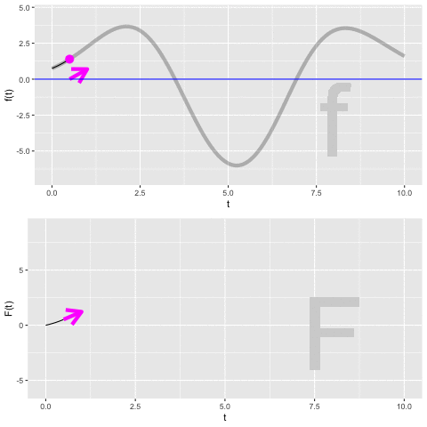
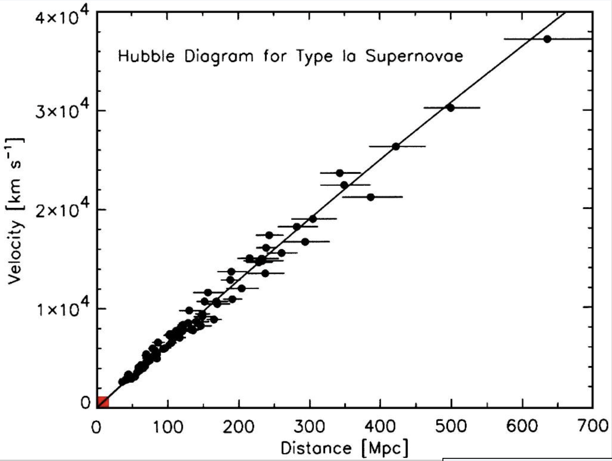

# Integration {#net-change}

Anti-derivatives are useful when you know how a quantity is changing but don't yet know the quantity itself. 

It's important, of course, to keep track of which is the "quantity itself" and which is the "rate of increase in that quantity." This always depends on context and your point of view. It's convenient, then, to set some fixed examples to make it easy to keep track of which quantity is which.


Context | Quantity             | Rate of increase in quantity
--------|----------------------|--------------------
Money   | Cash on hand ${\mathbf S}(t)$         | Cash flow $s(t)$
Fuel    | Amount in fuel tank ${\mathbf F}(t)$ | Fuel consumption rate, e.g. kg/hour $f(t)$
Motion  | Velocity   ${\mathbf V}(t)$          | Acceleration, i.e. force/mass $v(t)$
notation| ${\mathbf H}(t)$               | $\partial_t {\mathbf H}(t)$
notation| $G(t) = \int g(t) dt$| $g(t)$

We'll also adopt a convention to make it simpler to recognize which quantity is the "quantity itself" and which is the "rate of increase in that quantity." We will use CAPITAL LETTERS to name functions that are the quantity itself, and *lower-case* letters for the rate of increase in that quantity. For example, if talking about velocity and how it changes over time, the velocity itself will be ${\mathbf V}(t)$ while the rate of increase of velocity will be $v(t)$. The amount of money a business has on hand at time $t$ is ${\mathbf M}(t)$ measured, say, in dollars.  The rate of increase of that money is $m(t)$, in, say, dollars per day.  

Notice that we're using the phrase "rate of increase" rather than "rate of change." That's because we want to keep straight the meaning of the sign of the *lower-case* function. If $v(t)$ is positive, the velocity is increasing. If $v(t)$ is negative, then it's a "negative rate of increase," which is, of course, just a "decrease."

For a business, money coming in means that $v(t)$ is positive. Expenditures of money correspond to $v(t)$ being negative. In the fuel example. ${\mathbf F}(t)$ is the amount of fuel in the tank. $f(t)$ is the rate of *increase* in the amount of fuel in the tank. Of course, engines burn fuel, removing it from the tank. So we would write the rate at which fuel is burned as $-f(t)$: removing fuel is a negative increase in the amount of fuel, an expenditure of fuel.

The objective of this chapter is to introduce you to the sorts of calculations, and their notations, that let you figure out how much the CAPITAL LETTER quantity has changed over an interval of $t$ based on what you already know about the value over time of the *lower-case* function.

The first step in any such calculation is to find or construct the *lower-case* function $f(t)$ or $c(t)$ or $v(t)$ or whatever it might be. This is a modeling phase. In this chapter, we'll ignore detailed modeling of the situation and just present you with the *lower-case* function. 

The second step in any such calculation is to compute the anti-derivative of the *lower-case* function, giving as a result the CAPITAL LETTER function. You've already seen the notation for this, e.g.
$${\Large F(t) = \int f(t) dt}\ \ \ \ \ \text{or}\ \ \ \ \ {\Large G(t) = \int g(t) dt}\ \ \ \ \text{and so on.}$$ In this chapter, we will not spend any time on this step; we will assume that you already have at hand the means to compute the anti-derivative. (Indeed, you already have `antiD()` available which will do the job for you.) Later chapters will look at the issues around and techniques for doing the computations by other means.

The remaining steps in such calculations are to work with the CAPITAL LETTER function to compute such things as the amount of that quantity, or the change in that quantity as it is accumulated over an interval of $t$.

::: {.why data-latex=""}
Sometimes you're writing the capital letter functions in **bold-face**, e.g. ${\mathbf F}(t)$ and other times you aren't, e.g. $F(t)$. What's going on?

This is a convention we're adopting for this chapter, which is when we need it the most to introduce the concepts.

**Bold-face** is being used in this chapter to represent the real-world quantity of interest. So ${\mathbf F}(t)$ is the actual amount of fuel in the tank, ${\mathbf V}(t)$ is the actual velocity of the car, and ${\mathbf M}(t)$ is the actual amount of money on hand. The regular-face functions, $F(t)$ and $V(t)$ and $M(t)$ are the functions that we get by applying anti-differentiation to $f(t)$ or $v(t)$ or $m(t)$.

Our broad interest is to construct the **bold-face** function knowing just the derivative of that function, which we're writing in *lower-case*. So, $f(t) \equiv \partial_t {\mathbf F}(t)$. Similarly, $v(t) \equiv \partial_t {\mathbf V}(t)$ and $m(t) \equiv \partial_t {\mathbf M}(t)$.

If we knew ${\mathbf F}(t)$ or ${\mathbf V}(t)$ or ${\mathbf M}(t)$, that would be the end of the matter, since our interest is in the quantity ${\mathbf F}$ or ${\mathbf V}$ or ${\mathbf M}$.

But we are working with a situation where we know $f(t)$ but not ${\mathbf F}(t)$, or we know $v(t)$ but not ${\mathbf V}(t)$, and so on.

How could such a situation arise in the real world? Suppose the car's fuel gauge is broken, depriving us of direct knowledge of $\mathbf F$, but that we have a dashboard readout of the rate of fuel consumption. Then we would know $f(t)$ but not ${\mathbf F}(t)$. Or suppose you are in charge of day-to-day running of a business, collecting the income each day and paying the daily expenses. Thus, each day you know $m(t)$---the cash flow. But it's your boss who has access to the bank account; you merely deposit money as you get it and write checks or Venmo suppliers (or however it is that your business operates day to day). So your boss knows ${\mathbf M}(t)$ but you know only $m(t)$.

Since you know about anti-differentiation, you can try to reconstruct the fuel level ${\mathbf F}(t)$ from the known $f(t)$, or to figure out the bank balance ${\mathbf M}(t)$ from your records of $m(t)$.

But anti-differentiation, while part of the solution, is only just a part. You can apply anti-differentiation to $f(t)$, but what you get back will be $F(t)$, not ${\mathbf F}(t)$. 

What's the difference between the two? It involves a constant value $C$ which, alas, you can never figure out from $f(t)$. All that you can claim, given the $F(t)$ generated by anti-differentiation, is that $${\mathbf F}(t) = F(t) + C .$$

:::


## Net change

Perhaps it goes without saying, but once you have the CAPITAL LETTER function, e.g. $F(t)$, you can evaluate that function at any input that falls into the domain of $F(t)$. If you have a graph of $F(t)$ versus $t$, just position your finger on the horizontal axis at input $t_1$, then trace up to the function graph, then horizontally to the vertical axis where you can read off the value $F(t_1)$. If you have $F()$ in the form of a computer function, just ***apply*** $F()$ to the input $t_1$.

In this regard, $F(t)$ is like any other function.

However, in using and interpreting the $F(t)$ that we constructed by anti-differentiating $f(t)$, we have to keep in mind the limitations of the anti-differentiation process. In particular, any function $f(t)$ does not have a unique anti-derivative function. If we have one anti-derivative, we can always construct another by adding some constant: $F(t) + C$ is also an anti-derivative of $f(t)$.

But we have a special purpose in mind when calculating $F(t_1)$. We want to figure out from $F(t)$ how much of the quantity $f(t)$ has accumulated up to time $t_1$. For example, if $f(t)$ is the rate of increase in fuel (that is, the negative of fuel consumption), we want $F(t_1)$ to be the amount of fuel in our tank at time $t_1$. **That cannot happen.** All we can say is that $F(t_1)$ is the amount of fuel in the tank at $t_1$ give or take some unknown constant C.

Instead, the correct use of $F(t)$ is to say how much the quantity has changed over some interval of time, $t_0 \leq t \leq t_1$. This "change in the quantity" is called the ***net change** in $F()$. To calculate the net change in $F()$ from $t_0$ to $t_1$ we apply $F()$ to both $t_0$ and $t_1$, then subtract:

$$\text{Net change in}\ F(t) \ \text{from}\ t_0 \ \text{to}\ t_1 :\\= F(t_1) - F(t_0)$$

::: {.example}
Suppose you have already constructed the rate-of-change function $v()$ and implemented it as an R function `v()`. For instance, $v(t)$ might be the amount of **acceleration** at any instant $T$ of a car, and $V(t)$ is the **accumulated acceleration**, better known as velocity. We'll assume that the input to `v()` is in seconds, and the output is in meters-per-second-squared, which has the correct dimension for acceleration.

You want to find the amount of acceleration accumulated between time $t=2$ and $t=5$ seconds. 


```{r echo=FALSE}
vraw <- rfun( ~ t, seed=9090)
v <- function(t) vraw(t-5)
```

```{r}
# You've previous constructed v(t)
V <- antiD(v(t) ~ t)
V(5) - V(2)
```
To make use of this quantity, you'll need to know it's dimension and units. For this example, where the dimension [$v(t)$] is L T$^{-2}$, and [$t$] = T, the dimension [$V(t)$] will be L T$^{-1}$. In other words, if the output of $v(t)$ is meters-per-second-squared, then the output of $V(t)$ must be meters-per-second.
:::

## The "definite" integral

We have described the process of calculating a net change from the *lower-case* function $f(t)$ in terms of two steps:

1. Construct $F(t) = \int f(t) dt$. 
2. Evaluate $F(t)$ at two inputs, e.g. $F(t_2) - F(t_1)$, giving a net change, which we'll write as ${\cal F}(t_1, t_2) = F(t_2) - F(t_1)$.

As a matter of notation, the process of going from $f(t)$ to the net change is written as one statement.
$${\cal F}(t_1, t_2) = F(t_2) - F(t_1) = \int_{t_1}^{t_2} f(t) dt$$

The punctuation $$\int_{t_1}^{t_2} \_\_\_\_ dt$$ captures in one construction both the anti-differentiation step ($\int\_\_dt$) and the evaluation of the anti-derivative at the two bound $t_2$ and $t_1$.

Several names are used to describe the overall process. It is important to become familiar with these.

- $\int_a^b f(t) dt$ is called a ***definite integral*** of $f(t)$.
- $a$ and $b$ are called, respectively, the ***lower bound of integration*** and the ***upper bound of integration***, although given the way we draw graphs it might be better to call them the "left" and "right" bounds, rather than lower and upper.
- The pair $a, b$ is called the ***bounds of integration***. 

As always, it pays to know what *kind of thing* is ${\cal F}(t_1, t_2)$.
Assuming that $t_1$ and $t_2$ are fixed quantities, say $t_1 = 2$ seconds and $t_2 = 5$ seconds, then ${\cal F}(t_1, t_2)$ is itself a quantity. The dimension of that quantity is [$F(t)$] which in turn is [$f(t)$]$\cdot$[$t$]. So if $f(t)$ is fuel consumption in liters per second, then $F(t)$ will have units of liters, and ${\cal F}(t_1, t_2)$ will also have units of liters.

Good to remember, too, that $F(t) = \int f(t) dt$ is a ***function*** whose output is a quantity, while $F(t_2) - F(t_1) = \int_{t_1}^{t_2} f(t) dt$ is a ***quantity***, not a function. And $f(t)$ is also a ***function*** whose output is a quantity, although in general $F(t)$ and $f(t)$ are different kinds of quantities. For instance, the output of $F(t)$ is liters of fuel while the output of $f(t)$ is liters per second: fuel consumption. Similarly, the output of $M(t)$ is dollars, while the output of $m(t)$ is dollars per day. 

The use of the term ***definite integral*** suggests that there might be something called an ***indefinite integral***, and indeed there is. "Indefinite integral" is just a synonym for "anti-derivative." In this book we favor the use of ***anti-derivative*** because it's too easy to leave off the "indefinite" and confuse an indefinite integral with a definite integral. Also, "anti-derivative" makes it completely clear what is the relationship to "derivative."

Since 1700, it's common for calculus courses to be organized into two divisions:

i. Differential calculus, which is the study of derivatives and their uses.
ii. Integral calculus, which is the study of anti-derivatives and their uses. 

Mathematical notation having been developed for experts rather than for students, very small typographical changes are often used to signal very large changes in meaning. When it comes to anti-differentiation, there are two poles of fixed meaning and then small changes which modify the meaning. The poles are:

i. Anti-derivative: $\int f(t) dt$, which is a function whose output is a quantity.
ii. Definite integral $\int_a^b f(t) dt$, which is a quantity plane and simple.

But you will also see some intermediate forms:

a. $\int_a^t f(t) dt$, which is a **function** with input $t$.
b. $\int_a^x f(t) dt$, which is the same function as in (a) but with the input name $x$ being used.
c. $\int_t^b f(t) dt$, which is a **function** with input $t$.
d. Less commonly, $\int_x^t f(t) dt$ which is a **function** with two inputs, $x$ and $t$. The same is true of $\int_x^y f(t) dt$ and similar variations.

## Initial value of the quantity

Recall that we're interested in a real quantity ${\mathbf F}(t)$, but we only know $f(t)$ and from that can calculate an anti-derivative $F(t)$. The relationship between them is
$${\mathbf F}(t) = F(t) + C$$ where $C$ is some fixed quantity that we cannot determine directly from $f(t)$.

Still, even if we cannot determine $C$, there's one way we can use $F(t)$ to make definite statements about ${\mathbf F}(t)$. Consider the net change from $t_1$ to $t_2$ in the real quantity ${\mathbf F}$. This is
$${\mathbf F}(t_2) - {\mathbf F}(t_1) =  \left[F(t_2) + C\right] - \left[F(t_1) + C\right] = F(t_2) - F(t_1)$$
In other words, just knowing $F(t)$, we can make completely accurate statements about net changes in the value of ${\mathbf F}(t)$.

Let's develop our understanding of this unknown constant $C$, which is called the ***constant of integration***. To do so, watch the following movie which attempts to show the process of constructing the anti-derivative of a function $f(t)$.

```{r accum-movie-1, echo=FALSE}, fig.cap="Write the caption!!!!"}

```

1. Focus first on the top graph. $f(t)$ is the rate of increase in $F(t)$ (or ${\mathbf F}(t)$ for that matter). From the graph, you can read using the vertical axis the value of $f(t)$ for any input $t$. But since $f(t)$ is a rate of increase, we can also depict $f(t)$ as a slope. That slope is being drawn as a $\color{magenta}{\text{magenta}}$ arrow. Notice that when $f(t)$ is positive, the arrow slopes upward and when $f(t)$ is negative, the arrow slopes downward. The steepness of the arrow is the value of $f(t)$, so for values of $f(t)$ far from zero the arrow is steeper than for it is for values of $f(t)$ that are near zero.

2. Now look at both graphs, but concentrate just on the arrows in the two graphs. They are always the same: carbon copies of one another.

3. Finally the bottom graph.


::: {.intheworld}
Is the quantity always a function of $t$? No, but that's easy to conceptualize.  For example, a car's dashboard instrumentation conventionally reports instantaneous fuel use in liters/mile which we want to integrate to find liters. This integration must be over miles not seconds.

:::

::: {.intheworld}
The universe and the atom

In the 1920s, astronomers and cosmologists started to question the idea that the large-scale universe is static and unchanging. This traditional belief was undermined both by theory (e.g. General Relativity) and observations. The most famous of these were collected and published by Edwin Hubble, starting in 1929 and continuing over the next decade as improved techniques and larger telescopes became available. In recent years, with the availability of the space telescope named in honor of Hubble data has expanded in availability and quality. Figure \@ref(fig:hubble-curve) shows a version of [Hubble's 1929 graph](https://www.pnas.org/content/15/3/168) based on [contemporary data](https://www.ncbi.nlm.nih.gov/pmc/articles/PMC314128/).

```{r hubble-curve, echo=FALSE, fig.cap="}

```
Each dot in Figure \@ref(fig:hubble-curve) is an exploding star called a *supernova*. The graph shows the relationship between the distance of the star from our galaxy and the outward velocity of that star. The velocities are large, $3 \times 10^4$ km/s is about one-tenth the speed of light. Similarly, the distances are big; light from the furthest star shown took about 2 billion years to reach Earth. 

For each star, we know the "current" velocity and the "current" position.^["Current" is in quotes because the measurements reflect the situation 100s of millions of years ago, when the light was emitted from the star.] For cosmologists constructing theories of the origin of the universe, an important question is the location of the star in the remote past. 

The location of each star can be found by integrating the velocity backwards in time.

$$D(t) = D_\text{now} - \int_t^\text{now} v(t) dt$$

Ideally we would have measurements of the function $v(t)$, but nobody was around to record them 500 million years ago. So, to model $v(t)$ we can use theories of the evolution of the universe or ... we can start simply and imagine that $v(t)$ is constant. Let's play out the consequences of that assumption.

From the Hubble diagram, we can compute $v$ as a function of $D$---the data show a simple straight-line relationship. The slope is (as always) rise-over-run: the rise is 40000 km/s and the run is 700 megaparsecs, which is $2.2 \times 10^{22}$ km, so the slope is $1.8 \times 10^{-18}$ $s$^{-1}$. Consequently, the straight-line relationship is $$v(D_{now}) = 1.8 \times 10^{-18}\ D_{now} .$$

Since $v$ is assumed not to depend on $t$, the anti-derivative itself is trivial: $\int_t^\text{now} v dt = t v$. Evaluating the anti-derivative at the limits of integration gives, for each star, 
$$D(t) = D_\text{now} - 1.8\times 10^{-18} D_\text{now} \left[\text{now} - t\right]$$
Let's define now$=0$ and ask what might be a obvious question for people interested in the origin of the universe: At what $t+0$ was each star at distance zero from the Milky Way? That is, what is the $t_0$ at which $D(t_0) = 0$?

Re-arranging the equation gives $$0 = D_\text{now} \left[1 - 1.8\times 10^{-18} t_0\right]\ \ \implies \ \ t_0 = \frac{1}{1.8\times 10^{-18}} \approx 5.5 \times 10^{17} \text{seconds}.$$

Notice that time $t_0$ does not depend on $D_\text{now}$. According to the theory that the star's velocity $v(t)$ is constant, all of the stars, now spaced apart across 2 billion light years, were at the same position at $t_0 = 5.5 \times 10^{17}$ seconds ago. Converting seconds to years, we get that this grand (but hypothetical) meeting of the stars occurred 17 billion years ago. Pretty crowded to have all the mass in the universe in one place at the same time. No wonder they call it the Big Bang! 


:::

