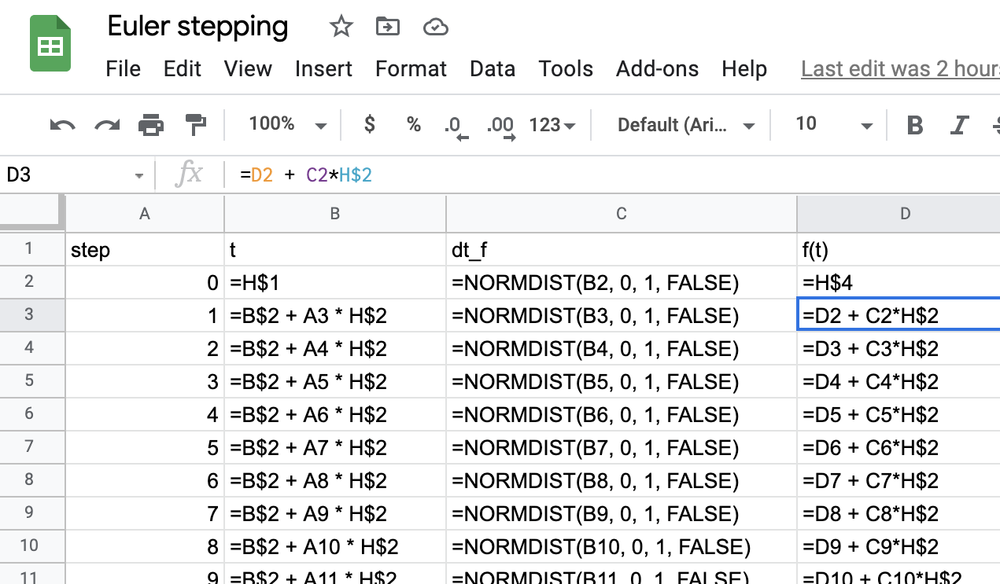
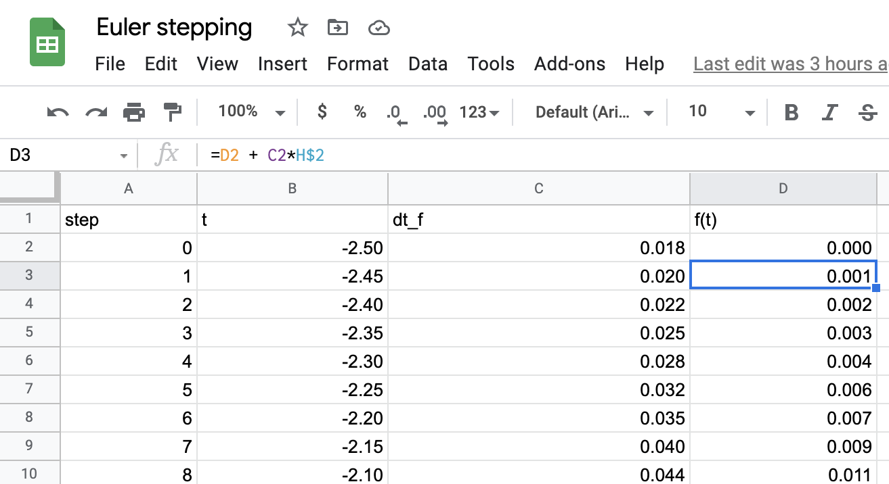

# Iteration and accumulation {#iteration-and-accumulation}

Let's review the concept of an ***Euler step***.


**Problem statement**:

1. You seek to find a function, e.g. $f(t)$ which you do not yet know.
2. You already know $\partial_t f(t)$. (In the following chapters we'll show you some of the many instances of this unlikely-sounding situation, where you don't know $f(t)$ but you do know $\partial_t f(t)$.) This relationship, $\partial_t f(t) \longrightarrow f(t)$ is, of course, revealed by ***anti-differentiation***. `r mark(3300)`

**Setup**:

3. You know or make up a value for $f(t)$ at a particular time of interest $t=t_0$. "Making up" is a perfectly legitimate practice here to get started in creating an an anti-derivative. The reason is hard to explain until you see the whole process of anti-differentiation by the ***Euler method***, so hang on. In the population modeling problem in Chapter \@ref(change-accumulation), we were interested in forecasting the population into the future, so we chose $t_0$ to be the most recent year for which we have information: $t_0 = 2020$. (In polite mathematical conversation, "making up" is pronounced "assuming.")
4. Consider a quantity $h$ which is to be regarded as a little bit of $t$: they have the same dimension. $h$ should be "small," but "small" compared to what? Often, the modeling problem at hand involves a domain of interest. For instance, the population modeling problem in Chapter \@ref(change-accumulation) involved a forecast over the time interval from year 2020 to 2100. Provisionally, take small to mean 1% or 0.1% of the extent of the domain of interest. (In the population modeling problem, we chose $h=1$ year.) `r mark(3305)`

**The Step**

1. Compute the value of the (still unknown) function $f(t)$ at input $t_0 + h$ as
$$f(t_0+h) = f(t_0) + h \times \partial_t f(t)$$

Now you know a little bit more about $f(t)$, namely, its value at $t_0 + h$.

Since the original problem was to figure out $f(t)$ over some domain of interest (starting at $t=t_0$), we are not finished. We have taken but one step of our journey and have many more to go.

To continue on the journey, we take what we just found out, namely $f(t_0 + h)$. We use this as the starting point in a new step. We don't have to make anything up because we already know $f(t_0 + h)$. `r mark(3310)`

The second step brings us to $f(t_0 + 2h)$

$$f(t_0+2h) = f(t_0+h) + h \times \partial_t f(t+h)$$
And the third:
$$f(t_0+3h) = f(t_0+2h) + h \times \partial_t f(t+2h)$$

How long to continue this step-by-step process? The original problem involved some domain of interest, and we selected $h$ as 1% or 0.1% of the extent of this domain. For $h$ as 1%, taking 100 steps will get us to the far end of the domain. For $h$ as 0.1%, we would need to take 1000 steps.  `r mark(3315)`


## Automating Euler

Although the Euler method was invented in the 18th century, it only became a practicable way of accumulating in the 1930s with the advent of analog computing and then in the 1940s when electronic computing was first becoming available. In those days, a primary mission for computers was accumulating the trajectories of artillery shells, a problem that was inaccessible to symbolic anti-differentiation because of the complexities of air resistence and the varying density of air at different altitudes, with different humidity, and so on.  `r mark(3320)`

Nowadays computing is roughly one-billionth the cost that it was the World War II era, and we use computers for just about every task imaginable. But in those early days, the huge costs involved in developing early computers was justified only by the prospect of improved gunnery in war. And those problems were all about accumulation and, more specifically, Euler methods.  `r mark(3325)`

What today seems an esoteric use for computers was in fact the prime motivation for their development. This section introduces various ways of programming the Euler method on a computer. 

::: {.takenote  data-latex=""}
The Euler method has been supplanted by other, more modern methods whose inner workings are based on a deeper knowledge of calculus than we have covered to date and programming methods that automatically check and adapt the size of $h$.  `r mark(3330)`

However sophisticated these methods may be, they are always easy to use. For example, the R/mosaic `antiD()` operator draws on one of these methods.
:::

### Euler as a spreadsheet

Spreadsheets are popular for certain simple kinds of computer programming. The Euler method is a case in point. Figure \@ref(fig:euler-spreadsheet1) shows the formula layer of a Google Sheet implementing the Euler method for $\int \dnorm(t) dt$. In the spreadsheet, `NORMDIST()` is the equivalent of $\dnorm()$. (The whole spreadsheet is viewable [here](https://docs.google.com/spreadsheets/d/1e3SwcNLQxoYCUedALia6XxzIlh5kY_dTohFroewbNR8/edit?usp=sharing)) `r mark(3335)`

```{r euler-spreadsheet1, echo=FALSE, fig.cap="The formula layer of a spreadsheet implementing the Euler method for $\\int \\dnorm(x) dx$."}

```

The first argument to `NORMDIST()` is a reference to a cell in column B which stores the sequence $t_0$, $t_0 + h$, $t_0 + 2h, \ldots$. (The value of $h$ is stored in cell `H2` (not shown).) Column D contains the results of the Euler calculation. It starts at time $t_0=0$ by referencing cell `H4` (not shown) which contains the starting value $f(t_0)$. Each successive cell in that column refers to the one immediately above that, adding in the appropriate value from the `NORMDIST()` column and multiplying it by $h$ (that is, `H2`).  `r mark(3340)`

Only about 10 Euler steps are shown, out of 100 altogether. Typically in viewing a spreadsheet you don't see the formula layer. Instead, the results of the calculation in each cell are presented. (Figure \@ref(fig:euler-spreadsheet2)).  `r mark(3345)`

```{r euler-spreadsheet2, echo=FALSE, fig.cap="Results from the formula layer shown in Figure \\@ref(fig:euler-spreadsheet1)."}

```

Plotting column `D` against column `B` gives a graph of $\int \dnorm(t) dt$ versus $t$. Notice that the output of the Euler method is a function stored as a ***table*** rather than as a function formula. And even though $\int \dnorm(t) dt$ has a pretty simple form, namely, $\pnorm(t)$, the spreadsheet makes it look like something more elaborate. `r mark(3350)`

Spreadsheets are rightly criticized for being verbose. This can make it extremely challenging for the human programmer to create a spreadsheet that does what is claimed for it, let alone to demonstrate that the result is correct.  `r mark(3355)`

Worse, it's hard to generalize a spreadsheet to handle any given function rather than the one (here, `NORMDIST()`) hard-coded into the sheet. A usual practice is to copy a spreadsheet and then customize it to use the function whose anti-derivative is sought. This introduces the potential for human error in a way that can be hard to detect down the line. `r mark(3360)`

### Using `antiD()`

The R/mosaic `antiD()` operator uses symbolic differentiation if it can. Otherwise it uses numerical methods in the spirit of Euler. Here is the same anti-differentiation as in the spreadsheet but done with `antiD()`: `r mark(3365)`

```{r}
f <- antiD(dnorm(t) ~ t)
```

It happens that $\dnorm(t)$ is one of those many functions where the anti-derivative cannot be calculated symbolically. (We already know that $\int \dnorm(t) dt = \pnorm(t)$, but this in fact the *definition* of $\pnorm()$, which is only known from numerical calculations like Euler.) `r mark(3370)`

An advantage of using programming systems like R/mosaic is that they provide a way to do something with the result of the calculation. You could of course plot `f()` with `slice_plot()`, but let's show something much more fundamental ...  `r mark(3375)`

> **How do we know that `antiD()` is giving the result it should give?**

Whenever you do a calculation, you should ask a similar question: "How do I know that [*my calculation*] is giving the result it should?" In general, it takes considerable experience to provide an answer to such a question, but in the case of `antiD()`, the approach is simple: If `f()` is really the anti-derivative of `dnorm()`, then differentiating `f()` should give us something that's the same as `dnorm()`. `r mark(3380)`

Here's the actual calculation:
```{r}
fprime <- D(f(t) ~ t)
deviation <- makeFun(dnorm(t) - fprime(t) ~ t)
slice_plot(deviation(t) ~ t, domain(t=c(-5,5)))
```

With numerical methods, there will almost always be some error introduced by round-off in the calculations, so we should never expect the deviation to be zero. You can see from the plot of the deviation (Look carefully at the vertical axis!) that it is smaller than 0.0000000001, which is a tiny, tiny part of the size of the output from $\dnorm()$. `r mark(3385)`

It might seem odd to use 3 lines of R/mosaic commands to confirm an answer that was calculated in one line. That's a pretty good representation of how much effort a professional will put into **testing** the result compared to **getting** the result. `r mark(3390)`


### Using `cumsum()` {#using-cumsum}

`antiD()` produces a function that can be evaluated at any input. In contrast,
the Euler method as described here produces a data table of values as, for example, seen in the spreadsheet implementation of Euler.

In R, a data table can be created with the `data.table()` function. Here' we'll illustrate how to implement Euler with this format as a topic. The raw ingredients are:

- $t_0$ and $t_\text{end}$, the start and end of the input interval over which you want to do the accumulation.
- Your choice of $h$. We'll set this to 1/100 of the length of the input interval.
- The function that you want to accumulate. We'll represent that with a tilde expression in exactly the same manner as `makeFun()`, `D()`, and other operators in the R/mosaic suite of software. We'll implement the method as a series of steps that make a data table whose `t` and `accum` columns describe the accumulated function. `r mark(3395)`

```{r}
# Setup the incredients
tilde_expr <- dnorm(t) ~ t
t_0 <- -2
t_end <- 2
h <- (t_end - t_0) / 100
# Create the function to be accumulated from the tilde expression
f <- makeFun(tilde_expr)
# Create a set of evenly spaced input values separated by h
# tibble() arranges this as a data table
Results <- tibble(
  t = seq(t_0, t_end, by=h), # seq() makes a sequence
  steps = f(t) * h,
  accum = cumsum(steps)
)
```

The `cumsum()` function is easy to understand. First, know that `sum()` adds together a set of numbers. For instance, here's a data frame with the numbers 0, 1, 2, 3, ..., 10. The sum of these is 55. The cumulative sum is also known as the "running sum." `r mark(3400)`

```{r}
n <- seq(0, 10, by=1)
n
sum(n)
cumsum(n)
```


A good practice with numerical methods is to package them as a ***function***, so that you can easily apply the same method in many different contexts. This is the best way to arrange a calculation so it can be debugged and verified. This is what such a function would look like in R: `r mark(3405)`

```{r}
accumulate <- function(tilde_expr, t_0=0, t_end=1, h=(t_end-t_0)/100) {
  f <- makeFun(tilde_expr)
  
  tibble(
    t = seq(t_0, t_end, by=h), 
    steps = f(t) * h,
    euler = cumsum(steps)
  )
}
```
 
Let's test `accumulate()`. Since `dnorm()` is the derivative of `pnorm()`, accumulating `dnorm()` should give a function that has the same shape as `pnorm()`.

```{r}
Pts <- accumulate(dnorm(t) ~ t, t_0=0, t_end=3, h=0.01)
gf_point(euler ~ t, data = Pts) %>%
  slice_plot(pnorm(t) ~ t, color="orange3")
```

From the plot, you can see that accumulated version of `dnorm()` has the same shape as `pnorm()`. But the two functions are shifted vertically. By how much?

```{r}
For_plot <- Pts %>%
  mutate(actual = pnorm(t),
         diff = abs(actual - euler))
gf_point(diff ~ t, data = For_plot) %>% 
  gf_lims(y = c(0, NA))
```

The Euler method gives results that are roughly 0.16 units less than the true answer, `pnorm()`. Notice that the error is practically the same for all $t$. This shows that the Euler accumulated `dnorm()` is practically `pnorm(t) - 0.16`: a pure vertical shift. (If you look very closely, you'll see that `diff` is not exactly a constant. That's the result of using finite $h$ in the Euler accumulation.) `r mark(3410)`


`r insert_calcZ_exercise(22.5, "3VBHW", "Exercises/Accum/accumulate-R.Rmd")`


## Iteration

There is an important computational strategy behind the Euler method, whether it be implemented on a spreadsheet or in R: ***iteration***

"Iteration" means to do something over and over again, or, as defined nicely by the New Oxford American Dictionary:

> *repetition of a mathematical or computational procedure applied to the result of a previous application*

You saw iteration at work in Section \@ref(anti-diff-viz) when we turned the discrete sloping segments of the ***slope-function visualization*** into continuous, joined line segments. We started with the right endpoint of segment (a). Then we applied a procedure: change the vertical position of segment (b) so that the left end of (b) joins with the right end of (a). Now repeat that, but starting not with the original segment (a) but the joined (a)-(b) segments: move segment (c) vertically until its left end is joined with the rightmost point of the (a)-(b) segments. This produces a continuous (a)-(b)-(c) structure. Repeat again, using (a)-(b)-(c) and joining (d) to that. And so on. Iteration. `r mark(3415)`

Iteration is behind many of the algorithms used throughout mathematics and computation generally. The fundamental structure of iteration involves three things:

1. A set of items over which the iteration is to be performed. Call this the ***iteration set***. Examples of iteration sets: the line segments in the slope-function visualization; the cells in a spreadsheet; the individual numbers in a sequence like 0, 1, 2, 3, 
2. An object, called the ***accumulator*** to hold the result of the accumulation. This might be in the shape of a single number, or it might be a sequence of things, more or less like the set in (1).
3. A ***procedure*** that takes the accumulator as well as an item from (1) and calculates something, with which to augment the accumulator.

To carry out the iteration, you initialize the accumulator in a way that's appropriate, then apply the procedure to the first item of the set (1), thereby updating the accumulator. Next, move to the second item in the set (1) and update the accumulator. Repeat this for each of the items in the set (1). When you've processed each of those items the accumulator holds the result. `r mark(3420)`

**Example 1**: Summing a set of numbers. 

- The iteration set is those numbers, for instance, 3, 5, -2, 1, 4.
- The accumulator is a single number, which we initialize to 0.
- The procedure takes the item from the iteration set and updates the accumulator by adding that item to the accumulator.

The accumulator starts out as 0. Then 3 is added to it and the accumulator becomes 3. Then 5 is added to it and the accumulator becomes 8. Next, -2 is added to it and the accumulator becomes 6. The 1 in the iteration set updates the accumulator to 7 and, finally, the last item in the iteration set---4---updates the accumulator to 11. The final result: 11. `r mark(3425)`

Let's look at how this might be written in base R, even though the R/mosaic software allows you to avoid such constructions.

```{r}
iteration_set <- c(3, 5, -2, 1, 4)
accumulator   <- 0 # initialize accumulator
for (item in iteration_set) { # for every item in the set, do ...
  accumulator <- accumulator + item # the procedure on that item
}
# Done! accumulator holds the final result
accumulator
```

Almost all computer languages have a structure like the ***for loop*** in R for carrying out the repetition. Learning how to use such things is a fundamental part of computer programming.

**Example 2**: The cumulative sum

We'll use the same iteration set as in the previous example. But the accumulator will have two parts, a `running_sum` and a set of numbers. As in the summation iteration, we'll initialize `running_sum` to zero. The set of numbers will be initialized to the empty set.  In addition to updating `running_sum`,  the update procedure will append the running sum to the end of the set of numbers. The process of appending is called ***concatenation***. One of the many ways in R to concatenate the most recent result looks like `r mark(3430)`

    set_of_numbers <- c(set_of_numbers, running_sum)
    
In R, the `c()` function performs the appending. "`c`" stands for "concatenate."

Here's one way to write the cumulative sum operation in R:
```{r}
iteration_set <- c(3, 5, -2, 1, 4)
running_sum   <- 0 # initialize accumulator
set_of_numbers <- c()
for (item in iteration_set) {
  # procedure on one item
  running_sum <- running_sum + item # update running_sum
  set_of_numbers <- c(set_of_numbers, running_sum) # append
}
# set_of_numbers holds the result
set_of_numbers
```

::: {.takenote  data-latex=""}
To experienced programmers, the cumulative-sum iteration code listed above will seem odd. That's because in learning to program they mastered additional features of the programming language like ***indexing***, which enables you to refer to a specific item in a set. Many, many bugs in programs originate in faulty indexing; it's not always so easy to do right.  `r mark(3435)`

Here's the cumulative-sum iteration in a way that will seem more familiar to experienced programmers:

```{r}
iteration_set <- c(3, 5, -2, 1, 4)
accumulator   <- rep(iteration_set[1], length(iteration_set))
for (index in seq(2, length(iteration_set))) {
  accumulator[index] <- accumulator[index-1] + iteration_set[index]
}
accumulator
```
In programming languages such as Python or C, such a looping style is commonplace. It also works in R, but experienced R programmers know a set of functions such as `cumsum()` or `cumprod()` or `lapply()` that enable the programmer to write iteration operations without explicitly showing the loop. Hiding the loop makes the program much smaller and simpler, for instance, the following does the same accumulation as the loop.
```{r}
iteration_set <- c(3, 5, -2, 1, 4)
cumsum(iteration_set)
```

Since functions like `cumsum()` have been carefully debugged and validated by their authors, they are much more reliable than home-brew loops. In addition, they are programmed to run close to the hardware and are therefore very fast. That's not an issue with an iteration set containing five numbers, but such sets might well be 100,000 times longer, or more. `r mark(3440)`


:::

## Accumulating population change

Let's return to the prediction of future population to show how it was done. Recall that we started with the total population of the US as estimated by the Census Bureau every ten years from 1790 on.^[The Census estimate was a particular and somewhat peculiar way of counting people. For instance, Native Americans were excluded from the count. So the census numbers give a false impression of a small population growing on an empty continent.]  `r mark(3445)`

Those numbers are monotonically increasing, so a projection into the future based just on those numbers is bound to give an ever-increasing value. Augmenting the data with our understanding of the mechanisms of population growth, and bringing in additional information from other sources---families are getting smaller on average, people are living longer---we decided to process the census numbers to give us a better representation of growth: the annual per-capita population growth.  `r mark(3450)`

Writing "annual per-capita population growth" in explicit units gives "change in population per year per person." We observed from the historical record that this quantity is decreasing over time in a way that's reasonably extrapolated into the future by a straight-line function.  `r mark(3455)`

That part of the quantity which is "change in population per year" has the units of the derivative with respect to time of population: $\partial_t P(t)$. In other words, the information that we're taking as informative for predicting future population growth, the extrapolation of the growth rate, has the form of a derivative. We're going to transform that derivative into the the population function itself $P(t)$. This is an absolutely typical use of anti-differentiation.  `r mark(3460)`

The annual growth rate in population $\partial_t P(t)$ can be approximated from the once-per-decade data by finite differencing:
$$\diff{t} P(\text{year}) = \frac{P(\text{year} + 10) - P(\text{year})}{10}$$
The quantity graphed in Figure \@ref(fig:pop-growth) is a little different, it is 
the population growth rate ***per capital***, that is, population growth rate divided by the population. In terms of derivatives, the quantity we are using for the prediction is the function drawn as a blue line in Figure \@ref(fig:pop-growth) we can directly estimate from the data $P(t)$ is 
$$\frac{\partial_t P(t)}{P(t)} = 0.0071 - 0.000120 (t - 2020)$$

Someone who has absolutely mastered the rules of differentiation in Block 2 might recognize that $$\partial_t \ln(P(t)) = \frac{\partial_t P(t)}{P(t)}$$
In other words, our modeling of the data has told us the derivative not of $P(t)$ but of $\ln(P(t))$. Let's accumulate that.

The growth rate model is $$\text{Growth rate model:}\ \ \ \partial_t \ln(P(t)) = 0.0071 - 0.000120(t-2020)$$

We'll start in 2020, when we know $P(t) = 331$ million, so $\ln(P(2020)) = 19.618$. According to the growth rate model, for the year to 2021, the growth rate will be  $0.0071 - 0.000120(2021-2020)n= 0.00698$$ per year. This means that $\ln(P(2021)) = 19.619 + 0.00698 = 19.6247$.  `r mark(3465)`

Year $t$ | $P(t)$ | $\ln(P(t))$ | $\partial_t \ln(P(t))$ (from model)
---------|--------|-------------|----------------------------------
2020     | 331M   | 19.618      | 0.00698
2021     |        | 19.625      | 0.00686 
2022     |        | 19.632      | 0.00674 
2023     |        | 19.639      | 0.00662 
2024     |        | 19.645      | 0.00650 
2025     |        | 19.652      | 0.00638 
2026     |        | 19.658      | 0.00626 
2027     |        | 19.664      | 0.00614 
2028     |        | 19.670      | 0.00602 
2029     | 351M   | 19.677      | 0.00590


Performing the accumulation is simply accounting. Our model has told us the 4th column of the table for each year. We the first row of the table: $P(2020) = 331$M and therefore $\ln(P(2020)) = 19.618$. To get the $\ln(P(2021)$ row, add the number in the fourth column of previous row. Continue on from each row to the next. Once we have accumulated $\ln(P(t))$, we can convert it through exponentiation to $P(t)$. `r mark(3470)`


::: {.objectives}
```{r echo=FALSE, results="asis"}
state_objective("Int-2e", "Determine the units of an anti-derivative given the base function and the variable of integration.")
```
:::


::: {.objectives}
```{r echo=FALSE, results="asis"}
state_objective("Int-5a", "Determine dimensions and units utilizing a graph.")
state_objective("Int-5b", "Graph the anti-derivative of a function given the graph of the base function and a single point on the anti-derivative.")
```
:::


::: {.objectives}
```{r echo=FALSE, results="markup"}
state_objective("Int-2a", "Utilize Euler’s Method to approximate anti-derivatives when the value of is small.")
```
:::


`r insert_calcZ_exercise("XX.XX", "HJWsexj","Exercises/Accum/Graph-anti.Rmd")`

`r insert_calcZ_exercise("XX.XX", "exkews","Exercises/Accum/computing-and-antiD.Rmd")`

`r insert_calcZ_exercise("XX.XX", "KELSE","Exercises/Accum/lessons-from-euler.Rmd")`

## Any use for this?

To construct an anti-derivative with the Euler Method, you need:

1. Obviously ... The function to be anti-differentiated, which we'll call $f(t)$ in the example.
2. Specific numerical values for all parameters of the function, e.g. the $k$ in $e^{kt}$ or the $P$ in $\sin(2\pi t/P)$.
3. The domain over which you want to know the anti-derivative.
4. A numerical value for a "step size" $h$. This should be "small," but "small" depends on the problem being tackled, just as you saw with the graphics in the previous problem.

To see where the Euler Method comes from, recall that anti-differentiation is "undoing" differentiation and remember the discrete time version of differentiation:
$$\partial_x f(x) \approx \frac{f(x+h) - f(x)}{h}$$
To make it clear where the anti-derivative comes in to this, let's rewrite the finite-difference formula using a different notation: $f(x)$ will be the function to be anti-differentiated and $F(x)$ will be the result of the anti-differentiation of $f(x)$. Using this notation:
$$f(x) \approx \frac{F(x+h) - F(x)}{h}$$
You can see that $f(x)$ is the derivative of $F(x)$, but here we know $f(x)$ but do not (yet) know $F(x)$. To find $F(x)$ at a series of discrete values of $x$ spaced by $h$, re-arrange the equation:
$$F(x + h) \approx F(x) + h f(x)\ \ \  \ \ \text{Euler method formula}$$

As an example of using this formula, let's anti-differentiate $\sin(2\pi x/0.3)$ over the domain $1 \leq x \leq 21$ with a step size of $h=0.01$

We start at $x=1$ and

i. Since we don't yet know $F(x)$, let's make our life simple and assume that $F(x=1) \equiv 0$. (You will see why this choice works later on. In fact, you could use any value you like for $F(x=1)$.)
ii. We do know $f(x)$. Calculate $f(x=1)$. This comes out to be `sin(2*pi*1 / 0.3)` or 0.866.
iii. Plug in the value of $f(x=1)$ from step (ii) to the Euler method formula in order to calculate $F(1 + 0.01)$. The formula, and our assumed value $F(1) = 0$,  gives $$F(1 + 0.01) = 0 + 0.01 \times 0.866 = 0.00866$$
iv. Now move on to the next time step. We know $f(1.01) = 0.743$ and $F(1.01) = 0.00866$. We use the Euler method formula to find
$$F(1.02) = F(1.01) + 0.01\times 0.743 =  0.00866 + 0.00743 = 0.01609$$

```{r eulersandbox, exercise = TRUE, exercise.cap="Sandbox for Euler calculations", exercise.nlines=5}

```

```{r euler1}
askMC(
  "What is the value of $F(1.03)$?",
  "+`0.01609 + 0.01*0.588`+",
  "`0.01609 + 0.01*0.743`" = "You should be using $f(1.02)$, not $f(1.01)$.",
  "`0.00866 + 0.01*0.743`"="You should be using $F(1.02)$, not $F(1.01)$.",
  "`0.00866 + 0.01*0.588`" = "You should be using $F(1.02)$ and  $f(1.02)$, not $F(1.01)$ and $f(1.01)$."
)
```

```{r euler2}
askMC(
  "How many steps will it take from $x=1.03$ to reach $x=1.05$?",
  1, 2, 3, 4, 5, right_one = 2,
  random_answer_order = FALSE
)
```

```{r euler3}
askMC(
  "What is $F(1.05)$?",
  "0.028" = "That's $F(1.04)$.",
  "+0.030+",
  "0.032",
  "0.033",
  random_answer_order = FALSE
)
```
