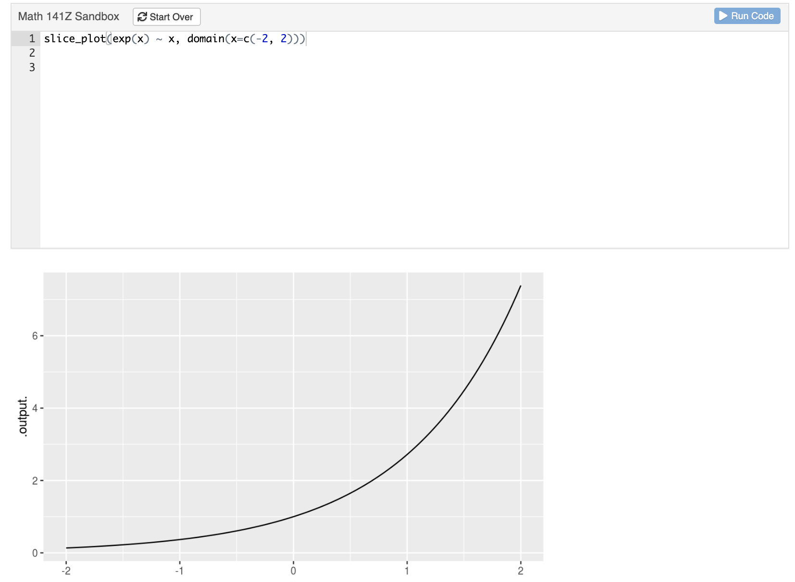

--- 
title: "CalcZ Student Notes"
author: "Daniel Kaplan"
date: "`r Sys.Date()`"
site: bookdown::bookdown_site
documentclass: book
bibliography: [book.bib, packages.bib]
biblio-style: apalike
link-citations: yes
description: "Textbook for Math 141Z/142Z for 2021-2022"
---
```{r include=FALSE, cache=FALSE}
library(mosaic)
library(mosaicCalc)
library(glue)
library(math141Z) # REPLACE THIS WHEN PACKAGES ARE RE-ALIGNED
library(here) # for file locations


exercise_file <- function(day,  file_name, course="141Z") {
    path=glue::glue("Exercises/DD-{course}-{day}/{file_name}")
    here(path)
}

if (!exists("objective_list"))
  objective_list <- list()

add_objective <- function(ID, text) {
  objective_list[[length(objective_list) + 1]] <<-
                      list(ID = ID, text = text)
}

state_objective <- function(ID, text) {
  add_objective(ID, text)
  format_objective(list(ID=ID, text=text))
}

format_objective <- function(obj) {
  knitr::asis_output(glue::glue("#. **[{obj$ID}]** *{obj$text}*\n\n"))
}

show_objectives <- function() {
  Tmp <- lapply(objective_list, tibble::as_tibble) %>%
    bind_rows()
  readr::write_csv(Tmp, file="objective-list.csv")

  lapply(objective_list, format_objective) %>%
    unlist() %>%
    paste(collapse="\n") %>%
    knitr::asis_output()
}

# A blank image for spacing
BlankImage <- gf_blank(hp ~ wt, data=mtcars) %>% gf_theme(theme_void())
```

# Welcome to calculus {.unnumbered}

Calculus is the set of concepts and techniques that provide the main mathematical basis for dealing with motion, growth, decay, and oscillation.  The phenomena can be as simple as a ball arcing through the air to as complex as the airflow over a wing that generates lift. Calculus is used in biology and business, chemistry, physics and engineering. It is the basis for weather prediction, understanding climate change, the algorithms for heart rate and blood oxygen measurement by wristwatches. It is a major part of the language of science, of logistics. The electron orbitals of chemistry, the stresses of bones and beams, and the business cycle of recession and rebound are all understood primarily through calculus. 

Calculus has been central to science from the very beginnings. It is no coincidence that the scientific method was introduced and the language of calculus was invented by the same small group of people during the historical period known as the enlightenment. Learning calculus has always been a badge of honor and an entry ticket to professions. Millions of students career ambitions have been enhanced by passing a calculus course or thwarted by lack of access to one.

In the 1880s, a hit musical featured a man who was "the very model of a modern major general."  One of his claims for modernity was that "I'm very good at integral and differential calculus." [Watch here](https://www.youtube.com/watch?v=Rs3dPaz9nAo)

Of course, what was modern in 1880 is not modern anymore. Yet, amazingly, calculus today is every bit as central to science and technology as it ever was, and is much more important to logistics, economics and myriad other fields than every before. 
In the last 20 years, calculus has become even more important. There's a very concrete reason for this. Science, engineering, and society have now fully adopted the computer for almost all aspects of work, study, and life. The amount of data collected and used has exploded. Machine learning has become the way human decision makers interact with such data.

Think about what it means to become "computerized." To take an everyday example, consider video. Over the span of a human life we moved from a system which involved people going to theaters to watch the shadows recorded on cellulose film to the distribution over the airwaves by low-resolution television, to the introduction of high-def broadcast video, to on demand streaming from huge libraries of movies. Just about anyone can record, edit, and distribute their own video. The range of topics (including calculus) on which you can access a video tutorial or demonstration is incredibly vast. All of this recent progress is owed to computers.

The "stuff" that computers operate on, transform and transmit is always mathematical representations stored as bits. The creation of mathematical representations of objects and events in the real world is essential to every task of any sort that any computer performs. Calculus is a key component of inventing and using such representations.

You may be scratching your head. If calculus is so important, why is it that many of your friends who took calculus came away wondering what it is for? What's so important about "slopes" and "areas" and how come your high-school teacher couldn't tell you what calculus is for?

The disconnect between the enthusiasm expressed in the preceding paragraphs and the lived experience of students is very real. There are two major reasons for that disconnect, both of which we tackle head-on in this book.

First, teachers of mathematics have a deep respect for tradition. Such respect has its merits but the result is that almost all calculus is taught using methods that were appropriate for the era of paper and pencil, but not for the computer era. As you will see, in this book we express the concepts of calculus in a way that carries directly over to the uses of calculus on computers and in genuine work.

Second, the uses of calculus are enabled not by the topics of Calc I and Calc II, but the courses for which I/II are a preliminary: linear algebra and dynamics. Only a small fraction of students who start in Calc I ever reach the parts of calculus that are the most useful.

Fortunately, there is a large amount of bloat in the standard textbook topics of Calc I/II which can be removed to make room for the genuinely important topics. 

## Computing and apps {.unnumbered}

The text provides two complementary ways to access computing. The most intuitive is designed purely to exercise and visualize mathematical concepts through mouse-driven, graphical ***apps***. To illustrate, here is an app that we'll use in Block 6. You can click on the snapshot to open the app in your browser.

<a href="https://maa-statprep.shinyapps.io/142Z-Matrix-iteration/" target="_blank"></a>

More fundamentally, you will be carrying out computing by composing computer commands and text and having a computer carry out the commands. One good way to do this is in a ***sandbox***, a kind of app which provides a safe place to enter the commands. You'll open the sandbox (click on the image below) in your browser. 

<a href="https://maa-statprep.shinyapps.io/141Z-Student-sandbox" target="_blank"></a>

::: {.todo}
Update the image and link to the new version of the sandbox app.
:::


Once you've entered the computer commands, you press a button to have the commands carried out.

::: {.tip}
You may prefer to install the R and RStudio software on your own laptop. This usually provides a faster response to you and lowers the load on the sandbox cloud servers being used by other students. 

Experienced R users may even prefer to skip the sandbox entirely and use the standard resources of RStudio to edit and evaluate their computer commands. You'd use exactly the same R commands regardless of whether you use a cloud server or your own laptop.
:::

An important technique for teaching and learning computing is to present ***scaffolding*** for computer commands. At first, the scaffolding may be complete, correct commands that can be cut-and-paste into a ***sandbox*** where the calculation will be carried out. Other times it will be left to the student to fill in some part that's been left out of the scaffolding. For example, when we introduce drawing graphs of functions and the choice of a domain, you might see a scaffold that has blanks to be filled in:

::: {.scaffold}
```{r eval=FALSE}
slice_plot( exp(-3*t) ~ t, domain( --fill in domain-- ))
```
:::

You can hardly be expected at this point to make sense of any part of the above command, but soon you will. 

## Exercises and feedback {.unnumbered}


Learning is facilitated by rapid, formative feedback. Many of the exercises in this book are arranged to give this. 

```{r child=exercise_file("01", "exercise-intro.Rmd")}
```

## [[Taken out. Is there any use for it?]]

There's mathematics ... and then there's the real world. The term ***mathematical modeling*** is about constructing representations of situations or phenomena in the real world in terms of mathematical objects. The advantage of being able to construct models is that models are easy to study, explore, take apart, do experiments on, and deduce the implications of.

We use computers to interact with the world, whether that be record-keeping, communications, media displays, and so on. The "things" that computers work with are always mathematical representations of the real world: models. Computers carry out operations on models. For instance, sound is a real-world phenomenon that resides somewhere between the vibrations of air and the psycho-acoustics of the brain. A simple computer representation of sound is constructed using mathematical stuff: a long series of numbers. Suppose we want to *slow down* sound (say, for someone learning a foreign language) or to speed it up (to get through a slow-paced video) or to translate it into text. The technologies for doing these things are almost always implemented by doing arithmetic or more complicated mathematical procedures on the mathematical stuff.

A major theme of this course is how to make such mathematical representations of real-world phenomena and how to work with the representations to extract the results we want. In particular, we will focus on representations in the form of mathematical functions. (There are other mathematical representations, but functions have a special importance and are ubiquitous in scientific work and computing.) 


<!--chapter:end:index.Rmd-->

```{r include=FALSE, cache=FALSE}
library(mosaic)
library(mosaicCalc)
library(glue)
library(math141Z) # REPLACE THIS WHEN PACKAGES ARE RE-ALIGNED
library(here) # for file locations


exercise_file <- function(day,  file_name, course="141Z") {
    path=glue::glue("Exercises/DD-{course}-{day}/{file_name}")
    here(path)
}

if (!exists("objective_list"))
  objective_list <- list()

add_objective <- function(ID, text) {
  objective_list[[length(objective_list) + 1]] <<-
                      list(ID = ID, text = text)
}

state_objective <- function(ID, text) {
  add_objective(ID, text)
  format_objective(list(ID=ID, text=text))
}

format_objective <- function(obj) {
  knitr::asis_output(glue::glue("#. **[{obj$ID}]** *{obj$text}*\n\n"))
}

show_objectives <- function() {
  Tmp <- lapply(objective_list, tibble::as_tibble) %>%
    bind_rows()
  readr::write_csv(Tmp, file="objective-list.csv")

  lapply(objective_list, format_objective) %>%
    unlist() %>%
    paste(collapse="\n") %>%
    knitr::asis_output()
}

# A blank image for spacing
BlankImage <- gf_blank(hp ~ wt, data=mtcars) %>% gf_theme(theme_void())
```
# CalcZ Project Development Plan {.unnumbered}

```{r include=FALSE}
dd1 <- function(days, course=c("141Z", "142Z")) {
  course <- match.arg(course)
  raw_days <- days <- as.character(days)
  days <- ifelse(nchar(days) < 2, 
                 paste0("0", days),
                 days)
  path <- if (course == "142Z") {
    "https://maa-statprep.shinyapps.io/142Z-DD-"
  } else {
     "https://maa-statprep.shinyapps.io/141Z-daily-digital-"
  }
    
  path <- paste0(path, days)
  
  links <- glue::glue("[DD-{days}]({path})")
  paste0(links, collapse=", ")
}
dd2 <- function(days) {
  dd1(days, course="142Z")
}
```


This document reflects the developing text for Math141Z/142Z in AY 2021-2022 at the US Air Force Academy. This section describes to prospective instructors and project collaborators the planned schedule for the book and links to the materials developed in AY 2020-2021.

Note that nothing in this book necessarily reflects any official policy of the US Air Force Academy or the US government more generally.

## Development schedule {.unnumbered}

- 1 June 2021: Complete usable draft of Block 1 (Functions)
- 7 June 2021: Deployment of CalcZ R sandbox
- 15 June 2021: Complete usable draft of Block 2 (Differencing)
- 30 June 2021: Complete usable draft of Block 3 (Accumulation)
- 15 July 2021: Re-organization of relevant `{mosaicCalc}` and `{CalcZ}` R packages.
- 1 August 2021: Deployment of Shiny apps for Blocks 1-3.
- 1 August 2021: Revisions to Blocks 1, 2, and 3 and deployment in a student-facing form
- 31 September 2021: Complete usable draft of Block 4 (Applications of calculus)
- 30 October 2021: Complete usable draft of Block 5 (Linear combinations)
- 31 November 2021: Complete usable draft of Block 6 (Dynamics)
- 1 December 2021: Student-facing form of entire book deployed.

## Resources from AY 2020-2021 {.unnumbered}

### Software {.unnumbered}

Note that the book itself and the multiple-choice questions with feedback included in the book, require only a browser. No software needs to be installed.

Computational exercises can be handled with a "sandbox" app that, similarly, requires only a browser. 

The [R Command Guide](https://maa-statprep.shinyapps.io/141Z-R_command_guide/) from AY 2020-2021 will be integrated into the book.

The Daily Digitals from AY 2020-2021 have integrated R consoles that are sufficient for all computations in the course. 

You can also use RStudio directly. After installing R and RStudio, install Rtools from [here](https://cran.rstudio.com/bin/windows/Rtools/). 

You will then need to run the following commands and install the following packages:
```r
install.packages(c("mosaic", "ggplot2", "ggformula", "MMAC"))
writeLines('PATH="${RTOOLS40_HOME}\\usr\\bin;${PATH}"', con = "~/.Renviron")
install.packages("tidyverse")
install.packages("remotes")
remotes::install_github("ProjectMosaic/mosaicCalc", ref="beta", upgrade = "always")
remotes::install_github("dtkaplan/math141Z", ref="master", upgrade = "always")
```

Collaborators who wish to compile the book will need to use the RStudio interface and install several additional packages. Be a volunteer to identify these packages! Start with a fresh installation of R and RStudio and work with Danny to get a comprehensive list. (It's hard for me to do this since I have the packages installed on the computers I use and don't want to start over with a brand-new installation to make sure I've got them all.)

### Exercises {.unnumbered}

**Daily digitals** containing student exercises. Some contain narrative that will be folded in to this book.

[NOTE: This is a quick pass through the links. Some will be broken or lead to a different topic]

1. Functions `r dd1(1:12)`
2. Linear Combinations `r dd1(13:25)`
3. Differencing `r dd1(26:38)`
4. Accumulation `r dd2(1:12)`
5. Dynamics `r dd2(13:25)`
6. Decision-making `r dd2(26:38)`

### Projects from AY 2020-2021 {.unnumbered}

1. [Spread of ebola](https://dtkaplan.github.io/CalcZ/project-lessons-from-ebola.html) (sigmoidal functions)
#. [Engines big and small](https://dtkaplan.github.io/CalcZ/project-engines-big-and-small.html) (dimensions, linear combinations)
#. [Walking the gradient](https://dtkaplan.github.io/CalcZ/project-gradient-ascent.html) (derivatives, optimization, modeling)
#. [Gears and grades](https://dtkaplan.github.io/CalcZ/project-gears-and-grades.html)
#. [Driving with integrals](https://maa-statprep.shinyapps.io/142Z-driving-with-integrals/) (accumulation, function composition)
#. Intervening in an epidemic (dynamics)
#. [Security and life](https://maa-statprep.shinyapps.io/142Z-Project3/) (decision making)

### Apps {.unnumbered}

Some of these were used as part of Daily Digital assignments, some were not used. There are also some apps integrated with the Daily Digitals. These will be provided as stand-alone apps.


#. [Numerics of search](https://maa-statprep.shinyapps.io/141Z-numerics-of-search/) optimization, zero finding not yet included.
#. [Average vs marginal](https://maa-statprep.shinyapps.io/141Z-average_marginal/)
#. [Interpolation explorer](https://maa-statprep.shinyapps.io/142Z-Interpolation/)
#. [Euler for DE](https://maa-statprep.shinyapps.io/142Z-DE-Euler/)
#. [Balancing functions to solve a DE](https://maa-statprep.shinyapps.io/142Z-balance-logistic/)
#. [Eigenflows](https://maa-statprep.shinyapps.io/142Z-Eigenflows/)
#. [Matrix iteration](https://maa-statprep.shinyapps.io/142Z-Matrix-iteration/)
#. [Using the SIR model](https://maa-statprep.shinyapps.io/using-the-SIR-model)

Some apps that aren't graphic:

#. [Instructor sandbox](https://maa-statprep.shinyapps.io/141Z-Instructor-sandbox/) containing blank sandboxes for use outside of the Daily Digitals. (This will be revised for AY 2021-2022.)
#. [Student sandbox]() is like the instructor sandbox. It will also be revised for AY 2021. The revised version, as it will be deployed is the main computational resource for students not using RStudio. It will be beefed up to handle hundreds of students simultaneously. In AY 2021-2022 we will be using an MAA-StatPREP server, which is open to everyone. Thereafter, we will switch servers. We're not sure how this will be set up, but there are several arrangement which can already be used by schools or students.

    a. Schools can deploy their own Shiny/RStudio servers or use a service like `shinyapps.io`.
    b. Small groups of students can be handled with the "free tier" account on `shinyapps.io`.
    c. Students can install RStudio on their laptops and run the sandbox there. Note: There is no tablet version of RStudio.
    d. Students can set up an RStudio.cloud account (which is free) and run the sandbox from there. 
    e. Students or instructors can use the RStudio console or (better) an Rmd document to run the commands needed for the exercises and projects. This will work either on RStudio desktop, an institution's RStudio server, or `rstudio.cloud`
    
The same applies for the apps, but the apps consume relatively little in the way of computer resources, so we will try to have them available on the web with no setup. *Performance* won't be optimal, but at least *access* will be easy.
#. [Basic R syntax](https://maa-statprep.shinyapps.io/141Z-Syntax/). This is just a homework assignment that fell outside the Daily Digital organization.
#. [Swimming records](https://maa-statprep.shinyapps.io/144Z-Swimming-Day-04). This is just a single exercise that wasn't integrated with the Daily Digitals.

<!--chapter:end:Development-outline.Rmd-->

```{r include=FALSE, cache=FALSE}
library(mosaic)
library(mosaicCalc)
library(glue)
library(math141Z) # REPLACE THIS WHEN PACKAGES ARE RE-ALIGNED
library(here) # for file locations


exercise_file <- function(day,  file_name, course="141Z") {
    path=glue::glue("Exercises/DD-{course}-{day}/{file_name}")
    here(path)
}

if (!exists("objective_list"))
  objective_list <- list()

add_objective <- function(ID, text) {
  objective_list[[length(objective_list) + 1]] <<-
                      list(ID = ID, text = text)
}

state_objective <- function(ID, text) {
  add_objective(ID, text)
  format_objective(list(ID=ID, text=text))
}

format_objective <- function(obj) {
  knitr::asis_output(glue::glue("#. **[{obj$ID}]** *{obj$text}*\n\n"))
}

show_objectives <- function() {
  Tmp <- lapply(objective_list, tibble::as_tibble) %>%
    bind_rows()
  readr::write_csv(Tmp, file="objective-list.csv")

  lapply(objective_list, format_objective) %>%
    unlist() %>%
    paste(collapse="\n") %>%
    knitr::asis_output()
}

# A blank image for spacing
BlankImage <- gf_blank(hp ~ wt, data=mtcars) %>% gf_theme(theme_void())
```
# (PART) Block 2: Differentiation {.unnumbered}


<!--chapter:end:Diff-part-marker.Rmd-->

```{r include=FALSE, cache=FALSE}
library(mosaic)
library(mosaicCalc)
library(glue)
library(math141Z) # REPLACE THIS WHEN PACKAGES ARE RE-ALIGNED
library(here) # for file locations


exercise_file <- function(day,  file_name, course="141Z") {
    path=glue::glue("Exercises/DD-{course}-{day}/{file_name}")
    here(path)
}

if (!exists("objective_list"))
  objective_list <- list()

add_objective <- function(ID, text) {
  objective_list[[length(objective_list) + 1]] <<-
                      list(ID = ID, text = text)
}

state_objective <- function(ID, text) {
  add_objective(ID, text)
  format_objective(list(ID=ID, text=text))
}

format_objective <- function(obj) {
  knitr::asis_output(glue::glue("#. **[{obj$ID}]** *{obj$text}*\n\n"))
}

show_objectives <- function() {
  Tmp <- lapply(objective_list, tibble::as_tibble) %>%
    bind_rows()
  readr::write_csv(Tmp, file="objective-list.csv")

  lapply(objective_list, format_objective) %>%
    unlist() %>%
    paste(collapse="\n") %>%
    knitr::asis_output()
}

# A blank image for spacing
BlankImage <- gf_blank(hp ~ wt, data=mtcars) %>% gf_theme(theme_void())
```
# Outline of Block 2 {.unnumbered}

::: {.todo}
This section is for development purposes only. It is not to be included in the released text.
:::

This outline was that established during the May 17-19, 2021 working sessions at USAFA. It's copied directly from the Teams document. I've made some modifications which are noted in [[square brackets]] for deletions and **bold face** for additions..


1. Revisiting Calculating slope
    a. NTI:
    b. Admin:
        i. Sizeable quiz on interlude
    c. Outcomes:
        i. Calculate a slope given two points
        ii. Given a graph of a function, identify graph of its slope function $s(x)$
        iii. Given a graph of the slope function, identify features of the original function
    d. Readings: Chapter \@ref{difference-and-change}

2. Derivatives
    a. NTI:
        i. Explain that limits are the solution to the problem of having an arbitrary $h$ in the slope function
    b. Topics:
        i. Show that there are different definitions of the slope function $s(x)$ that depend on the $h$ selected
        ii. Describe derivative as the limit where $h \rightarrow 0$
        iii. Derivatives of basic modeling functions
        iv. Linear properties of derivatives
        v. [[Derivative is a number; differentiation is an operator]] **We need to introduce operators earlier.
        v. Functions as arguments in R
        vi. Introduce notation: $f'$, $\frac{df}{dx}$, $\partial_x f(x)$, [[$D_x f]]$
        vii. Introduce NaN and Inf
    c. Outcomes:
        i. Find the derivatives of all basic modeling functions
        i. Know the basic properties of differentiation
        i. Continue working graphing a derivative
    d. Readings

3. Relationships between functions and their derivatives Part I
    a. NTIs:
        i. Split students into A/B pairs. A has graph of derivative. B can't see that graph, but can talk to A. B should sketch out the original function based on information from A, who can see B's sketch. Then reveal answer.
    b. Topics:
        i. Argmax/Argmin
        i. Max/min
        i. Critical points
    c. Outcomes: 
        i. Determine a function’s critical points graphically and algebraically
        i. Determine whether a critical point is a max or min
    d. Readings: \@ref(optim-and-shape). It doesn't take much to introduce max and min from graphs, argmax and argmin, and critical points. So the reading can be quite small.

4. Relationships between functions and their derivatives Part II
    a. NTI:
        i. Curvature. Up like a cup, down like a frown
        ii. 2nd derivative indicates curvature
    b. Topics:
        i. Second derivatives are the slope of the slope
        i. Concavity is the slope of the slope
    c. Readings: Chapter \@ref(optim-and-shape) This is the same as the previous days reading. Maybe we should add a section of chains of derivatives, especially for polynomials, showing how they eventually go to zero.

5. Relationships between functions and their derivatives Part III
    a. Topics:
        i. Knowing $f'(x_0) = 0$ tells you there is a min/max/saddle at $x_0$
        ii. 2nd derivative to distinguish between the three
        iii. Chain of derivatives
    b. Outcomes:
        i. Be able to find max/min, argmax/argmin of given functions graphically.
        ii. **Construct derivative function and use `findZeros()` to locate the argmax and evaluate the function to get the corresponding max
    c. Readings Chapter \@ref(optim-and-shape) Still the same as the previous two days. 

6. Continuity, Differentiability, Smoothness, Splines
    a. Topics:
        i. Spline is a piecewise function
        i. Order of continuity
        i. Determine graphically whether a function is continuous or not
        i. Determine order of continuity of a function
    b. Outcomes
        i. **Be able to determine if first derivative of function is continuous from graph of function**
        ii. **Be able to determine if second derivative of function is continuous from graph of function (or by taking the 1st derivative and plotting that)**
        iii. **Be able to demonstrate discontinuities in 3rd derivative of spline**
    c. Readings

7. Differentiation of Products of Functions
    a. Outcomes
        i. Identify when it is necessary to differentiate with product rule
        i. Find the derivative using product rule
    b. Readings

8. Differentiation of Composite Functions
    a. Topics
        i. Identifying a composite function
        i. Chain rule
    b. Homework: Save quotient rule for HW
    c. Outcomes: 
        i. Identify when it is necessary to differentiate with chain rule
        i. Find the derivative using chain rule
    d. Readings

9. Local Polynomial Approximation
    a. NTI:
        i. Killer application of Taylor polynomials when Brook Taylor figured out that tools of Newton developed
    b. Topics:
        i. List the benefits of approximation and specifically the benefits of quadratic approximation as opposed to linear approximation
        ii. [[Average rate of change]] moved to Block 1 slope function 
        iii. Tangent Lines
        iv. Quadratic equations
        v. Factorials
    c. Readings

10. Approximation at a point
    a. NTI:
        i. R exercise in constructing a Taylor polynomial computationally
    b. Outcomes:
        i. Calculate a Taylor polynomial
        ii. Use Taylor polynomials to simplify mathematical operations (derivatives, limits, etc.)


<!--chapter:end:Diff-outline.Rmd-->

```{r include=FALSE, cache=FALSE}
library(mosaic)
library(mosaicCalc)
library(glue)
library(math141Z) # REPLACE THIS WHEN PACKAGES ARE RE-ALIGNED
library(here) # for file locations


exercise_file <- function(day,  file_name, course="141Z") {
    path=glue::glue("Exercises/DD-{course}-{day}/{file_name}")
    here(path)
}

if (!exists("objective_list"))
  objective_list <- list()

add_objective <- function(ID, text) {
  objective_list[[length(objective_list) + 1]] <<-
                      list(ID = ID, text = text)
}

state_objective <- function(ID, text) {
  add_objective(ID, text)
  format_objective(list(ID=ID, text=text))
}

format_objective <- function(obj) {
  knitr::asis_output(glue::glue("#. **[{obj$ID}]** *{obj$text}*\n\n"))
}

show_objectives <- function() {
  Tmp <- lapply(objective_list, tibble::as_tibble) %>%
    bind_rows()
  readr::write_csv(Tmp, file="objective-list.csv")

  lapply(objective_list, format_objective) %>%
    unlist() %>%
    paste(collapse="\n") %>%
    knitr::asis_output()
}

# A blank image for spacing
BlankImage <- gf_blank(hp ~ wt, data=mtcars) %>% gf_theme(theme_void())
```
# Change relationships

The questions that started it all had to do with motion. There were words to describe speed: fast and slow. There were words to describe force: strong and weak, heavy and light. And there were words to describe location: far and near, long and short. But what were the relationships among these things? And how did time fit in, an intangible quantity that had aspects of location (long and short) and of speed (quick and slow)?

Galileo (1564-1642) started the ball rolling. As the son of a musician and music theorist, he had a sense of musical time, a steady beat of intervals. As a student of medicine in Pisa, he noted that swinging pendulums kept reliable time, regardless of the amplitude of their swing. After accidentally attending a lecture on geometry, he turned to mathematics and natural philosophy. Inventing the telescope, his observations put him on a collision course with the accepted classical truth about the nature of the planets. Seeking to understand gravity, he built an apparatus that enabled him to measure accurately the position in time of a ball rolling down a straight ramp. The belled gates he set up to mark the ball's passage were spaced arithmetically in musical time: 1, 2, 3, 4, .... But the distance between the gates was geometric: 1, 4, 9, 16, .... Thus he established a mathematical relationship between increments in time and increments in position. Time advanced as 1, 1, 1, 1, ... and position as 1, 3, 5, 7, .... He observed that the ***second*** increments of position, the increments of the increments 1, 3, 5, 7, ..., were themselves evenly spaced: 2, 2, 2, ....

Putting these observations in tabular form, and adding columns for the 

- first increment  $y(t) \equiv x(t+1) - x(t)$ and the
- second increment $y(t+1) - y(t)$

$t$ | $x(t)$ | first increment | second increment
----|--------|-----------------|---------------
0   | 0      | 1        | 2
1   | 1      | 3        | 2
2   | 4      | 5        | 2
3   | 9      | 7        | 
4   | 16     |          |

Galileo had neither the mathematics nor the equipment to measure motion continuously in time. So what might be obvious to us now, that position is a function of time $x(t)$, would have had little practical significance to him. But we discover in his first increments of $x$ something very much like our ***slope function***. 

$${\cal D}_t\, x(t) \equiv \frac{x(t + 1) - x(t)}{1}$$
From his data, he observed that ${\cal D}_t\, x(t)$ increases linearly in $t$: $${\cal D}_t x(t) = 2 t + 1$$

Calculating the second increments of $x$ is done by the "slope function of the slope function," which we can call ${\cal D}_{tt}$:
$${\cal D}_{tt} x \equiv {\cal D}_t \left[{\cal D}_t x(t)\right] = 2(t+1) + 1 - (2 t + 1) = 2$$

Newton considered the problem for continuous time rather than Galileo's discrete time. He reframed the slope function from the big increments of the slope operator ${\cal D}_t$ to imagined vanishingly small increments of a operator that we shall denote $\partial_t$ and call ***differentiation***.

The kind of question for which Newton wanted to be able to calculate the answer was, "How to find the function $x(t)$ whose second increment, $\partial_{tt} x(t) = 2$?" His approach, which he called the "method of fluxions," became so important that its name became, simply, "Calculus."

```{exercise, name="kid-mean-table"}
```
<details>`r knitr::knit_child("Exercises/Diff/kid-mean-table.Rmd")`</details>


## Slopes and increments.

The mathematical tools of Newton's day are the basis of today's conventional high-school curriculum.^[Perhaps this says something about how well education has kept up with technology.] We have today completely different tools based on the ability to do arithmetic and function evaluation very quickly with computers. We're going to use these new tools to explore the problem of relating the slope-function operator ${\cal D}_t$ to the differential operator $\partial_t$. We have the great advantage of being able to look backwards and so can focus on the functions that experience reveals have been the most widely useful: the basic modeling functions. 

Our goal in this section is to discover what are the slope functions of our basic modeling functions. Recall that the slope-function operator can be written as a ratio of rise-over-run:
$${\cal D}_t x(t) \equiv \frac{x(t+h) - x(t)}{h}$$ where $h$ is the length of the "run." We'll start with two of the basic modeling functions that have considerable "personality": the sinusoid (`sin()`) and the sigmoid (`pnorm()`).

```{r sign-sig, echo=FALSE, out.width="50%", fig.show = "hold", fig.cap="The naked sinusoid and sigmoidal functions. A vertical blue line has been added to mark the input $t=0$", warning=FALSE, message=FALSE}
slice_plot(sin(t) ~ t, domain(t=c(-5, 2*pi))) %>%
  gf_labs(title="Sinusoid") %>%
  gf_vline(xintercept=0, color="blue", alpha=0.5)
slice_plot(pnorm(t) ~ t, domain(t=c(-5, 2*pi))) %>%
  gf_labs(title="Sigmoid") %>%
  gf_vline(xintercept=0, color="blue", alpha=0.5)
```
We'll use the computer to construct the slope functions for the sinusoid and sigmoid, which we'll call `Dsin()` and `Dsigma()` respectively.
```{r}
Dsin   <- makeFun((  sin(t+h) -   sin(t))/h ~ t, h=0.1)
Dsigma <- makeFun((pnorm(t+h) - pnorm(t))/h ~ t, h=0.1)
```

In the tilde expression handed to `makeFun()`, we've identified `t` as the name of the input and given a "small" default value to the `h` parameter. But R recognizes that both `Dsin()` and `Dsigma()` are functions of two variables, `t` and `h`, as you can see in the parenthesized argument list for the functions.
```{r}
Dsin
Dsigma
```
This is a nuisance, since when using the slope functions we will need always to think about `h`, a number that we'd like to describe simply as "small," but for which we always need to provide a numerical value. Let's look at `Dsin()` and `Dsigma()` for a range of values of `h`, as in Figure \@ref(fig:sin-sig-many-h).

```{r sin-sig-many-h, echo=FALSE, out.width="50%", fig.show = "hold", fig.cap="The slope functions of the sinusoid and sigmoid. Each curve shows the slope function for a particular numerical choice of `h`. Both panels show $h=2, 1, 0.5, 0.1, 0.01, 0.001, 0.0001, 0.00001, 0.000001$.", warning=FALSE, message=FALSE}
rain <- rev(hcl.colors(12)[-(1:3)])
slice_plot(Dsin(t, h=1) ~ t, domain(t=c(-5, 2*pi)), color=rain[1], label_text="h=1", label_x=0.56) %>%
  slice_plot(Dsin(t, h=2) ~ t, alpha = 1, label_text="h=2", label_x=.58, color=rain[1]) %>%
  slice_plot(Dsin(t, h=0.5) ~ t, alpha = 1, label_text="h=0.5", label_x=.54, color=rain[3]) %>%
  slice_plot(Dsin(t, h=0.1) ~ t, alpha = 1, label_text="h=0.1", label_x=.53, color=rain[4]) %>%
  slice_plot(Dsin(t, h=0.01) ~ t, alpha = 1, label_text="h=0.01", label_x=.51, color=rain[5]) %>%
  slice_plot(Dsin(t, h=0.001) ~ t, alpha = 1, color=rain[6], label_text="h=0.001", label_x=.5) %>%
  slice_plot(Dsin(t, h=0.0001) ~ t, alpha = 1, color=rain[7], label_text="h=0.0001", label_x=.49) %>%
  slice_plot(Dsin(t, h=0.00001) ~ t, alpha = 1, color=rain[8], label_text="h=0.00001", label_x=.48) %>%
  slice_plot(Dsin(t, h=0.000001) ~ t, alpha = 1, color=rain[9], label_text="h=0.000001", label_x=.44) %>%
  gf_labs(title="Slope functions of sinusoid") %>%
  gf_vline(xintercept=0, color="blue", alpha=0.5)
slice_plot(Dsigma(t, h=1) ~ t, domain(t=c(-5, 2*pi)), label_text="h=1", label_x=.28, color= rain[2]) %>%
  slice_plot(Dsigma(t, h=2) ~ t, alpha = 1, label_text="h=2", label_x=.24, color=rain[1]) %>%
  slice_plot(Dsigma(t, h=0.5) ~ t, alpha = 1, label_text="h=0.5", label_x=.54, color=rain[3]) %>%
  slice_plot(Dsigma(t, h=0.1) ~ t, alpha = 1, label_text="h=0.1", label_x=.53, color=rain[4]) %>%
  slice_plot(Dsigma(t, h=0.01) ~ t, alpha = 1, label_text="h=0.01", label_x=.51, color=rain[5]) %>%
  slice_plot(Dsigma(t, h=0.001) ~ t, alpha = 1, color=rain[6], label_text="h=0.001", label_x=.5) %>%
  slice_plot(Dsigma(t, h=0.0001) ~ t, alpha = 1, color=rain[7], label_text="h=0.0001", label_x=.49) %>%
  slice_plot(Dsigma(t, h=0.00001) ~ t, alpha = 1, color=rain[8], label_text="h=0.00001", label_x=.48) %>%
  slice_plot(Dsigma(t, h=0.000001) ~ t, alpha = 1, color=rain[9], label_text="h=0.000001", label_x=.44) %>%
  gf_labs(title="Slope functions of sigmoid") %>%
  gf_vline(xintercept=0, color="blue", alpha=0.5)
```

Some observations from this numerical experiment:

1. As $h$ gets very small, the slope function doesn't depend on the exact value of $h$.

    This will provide a way for us, eventually, to discard $h$ so that the slope function will not need an $h$ argument.
    
2. For small $h$, we have ${\cal D}_t \sin(t) = \sin(t + \pi/2) = \cos(t)$. That is, taking the slope function of a sinusoid gives another sinusoid, shifted left by $\pi/2$ from the original. Or, in plain words, the cosine is the slope function of the sine.
3. For small $h$, we have ${\cal D}_t \text{pnorm}(t) = \text{dnorm(t)}$. That is, the hump function is the slope function of the sigmoid function.

You can confirm these last two statements by comparison with the original functions, especially the alignment of the peaks of the slope functions with respect to the peak of the sinusoid and the half-way point of the sigmoid.

Now consider the slope functions of the logarithm and exponential functions.

```{r log-exp-many-h, echo=FALSE, out.width="50%", fig.show = "hold", fig.cap="The slope functions of the logarithm and exponential.", warning=FALSE, message=FALSE}
rain <- rev(hcl.colors(12)[-(1:3)])
Dlog <- makeFun((log(x+h) - log(x))/h ~ x)
Dexp <- makeFun((exp(x+h) - exp(x))/h ~ x)
slice_plot(Dlog(t, h=1) ~ t, domain(t=c(0.01, 2)), color=rain[2], label_text="h=1", label_x=0.8) %>%
  slice_plot(Dlog(t, h=2) ~ t, domain(t=c(0.01, 2)), alpha = 1, label_text="h=2", label_x=.90, color=rain[1]) %>%
  slice_plot(Dlog(t, h=0.5) ~ t, domain(t=c(0.02, 2)), alpha = 1, label_text="h=0.5", label_x=.7, color=rain[3]) %>%
  slice_plot(Dlog(t, h=0.1) ~ t, alpha = 1, label_text="h=0.1", label_x=.6, color=rain[4]) %>%
  slice_plot(Dlog(t, h=0.01) ~ t, alpha = 1, label_text="h=0.01", label_x=.5, color=rain[5]) %>%
  slice_plot(Dlog(t, h=0.001) ~ t, domain(t=c(0.05, 2)), alpha = 1, color=rain[6], label_text="h=0.001", label_x=.4) %>%
  slice_plot(Dlog(t, h=0.0001) ~ t, domain(t=c(0.1, 2)), alpha = 1, color=rain[7], label_text="h=0.0001", label_x=.3) %>%
  slice_plot(Dlog(t, h=0.00001) ~ t, domain(t=c(0.125, 2)), alpha = 1, color=rain[8], label_text="h=0.00001", label_x=.2) %>%
  slice_plot(Dlog(t, h=0.000001) ~ t, domain(t=c(0.125, 2)),alpha = 1, color=rain[9], label_text="h=0.000001", label_x=.1) %>%
  gf_labs(title="Slope functions of logarithm") %>%
  gf_vline(xintercept=0, color="blue", alpha=0.5) %>%
  gf_lims(y=c(0,8))
slice_plot(Dexp(t, h=1) ~ t, domain(t=c(-2, 2)), label_text="h=1", label_x=.4, color= rain[2]) %>%
  slice_plot(Dexp(t, h=2) ~ t, alpha = 1, label_text="h=2", label_x=.3, color=rain[1]) %>%
  slice_plot(Dexp(t, h=0.5) ~ t, alpha = 1, label_text="h=0.5", label_x=.5, color=rain[3]) %>%
  slice_plot(Dexp(t, h=0.1) ~ t, alpha = 1, label_text="h=0.1", label_x=.55, color=rain[4]) %>%
  slice_plot(Dexp(t, h=0.01) ~ t, alpha = 1, label_text="h=0.01", label_x=.6, color=rain[5]) %>%
  slice_plot(Dexp(t, h=0.001) ~ t, alpha = 1, color=rain[6], label_text="h=0.001", label_x=.65) %>%
  slice_plot(Dexp(t, h=0.0001) ~ t, alpha = 1, color=rain[7], label_text="h=0.0001", label_x=.75) %>%
  slice_plot(Dexp(t, h=0.00001) ~ t, alpha = 1, color=rain[8], label_text="h=0.00001", label_x=.85) %>%
  slice_plot(Dexp(t, h=0.000001) ~ t, alpha = 1, color=rain[9], label_text="h=0.000001", label_x=.9) %>%
  gf_labs(title="Slope functions of exponential") %>%
  gf_vline(xintercept=0, color="blue", alpha=0.5) %>%
  gf_lims(y=c(0,8))
```
These numerical experiments with the logarithm and exponential functions are more evidence that, as $h$ gets small, the slope function doesn't depend on $x$. And, we find that:

- For small $h$, the slope function of the logarithm is a power-law function: ${\cal D}_t \ln(t) = \frac{1}{t}$.
- For small $h$, the slope function of the exponential is the exponential itself: ${\cal D}_t e^x = e^x$.

You can confirm these by evaluating the slope function of the exponential at $t=0$ and $t=1$, and the slope function of the logarithm at $t= 2, 1, 1/2, 1/4, 1/8.$

Such numerical experiments on the other naked modeling functions reveal a pattern: the slope function of the naked modeling functions tend to be similar to other naked modeling functions.

```{r child="D-naked-functions.Rmd"}
```


With this list of experimentally determined slope functions (for small $h$) we're ready to start using slope functions without having to use left-shift combinations like $f(t+h) - f(t)$.

```{exercise, name="lion-find-bowl"}
```
<details>`r knitr::knit_child("Exercises/Fun/lion-find-bowl.Rmd")`</details>

## Slopes and motion

Having worked out a theory of slope functions, Newton was ready to express the laws of motion in continuous time. He did this by expressing position as $x(t)$, and then familiar concepts velocity and force in terms of slope functions of position and the "quantity of matter," which we call "mass." 

- Velocity is the slope function of position: $v(t) \equiv {\cal D}_t x(t)$.
- Net force is the slope function of velocity times mass: $F(t) \equiv m {\cal D}_t v(t)$

To take mass out of the formulation, we give a name specifically to the slope function of velocity; we call it ***acceleration***. 

- Acceleration is the slope function of velocity: $a(t) \equiv {\cal D}_t v(t)$.

With acceleration as a concept, we can define net force as mass times acceleration.

::: {.why}
We used **net force** as the quantity we related to mass and the slope function of velocity. There are different sources of forces which add up and can cancel out. Famously, Newton formulated the ***law of universal gravitation*** which ascribed the force between masses as proportional to the product of the two masses and inversely proportional to the square of the distance between them. But a mass on a table has no net force on it, since the table pushes back (push = force) on the mass to cancel out the force due to gravity. "Net force" takes such cancellation into account.
:::

## Differentiation

***Differentiation*** is a process of transforming a function to produce another function. There are several traditional notations for differentiation of a function named $f()$, for instance:

- Leibnitz: $\frac{df}{dx}$
- Partial: $\frac{\partial f}{\partial x}$
- One-line: $\partial_x f$
- Newton: $\dot{f}$
- Prime: $f'$

In this book, we will mainly use the one-line notation, $\partial_x f$, but it means exactly the same as the Leibnitz and Partial notations, which are much more widely used in textbooks. 

If you've studied calculus before, you have likely seen the $f'$ notation. This is admirably concise but is only viable in a narrow circumstance: functions that take a single input. What $f'$ leaves out is a means to specify a crucial aspect of differentiation, the **with-respect-to variable**. The general situation for differentiation involves functions of one or more variables, for example, $g(x, y, z)$. For such functions, you need to specify which is the with-respect-to variable. For instance, we can differentiate $g()$ three different ways, each way incrementing one or another of the three inputs:

$$\partial_z g(x, y, z) \equiv \frac{g(x, y, z+h) - g(x, y, z)}{h}\\ 
\ \\
\partial_x g(x, y, z) \equiv \frac{g(x+h, y, z) - g(x, y, z)}{h}\\ 
\ \\
\partial_y g(x, y, z) \equiv \frac{g(x, y+h, z) - g(x, y, z)}{h}$$

At this point in your studies, you haven't seen why you might choose to differentiate a function with respect to one variable or another. That will come in time. But we want to set you up with notation that won't narrow your options.

Both the Leibnitz and Partial notations are explicit in identifying the function and the with-respect-to-variable. For example, using the Partial differentiation notation, the three ways of differentiating our example function $g(x, y, z)$ are labeled :

$$\frac{\partial f}{\partial x},\ \ \ \frac{\partial f}{\partial y},\ \ \text{and}\ \ \frac{\partial f}{\partial z}$$

Our R/mosaic computer differentiation is longer but explicit:
```r
D(g(x, y, z) ~ x)
D(g(x, y, z) ~ y)
D(g(x, y, z) ~ z)
```
Notice that the R/mosaic operator is named `D()` and that it is a function. It follows the same pattern as `makeFun()` or `slice_plot()` or `contour_plot()`: the first argument is a tilde expression, for instance `g(x, y, z) ~ x`, which identifies the mathematical function to work with (`g()`) and the name of the with-respect-to input to that function. The R/mosaic notation makes it clear that differentiation is an ***operation*** on a function. The `D()` operator takes a function as input and produces as output **another function**. We've seen similar behavior with, say, `slice_plot()`, which takes a function as input and produces graphics as output. Both `D()` and `slice_plot()` need to know the identity of the with-respect-to variable as well as the function to work with. What's why both pieces of input are packaged into a tilde expression.

::: {.why}
We're calling `D()` an ***operator*** rather than a ***function***. The reason is purely for communication with other people. There are so many "functions" in a calculus course that we thought it would be helpful to distinguish between the kinds of functions that take quantities as input and produce a quantity as output, and the functions that take a *function* as input and produce a *function* as output. Both sorts are called "functions" in R terminology. But a sentence like, "Differentiation is a function that takes a function as input and produces a function as output," true though it be, is dizzying.
:::

::: {.takenote}
It is a fact of mathematical and scientific life that a variety of notations are used for differentiation. To some extent, this reflects historical precedence and, to be honest, nationalistic European politics of the 18th century. To make sense of mathematical writing in the many areas in which calculus is used, you have to recognize all of them for what they are. Your skill will be enhanced if you also memorize the names of the different styles. It's not all that different from the pattern in English of having multiple words for the same sort of object, for instance: car, automobile, junker, ride, wheels, crate, jalopy, limo, motor car, horseless carriage. 

In the days when carriages where pulled by horses, the phrase "horseless carriage" made a useful distinction. Today, when horses are rarely seen on the road, it make sense to trim down the notation to its essentials: ~~~horseless~~~ **car**~~~iage~~~. Think of $\partial_x$ as this sort of minification.^[Yes, "minification" is a word!]   
:::

## Dimension of derivatives

Recall that the differencing operator takes as input a function and returns as output another function that takes the same kind of input, but produces a different kind of output. 

For instance, suppose the function `pressure()` takes an altitude as input (in km) and returns a pressure (kPA--air pressure at sea level is about 100 kiloPascal).

The derivative function, let's call it `d_pressure()`, also takes an input in km, but produces an output in kPA per km: a rate.

You can see this by examining the differencing operator itself:

$${\cal D}_x f(x) \equiv \frac{f(x+h) - f(x)}{h}$$

Remember the notation for dimensions. A quantity $x$ has dimensions denoted as $[x]$. (This is nothing more than saying, "Pronounce '$[x]$' as 'the dimensions of $x$'.")
The input to $f()$ has dimension $[x]$. The output from $f()$ has dimension $[f(x)]$.

What is the dimension of $h$? (We could write this question more simply, "What is $[h]$?) Since the operator adds $x + h$, it must be that $[h] = [x]$.

What is the dimension of $f(x + h) - f(x)$? (Again, we could ask this more simply, "What is $[f(x+h) - f(x)]$?") Since we're subtracting two quantities, the two quantities must have the same dimension and the result is also that dimension. So $[f(x+h) - f(x)] = [f(x)]$.

The output of the function $df(x)$ produced by $\mbox{Diff}(f)$ therefore has dimension $[f(x)] / [x]$.

```{exercise, name="kitten-put-kayak"}
```
<details>`r knitr::knit_child("Exercises/Diff/kitten-put-kayak.Rmd")`</details>


```{exercise, name="rat-take-fork"}
```
<details>`r knitr::knit_child("Exercises/Diff/rat-take-fork.Rmd")`</details>


## Using h

In working with differentiation, we introduced a quantity $h$ and then ignored it, saying that it doesn't really matter so long as it is "small." A reasonable person might wonder what "small" really means, and why we needed to introduce $h$ in the first place if we were eventually going to ignore it. 

One reason is that "small" and "zero," although related, are different. For example, refering to the slope functions `Dsin()` and `Dsigma()` that we created in an early example in this chapter, we see that setting $h$ to zero does not get us where we need to be:

```{r}
Dsin(t=1, h=0)
Dsigma(t=0, h=0)
```

In `NaN`, you can hear the echo of your fourth-grade teacher reminding you that it is illegal to divide by zero.

Think of $h$ as the solvent in paint. You don't want the solvent once the paint is on the wall; wet paint is a nuisance. But getting the paint from the can to the wall absolutely needs the solvent. 

We used the solvent $h$ earlier in the chapter in the numerical experiments that led us to the derivatives of the naked modeling functions, for instance $\partial_x e^x = e^x$ or $\partial_x \sin(x) = \cos(x)$.  Eventually, we'll construct an $h$-free theory of differentiation, reducing the process to a set of algebraic rules in which $h$ never appears. With this as our goal, let's continue using $h$ for a while to find some additional useful facts about derivatives.

***Linear combination*** is one of the ways in which we make new functions from existing functions. As you recall, linear combination involves ***scaling*** a function and ***adding*** the scaled functions. We can easily use $h$ to show what is the result of differentiating a linear combination of functions. We'll use $f(x)$ and $g(x)$ as the names that could stand for any function whatsoever. And we'll let $b$ be the name of a scalar. First, let's figure out what is $\partial_x\, b f(x)$, Going back to writing $\partial_x$ in terms of a slope function:
$$\partial_x\, b\,f(x) = \frac{b\, f(x + h) - b\,f(x)}{h}\\
\ \\
= b \frac{f(x+h) - f(x)}{h} = b\, \partial_x f(x)$$
In other words, if we know the derivative $\partial_x\, f(x)$, we can easily find the derivative of any scaled version of $f()$.

Now consider the derivative of the sum of two functions, $f(x)$ and $g(x)$:
$$\partial_x\, \left[f(x) + g(x)\right] =\\
\ \\
=\frac{\left[f(x + h) + g(x + h)\right] - \left[f(x) + g(x)\right]}{h} = \\
\ \\
= \frac{\left[f(x+h) -f(x)\right] + \left[g(x+h) - g(x)\right]}{h}\\
\ \\
= \frac{\left[f(x+h) -f(x)\right]}{h} + \frac{\left[g(x+h) - g(x)\right]}{h}\\
\ \\
= \partial_x\, f(x) + \partial_x\, g(x)$$

Using these two rules together, we can differentiate any linear combination of functions in terms of the differentiated functions themselves:

$$\partial_x\ \left[\strut a_1 g_1(x) + a_2 g_2(x) + a_3 g_3(x) + \cdots\right] =\ \ \ \ \ \ \ \ \ \ \\
\ \\
\ \ \ \ \ \ \ \ \ a_1 \partial_x\, g_1(x) + a_2 \partial_x\, g_2(x) + a_3 \partial_x\, g_3(x) + \cdots$$


Because of the way that $\partial_x$ can be "passed through" a linear combination, mathematicians say that differentiation is a ***linear operator***. Consider this new fact about differentiation as a down payment on what will eventually become a complete theory telling us how to differentiate a ***product of two functions*** or the ***composition of two functions***. 

EXERCISES: Simple drill on this


## Differencing

Our basic tool for showing difference and slope is a remarkably simple operator that takes a function as input. For a function with one input, the operator ${\cal D}()$ is defined as 
$${\cal D}(f) \equiv \frac{f(x + 0.1) - f(x)}{0.1}$$
Notice that the ${\cal D}()$ operator returns a **function**. The output is a linear combination of the input function $f()$ and a shifted version of $f()$.

For a function with two inputs, there are two versions of ${\cal D}$:
$${\cal D}_x(f) \equiv \frac{f(x+0.1, y) - f(x, y)}{0.1}$$

$${\cal D}_y(f) \equiv \frac{f(x, y+0.1) - f(x, y)}{0.1}$$


::: {.workedexample}
Suppose that $f(x)\equiv x^2$. What is the function ${\cal D}(f)$?

$$
{\cal D}(f) \equiv \frac{f(x+0.1) - f(x)}{0.1}\\ =
10\left((x+0.1)^2 - x^2\right)\\
=10 x^2 + 2x + 0.1 - 10x^2\\ = 2 x + 0.1$$
:::

::: {.workedexample}
Suppose that $f(x) \equiv 2 x + y$. Find the function ${\cal D_x(f)}$.

The linear combination will be 
$$\frac{1}{0.1}\left(\left[2 (x + 0.1) + y\right] - \left[2 x + y\right]\right) =\\ \\
20 x + 2 + 10y - \left[20 x - 10y\right] = 2$$
:::

```{r}
f <- makeFun(2 *x * y ~ x + y)
D(f(x, y) ~ x)
```


## Instantaneous rate of change

::: {.objectives latex-data=""}
```{r echo=FALSE, results="asis"}
state_objective("Deriv-2b", "Distinguish the \"average rate of change\" from the \"instantaneous rate of change\".")
```
:::


Imagine a graph of the position of a car along a road as in Figure \@ref{fig:stop-and-go2}. 

::: {.todo}
This graph appears in an exercise in Fun-slopes. What did I intend to prompt with this note. Perhaps a link to Fun-slopes.
:::

Over the course of an hour, the car travelled about 25 miles. In other words, the ***average*** speed is 25 miles/hour: the *slope* of the red line segment. Given the traffic, sometimes the car was stopped (time C), sometimes crawling (time D) and sometimes much faster than average (time B).  

```{r stop-and-go2, echo=FALSE}
f <- rfun(~ t, seed=105, n=5)
raw <- function(t) 
        f(t) - t - 30*dnorm(t, 0, 3) + 60*dnorm(t,7,1)
speed <- function(t) {
    pmax(4*raw(20*(t-.5)), 0)
}
position <- antiD(speed(t) ~ t)
Pts <- tibble::tibble(
    t = c(0, 0.19, 0.4, 0.54, 0.65, 1),
    y = position(t) + 2,
    label=c("", "A", "B", "C", "D", "")
)
Intervals <- tibble::tribble(
    ~t0, ~ t1, ~color,
    0, 1, "red",
    # .54, .65, "orange",
    # .19, .4, "green",
    # .4, .54, "brown",
) %>%
    mutate(y0=position(t0), y1=position(t1))
slice_plot(position(t) ~ t, domain(t = c(0, 1)), size=2) %>%
    gf_labs(y = "x(t): Position from start of trip (miles)",
            x = "Time since start (hours)") %>%
    gf_text(0 ~ t, data = Pts, label=~label, color="blue") %>%
    gf_segment(2 + y ~ t + t, data = Pts[-6,], color="blue") %>%
    gf_segment(y0 + y1 ~ t0 + t1, data = Intervals, color=~color, alpha=0.5, size=3) %>%
    gf_refine(scale_color_identity())
```


The car's speedometer shows the speed at each moment---or ***instant***---of the trip. As you can see in Figure \@ref{fig:stop-and-go}, the speed varies and is sometimes less than the average speed, sometimes greater, and occasionally equal to the average speed over the trip. The general term for the kind of quantity presented by the speedometer is the ***instantaneous rate of change*** of the position function with respect to the input to that function. 

Figure \@ref{fig:instant-speed} shows the instantaneous rate of change of position with respect to time.

```{r instant-speed, echo=FALSE}
f <- rfun(~ t, seed=105, n=5)
raw <- function(t) 
        f(t) - t - 30*dnorm(t, 0, 3) + 60*dnorm(t,7,1)
speed <- function(t) {
    pmax(4*raw(20*(t-.5)), 0)
}
Pts <- tibble::tibble(
    t = c(0, 0.19, 0.4, 0.56, 0.65, 1),
    y = speed(t) + 5,
    label=c("", "A", "B", "C", "D", "")
)
slice_plot(speed(t) ~ t, domain(t=c(0,1)), npts=500) %>%
    gf_labs(y = "Instantaneous rate of change (miles/hour)", 
           x = "Time since start of trip.") %>%
    gf_text(2 ~ t, data = Pts, label=~label, color="blue") %>%
    gf_segment(5 + y ~ t + t, data = Pts[-1,], color="blue")
```
The two graphs in Figures \@ref{fig:stop-and-go} and \@ref{fig:instant-speed} show exactly the same car trip. The presentation of the data in the different graphs makes it easy to see some things and hard to see others. For instance, figuring out when the car is at a stand-still is harder in the position-vs-time graph than in the speed-vs-time graph. This is very much in the spirit of the sand-furrows example at the start of this chapter: it's much easier to perceive the furrows because the lighting highlights areas sloping toward the sun as bright and areas sloping away from the sun as dark. In Figure \@ref{fig:instant-speed} we're not using light-and-dark for the display. Instead, we're showing the instantaneous speed using the vertical axis. 

Recall that the interval between $t_B$ and $t_C$ had an ***average rate of change*** of about 39 miles-per-hour. Looking at the ***instantaneous rate of change*** tells the story differently: at time $t_B$ the car was accelerating to about 60 miles-per-hour. Then it gradually slowed, coming to a stop just before time $t_C$.

Figure \@ref{fig:stop-and-go} shows the function $\mbox{position}(t)$. Figure \@ref{fig:instant-speed} shows a different function, $\mbox{speed}(t)$. Although the two functions are different, they are intimately related: $\mbox{speed}(t)$ is the ***instantaneous rate of change*** of $\mbox{position}(t)$. 

Two central operations in calculus are:

1. Given a function $f(t)$, find the function $g(t)$ giving the instantaneous rate of change of $f()$. This process of deriving $g(t)$ from $f(t)$ is called ***differentiation***.
2. Given a function $g(t)$, find the $f(t)$ of which $g(t)$ is the instantaneous rate of change. This process of finding $f()$ given $g()$ is called ***anti-differentiation***.

::: {.workedexample latex-data=""}

The context of the situation being modeled determines whether it's appropriate to look at an average rate of change or an instantaneous rate of change. Figure \@ref{fig:instant-tree} shows the instantaneous rate of change in the volume of wood.

```{r echo=FALSE, eval=!exists("tree_growth")}
# This is a redefinition from Fun-slopes.Rmd for when we do partial compilation.
tree_volume <- makeFun(1000*pnorm(year, mean=15, sd=10)^3 ~ year)
# do the deriv numerically to avoid bug in derivative 
# of normal function.
tree_growth <- numD(tree_volume(year) ~ year)
```

```{r instant-tree, echo=FALSE}
slice_plot(tree_growth(year) ~ year, domain(year=c(0,50)))
```
It's tempting to look to the year where the growth rate is highest as the optimal harvest year. This is a mistake. The volume of wood being harvested is the ***accumulated growth*** not the instantaneous growth. Even though the instantaneous growth is higher at year 23 than year 30, it's still pretty high at year 30 and waiting until then (or later) accumates those years of higher-than-average growth. That's why the ***average rate of growth*** is a better thing to look at to determine optimal harvest time. Still, is it the right thing to look at? 

Between year 30 and 32, there is hardly any change in the value of the average-rate-of-change function. It's increasing a little, but is it really worthwhile to wait? One argument is that at year 29 you already have a valuable resource: wood that could be money in the bank. If the money were in the bank, you could invest it and earn more money *and* at the same time get a new seedling in the ground to start its growth. You're doing two things at once. Efficient!

To know what is the best year for harvest from this point of view, you want to calculate the effective "interest rate" on the present amount of wood that you earn in the form of new wood. That interest rate is the ratio of the *instantaneous* rate of growth of new wood divided by the amount of existing wood. Figure \@ref{fig:tree-interest} shows this function:

```{r tree-interest, echo=FALSE, warning=FALSE}
slice_plot(100* tree_growth(year)/tree_volume(year) ~ year,
           domain(year=c(0,50))) %>%
  gf_labs(y = "Growth relative to volume (%/year)") %>%
  gf_refine(scale_y_log10()) %>%
  gf_hline(yintercept=5, color="blue")
```
Early in the tree's life, the growth is high compared to the volume of the tree. That's because the tree is small. As the years pass, the tree gets bigger. Even though the rate of growth increases through year 23, the accumulated volume increases even faster, so there is a fall in the rate of return. 

The best time to harvest is when the annual "interest rate" paid by the growing tree falls to the level of the next best available investment. Suppose that investment would pay 10% per year. Then harvest the tree at year 24. If the next best investment paid only 5% (blue horizontal line), the harvest should be made at about year 29.
:::

<!--chapter:end:Diff-intro.Rmd-->

```{r include=FALSE, cache=FALSE}
library(mosaic)
library(mosaicCalc)
library(glue)
library(math141Z) # REPLACE THIS WHEN PACKAGES ARE RE-ALIGNED
library(here) # for file locations


exercise_file <- function(day,  file_name, course="141Z") {
    path=glue::glue("Exercises/DD-{course}-{day}/{file_name}")
    here(path)
}

if (!exists("objective_list"))
  objective_list <- list()

add_objective <- function(ID, text) {
  objective_list[[length(objective_list) + 1]] <<-
                      list(ID = ID, text = text)
}

state_objective <- function(ID, text) {
  add_objective(ID, text)
  format_objective(list(ID=ID, text=text))
}

format_objective <- function(obj) {
  knitr::asis_output(glue::glue("#. **[{obj$ID}]** *{obj$text}*\n\n"))
}

show_objectives <- function() {
  Tmp <- lapply(objective_list, tibble::as_tibble) %>%
    bind_rows()
  readr::write_csv(Tmp, file="objective-list.csv")

  lapply(objective_list, format_objective) %>%
    unlist() %>%
    paste(collapse="\n") %>%
    knitr::asis_output()
}

# A blank image for spacing
BlankImage <- gf_blank(hp ~ wt, data=mtcars) %>% gf_theme(theme_void())
```
# h and derivatives

We already established, by numerical experiment, the result of differentiating the naked modelings functions. To summarize,

```{r child="D-naked-functions.Rmd"}
```

A mathematician might prefer to replace the word "established" in the first sentence of this table with a weaker word "motivated" or "proposed." This is entirely fair. Indeed, let's do another experiment that will cause us to wonder just how solid are the conclusions presented in the table above.

Recall that we can easily define the slope function for any $f(x)$, for example the slope function of $\sin(x)$:
```{r}
Dsin <- makeFun((sin(x+h) - sin(x))/h  ~ x)
```
In justifying the entry for $\sin()$ in the table, we plotted `Dsin()` using small `h`, for instance, `h=0.000001`. It would be comforting to continue the experiment with even smaller `h`. Doing so, we discover a problem.


```{r Dsin-small-h, echo=FALSE, fig.cap="Graphing the slope function of $\\sin(x)$ for small enough $h$ produces a result inconsistent with the table for the naked modeling functions. Instead of producing a $\\cos(x)$, we get a ragged function."}
slice_plot(Dsin(t, h=0.000000000000001) ~ t, domain(t=c(-5,2*pi)))
```
Things get even worse for smaller $h$ still, as you can confirm for yourself using a computing sandbox.

It turns out that the reason for this behavior is the way in which computer arithmetic has been engineered. To demonstrate the non-mathematical behavior of computer arithmetic, consider what happens when we add and subtract using 1 and a number that is small compared to 1.

```{r}
options(digits=20)
0.000000000000000000000001
1 + 0.000000000000000000000001
1 - 0.000000000000000000000001
1 + 0.000000000000000000000001 - 1
```

Using technical computing successfully at a professional level requires some understanding of the ways in which computer arithmetic differs from mathematical arithmetic, And the R/mosaic `D()` operator has been constructed with these considerations in mind. But our purpose here is not to push the computer beyond it's arithmetic limits but to demonstrate that the differentiation table for the naked modeling functions is correct.

## The $h$ framework

In the end, all of the work we're going to do with $h$ will have a simple result: confirming the facts presented in the differentiation table. In a court of law, that confirmation could be established by appeal to established authority. For instance, look in any calculus textbook and you'll see the same facts as in the table. (And if you find an exception, you can be sure it's a typographical error!)

For most people, mathematical proof is not much different from appealing to established authority. Not everyone is skilled at following the deductive steps of a proof and almost everyone has been tricked into accepting a step that is not logically valid. And everyone makes mistakes. 

For the benefit of such people, rather than proving the facts in the differentiation table, we're going to reconstruct, hopefully in a fun way, the  framework developed by the mathematics community over roughly two centuries that enabled mathematicians to satisfy themselves that the methods used by the pioneers could be justified beyond doubt.

The basic problem, which everyone always agreed on, is that it's not proper to set $h$ to zero. The dispute is about how to handle $h$ in such a way that it can be held non-zero and yet give results where $h$ has evaporated as if it were never there. 

To illustrate how this can be done, consider the algebra of the slope function for $g(x) \equiv x$:

$${\cal D}_x g(x) \equiv \frac{g(x+h) - g(x)}{h} = \frac{(x+h) - x}{h} = \frac{h}{h} = 1$$ 
The above steps are completely justified for any $h$ whatsoever, so long as $h \neq 0$. So we have a formula ${\cal D}_x\, x = 1$ which will be correct no matter whether $h$ is big or small.


In contrast, consider the slope function of $f(x) \equiv x^2$:
$${\cal D}_x f(x) \equiv \frac{f(x+h) - f(x)}{h} = \frac{(x+h)^2 -x^2}{h} = \\
\ \\
= \frac{x^2 + 2hx + h^2 - x^2}{h} = \frac{2 h x + h^2}{h} = 2 x + h$$
Again, we have a formula which is correct for any $h$ whatsoever, so long as $h$ is not zero. Unfortunately, $h$ is still present in the formula. In differentiating $x^2$ we want to make $h$ go away.


I like to think of $h$ as a kind of *tire iron*, a small tool used to stretch the bead of a bicycle tire in order to pull it over the wheel rim. 

```{r echo=FALSE, out.width="30%", fig.cap="A tire iron in use", fig.align="center"}
knitr::include_graphics("www/tire-iron.png")
```

Once the tire iron has done its job, its removed and you would never know that it was ever there (except that the tire is now successfully mounted on the wheel).

But this is calculus, not bicycle mechanics. How do we know that removing the tire iron isn't damaging the mathematical wheel? 

Still in the spirit of having fun, let's try a more serious metaphor... imagining $h$ is actually a central character in a calculus play. The character $h$ is in the middle of the story but *never appears in the play*, like the missing character Godot in the famous play *[Waiting for Godot](https://en.wikipedia.org/wiki/Waiting_for_Godot#Godot)*. 

We said that $h$ in the slope function ${\cal D}_x x^2 = 2 x + h$, so long as $h$ is small, plays both a central role and has hardly any effect. An economizing director re-writes the play to take $h$ out of it, setting $h=0$ in the formula $2 x + h$: a non-speaking, offstage role.

We've already seen using legitimate algebra that $${\cal D}_x g(x) = 2 x + h$$ Re-writing by replacing $h$ with 0 streamlines the play, turning ${\cal D}_x x^2 = 2x +h$ from a dialog involving both $x$ and $h$ into a monologue with $h$ absent: $$\partial_x x^2 = 2 x$$ Simple.

And yet ... the director gets a letter from the Bit Players Union. 

> *We observe that you have eliminated the role of $h$ in the final production version of $\partial_x g(x)$. This is a violation of Union regulations. Recall that the basis for $\partial_x g(x)$ is the slope function ${\cal D}_x g(x)$. The slope function is defined as a ratio: $${\cal D}_x g(x) \equiv \frac{g(x+h) - g(x)}{h}$$ Eliminating $h$ entirely by replacing her with zero is a **division by zero error** forbidden by Article 3.16§B¶2 of the Unified Laws of Arithmetic. We ask that you comply with this Article by re-instating the role of $h$ in all evaluations of ${\cal D} g(x)$.*

Reading this, the director calls her lawyer. Is there a loophole for removing $h$ without breaking the mathematical prohibition on dividing by zero? 

::: {.forinstructor latex-data=""}
In 1734, famous philosopher [George Berkeley](https://en.wikipedia.org/wiki/George_Berkeley) (1685-1753) published a long-titled book: *The Analyst: A Discourse Addressed to an Infidel Mathematician: Wherein It Is Examined Whether the Object, Principles, and Inferences of the Modern Analysis Are More Distinctly Conceived, or More Evidently Deduced, Than Religious Mysteries and Points of Faith*. In *The Analyst*, Berkeley took issue with the arguments of that time that it is legitimate to divide by $h$ when, ultimately, $h$ will be replaced by zero. Calling $h$ an "evanescent increment," he asked, 

> *"And what are these same evanescent Increments? They are neither finite Quantities nor Quantities infinitely small, nor yet nothing. May we not call them the ghosts of departed quantities?"*

Interesting, Berkeley believed that the ghost of $h$ yielded correct results. His objection was that the framers of calculus had made two, canceling errors. 

> *"[B]y virtue of a two fold mistake you arrive, though not at science, yet truth."*

Berkeley was saying that calculus had not yet been put on a solid logical foundation. It was to be more than a century after Berkeley's death until this work was accomplished. Once accomplished, the results that had been claimed true all along were confirmed.
:::

The loophole involves a bit of legalistic cover, something like a corporation. As you may know, a corporation is a legal structure that makes if feasible for people to invest without being subject to unlimited liability. You bought stock in a company that later accidentally caused a catastrophe? The company will go out of business and your stock will be worthless. But you are legally obliged to fix the damage: you liability is limited. Such companies identify themselves as such with the legal suffix "Inc." and they are beholden to the state in certain ways, such as the requirement to pay taxes on profits.

In calculus, the equivalent of "Inc" is $\lim_{h \rightarrow 0}$. By prepending this to a calculation, you are allowed to carry out arithmetic operations such as dividing by $h$ without concern about liability for dividing by zero. You can perform any algebraic operations so long as they are legitimate when $h \neq 0$. For instance, it is taken as entirely correct to say:

$$\lim_{h\rightarrow 0}\frac{h}{h} = 1$$
Another privilege for the users of $\lim_{h\rightarrow 0}$ is that, at the end of the algebraic derivation, they are entitled to replace $h$ with zero so long as no divide by zero is required. The endpoint of the above is 1, where $h$ doesn't even appear. But consider
$$\lim_{h \rightarrow 0} \frac{(x + h)^2 - x^2}{h} = \\
\ \\
= \lim{h \rightarrow 0} 2 x + h$$

In the last step, an $h$ appears. But we are entitled to take the result of the derivation, $2 x + h$, and replace the $h$ by zero. Doing so doesn't entail any illegitimate operation such as dividing by zero.

At it's most basic, you're entitled to state $$\lim_{h\rightarrow 0} h = 0$$ which, to be honest, looks like nothing more than common sense.

## Approximations to naked modeling functions

Let's take a close look at two of our naked modeling functions: $e^x$ and $\sin(x)$. By "close" I mean very near to $x=0$. You already know that $e^0 = 1$ and $\sin(0) = 0$. But consider "very small" $x$, in the spirit of $\lim_{x\rightarrow 0}$. 

The fundamental approximations are these:

$$e^x \approx 1 + x\\
\ \\
\sin(x) \approx x\\
\ \\
\cos(x) \approx 1 - x^2$$

Figure \@ref(fig:small-x-naked} shows the naked functions along with the approximations. We're interested in "small" $x$. The left panel shows the functions for $-1 \leq x \leq 1$ and the right panel zooms in for small $x$, taking "small" in an arbitrary but everyday sense of, say, less than 0.01.

```{r small-x-naked, echo=FALSE, fig.show="hold", out.width="50%", fig.cap="Comparing the naked modeling functions exp(x), sin(x), and cos(x) to their simple approximations for small x. The functions are drawn as a broad gray line; the approximations are a thin blue line."}
options(digits=5)
slice_plot(exp(x) ~ x, domain(x=c(-1, 1)), size=3, alpha=0.25) %>%
  slice_plot(1 + x ~ x, color="blue") %>%
  gf_labs(title = "Exponential")
slice_plot(exp(x) ~ x, domain(x=c(-0.01, 0.01)), size=3, alpha = 0.25) %>%
  slice_plot(1+x ~ x, color = "blue")

slice_plot(sin(x) ~ x, domain(x=c(-1, 1)), size=3, alpha = 0.25) %>%
  slice_plot(x ~ x, color="blue") %>%
  gf_labs(title = "Sin")
slice_plot(sin(x) ~ x, domain(x=c(-0.01, 0.01)), size=3, alpha = 0.25) %>%
  slice_plot(x ~ x, color = "blue")
  
slice_plot(cos(x) ~ x, domain(x=c(-1, 1)), size=3, alpha=0.25) %>%
  slice_plot(1 - x^2 ~ x) %>%
  gf_labs(title = "Cos")
slice_plot(cos(x) ~ x, domain(x=c(-0.01, 0.01)), size=2, alpha = 0.25) %>%
  slice_plot(1 - x^2 ~ x, color = "blue")
```

Near $x=0$, the graph of the approximation is dead on center of the corresponding naked modeling function.

The approximations will break down for very small $x$ because none of the approximations involve dividing by $x$. And remember that the approximations are only good when $x$ is small!

Consider the result of differentiating $e^x$. The slope function is

$${\cal D}_x e^x \equiv \frac{e^{x+h} - e^x}{h} = e^x \left[\frac{e^h - 1}{h}\right]$$
Let's examine $\frac{e^h - 1}{h}$ for very small $h$. This is where we will use the approximation for $e^x$, but we'll write it with $h$ as the argument: $e^h \approx 1 + h$. Plugging this in to the bracketed quantity, we have $$\lim_{h \rightarrow 0}\frac{e^h - 1}{h} = \lim_{h\rightarrow 0}\frac{1 + h - 1}{h} = 1$$ Overall, this means $$\partial_x e^x = \lim_{h\rightarrow 0}{\cal D}_x e^x = e^x$$

Now to demonstrate that $\partial_x \sin(x) = \cos(x)$ a fact that is often used in calculus. Only calculus teachers need to know how to perform this demonstration, so the following is just FYI:.

The demonstration builds on a formula for the sine of the sum of two quantities:

$$\sin(x + h) = \sin(x)\cos(h) + \cos(x)\sin(h)$$

With this, we can simplify the slope function of $\sin$:
$${\cal D}_x \sin(x) \equiv \frac{\sin(x+h) - \sin(x)}{h} =\\
\ \\
= \frac{1}{h} \left[\strut\sin(x)\cos(h) + \cos(x)\sin(h) - \sin(x) \right]\\
\ \\
= \frac{1}{h} \left[\strut \sin(x) \left[\cos(h) -1\right] + \cos(x)\sin(h)\right]$$
Plugging in the approximations $\sin(h) = h$ and $\cos(h) = 1 - h^2$ we get
$${\cal D}_x \sin(x) = \frac{1}{h} \left[\strut\sin(x)(- h^2)  +\cos(x)h\right] = \\
\ \\
= \cos(x) - h \sin(x)$$
With the division by $h$ safely removed, we cn now apply the limit:
$$\partial_x \sin(x) = \lim_{h\rightarrow 0} \left[\strut \cos(x) - h \sin(x)\right] = \cos(x) - \sin(x) \left[\lim_{h\rightarrow 0}h\right] = \cos(x)$$

::: {.takenote}
We write the differentiation operator (with respect to input $x$) as $\partial_x$. We wrote the slope-function operator (again, with respect to $x$) as ${\cal D}_x$. 

The slope-function operator ${\cal D}_x$ is only a stepping stone on the path toward the real destination: differentiation. We're defining differentiation as a limit:

$$\partial_x\, f(x) \equiv \lim_{h\rightarrow 0} {\cal D}_x\, f(x)$$
In practice, however, we perform differentiation whenever possible not with the limit definition, but with the *consequences* of the limit definition, such as $\partial_x e^x = e^x$ or $\partial_x \sin(x) = \cos(x)$. Sometimes these consequences are called the ***rules of differentiation***. These rules are important particularly for carrying out differentiation using paper and pencil, but if a computer is available, the rules have been mastered for you by software. Since such software is widely available, we're going to step away from them for a bit. The next chapters present some of the uses for differentiation and contexts in which differentiation is used in constructing new modeling functions. 
:::


<!--chapter:end:Diff-h-naked.Rmd-->

```{r include=FALSE, cache=FALSE}
library(mosaic)
library(mosaicCalc)
library(glue)
library(math141Z) # REPLACE THIS WHEN PACKAGES ARE RE-ALIGNED
library(here) # for file locations


exercise_file <- function(day,  file_name, course="141Z") {
    path=glue::glue("Exercises/DD-{course}-{day}/{file_name}")
    here(path)
}

if (!exists("objective_list"))
  objective_list <- list()

add_objective <- function(ID, text) {
  objective_list[[length(objective_list) + 1]] <<-
                      list(ID = ID, text = text)
}

state_objective <- function(ID, text) {
  add_objective(ID, text)
  format_objective(list(ID=ID, text=text))
}

format_objective <- function(obj) {
  knitr::asis_output(glue::glue("#. **[{obj$ID}]** *{obj$text}*\n\n"))
}

show_objectives <- function() {
  Tmp <- lapply(objective_list, tibble::as_tibble) %>%
    bind_rows()
  readr::write_csv(Tmp, file="objective-list.csv")

  lapply(objective_list, format_objective) %>%
    unlist() %>%
    paste(collapse="\n") %>%
    knitr::asis_output()
}

# A blank image for spacing
BlankImage <- gf_blank(hp ~ wt, data=mtcars) %>% gf_theme(theme_void())
```
# Optimization {#optim-and-shape}

To "optimize" means to make something as good as possible with the available resources. Optimization problems are common in science, logistics, industry, and any other area where one seeks the best solution to a problem. Some everyday examples:

- How much salt to add to a stew. Stews can be too salty, or they can be not salty enough. Somewhere in the middle is the optimum.
- When to harvest trees being grown for lumber. Harvest too soon and you might be losing out on the prime growing years. Wait too long and trees will have settled in to slow growth, if any.
- Walking up too steep a slope is tiring and slows you down; that's why hiking trails have switchbacks. When the switchbacks are too shallow, it takes a long time to cover the distance. What's the most efficient angle to enable hikers to get up the hill in the shortest time.

## Structure of the problem

In an optimization problem, there is one or more input quantity whose value you have to choose. The amount of salt; the years to wait from planting to harvesting a tree; the angle of the trail with respect to the slope. We'll call this the ***decision quantity***. 

Similarly, there is one or more output quantity that you value and want to make as good as possible. The taste of the stew; the income produced by selling the lumber; the time it takes to walk up the hill. The output quantity is called the ***objective***. 

The model that relates to inputs to the objective output is called the ***objective function***. Solving an optimization problem---once the modeling phase is complete---amounts to finding a value for the decision quantity (the input to the objective function) that produces the best level of the objective (the output from the objective function).

Sometimes the objective is something that you want to ***minimize***, make as small as possible. In the hiking trail problem, we seek to minimize the amount of time it takes to walk up the trail. Sometimes you want to ***maximize*** the objective, as in the wood-harvest problem where the objective is to harvest the most wood per year.

Mathematically, maximization and minimization are the same thing. Every minimization problem can be turned into a maximization problem by putting a negative sign in front of the objective function. To simplify the discussion, in talking about finding the solution to an optimization problem we'll imagine that the goal is to maximize. But keep in mind that many circumstances in the real world, "best" can mean to minimization.  

The solution you seek in a maximization problem is called the ***argmax***. This is a contraction of two words: the *argument* (that is, input) that produces the *maximum* output. (For minimization, the solution is the ***argmin.)

Once you have found the argmax you can plug that value into the objective function to find the value of the output. That value is the ***maximum***. 

::: {.takenote}
People often talk about "finding the maximum." This is misleading. The setup for an optimization problem is:

1. Construct (that is, model) the objective function.
2. Now that you know the objective function, find the input to that function---that is, the **argmax**---that produces the maximum output.
:::

To illustrate the setup of an optimization problem, imagine yourself in the situation of a contest to see who can shoot a tennis ball the farthest into a field with a slingshot. During the contest, you will adjust the vertical angle of launch, place the ball into the slingshot's cradle, pull back as far as possible, and let go. To win the contest, you need to optimize how you launch the ball.

The objective is the distance travelled by the ball. For simplicity, we'll imagine that the velocity of the ball at release is fixed at $v_0$. You'll win or lose based on the angle of launch you choose.

Before you head out into the field to experiment, let's do a bit of preparation. We'll model how far the ball will travel (horizontally) as a function of the angle of launch $\theta$ and the initial velocity $v_0$.

The mathematics of such problems involves an area called ***differential equations***, an important part of calculus which we'll come to later in the course. Since you don't have the tools yet, we'll just state a simple model of how long the ball stays in the air.
$$\text{duration}(v_0, \theta) = 2 v_0 \sin(\theta)/g$$ $g$ is the acceleration due to gravity, which is about $9.8 \text{m}\text{s}^{-2}$, assuming that the contest is being held on Earth.

The horizontal distance travelled by the tennis ball will be $$\text{hdist}(v_0, \theta) = \cos(\theta) v_0\, \text{duration}(v_0, \theta) = 2 v_0^2 \cos(\theta)\sin(\theta) / g$$
Our objective function is hdist(), and we seek to find the argmax. The input $v_0$ is (we have assumed) fixed, so the decision quantity is the angle $\theta$.

The best choice of $\theta$ will make the quantity $\cos(\theta)\sin(\theta)$ as large as possible. So in finding the argmax, we don't need to be concerned with $v_0$ or $g$. 

Finding the argmax can be accomplished simply by plotting the function $\cos(\theta)\sin(\theta)$. We'll implement the function so that the input is in units of *degrees*.

```{r ball-theta, fig.cap="The distance travelled by a ball launched at an angle of $\\theta$$, according to the simple model is duration of flight and distance travelled.", fig.show="hold"}
f <- makeFun(cos(pi*theta/180)*sin(pi*theta/180) ~ theta)
slice_plot(f(theta) ~ theta, domain(theta=c(0,90)))
slice_plot(f(theta) ~ theta, domain(theta = c(40, 50)))
```
From the graph, especially the zoomed-in version, you can read off the argmax as $\theta = 45^\circ$.

Finding the argmax solves the problem. You may also want to present your solution by saying what the value of the output of hdist() is when the argmax is given as input. You can read off the graph that the maximum of $\cos(\theta)\sin(\theta)$ is 0.5 at $\theta = 45^\circ$, so overall the distance will be $v_0^2 / g$
:::

Review Exercise: What is the dimension of $v_0^2 / g$?

## Interpreting the argmax

The graphical solution given to the slingshot problem is entirely satisfactory. Whether that solution will win the contest depends of course on whether the model we built for the objective function is correct. There are potentially important things we have left out, such as air resistence.

Solving the optimization problem has prepared us to go out in the field and test the result. Perhaps we'll find that the real-world optimum angle is somewhat steeper or shallower than $\theta = 45^\circ$.

Besides the argmax, another important quantity to read from the graph in Figure \@ref(fig:ball-theta) is the ***precision*** of the argmax. In strict mathematical terms, the argmax is exactly 45 degrees. But in practical terms, it may not matter so much to the outcome if we are a little away from $45^\circ$. For example, according to the model, any angle in the range $40^\circ < \theta < 50^\circ$ would produce an output that is within 1% of the distance reached at the argmax.

Contests are won or lost by margins of less than 1%, so you should not casually deviate from the argmax. On the other hand, $45^\circ$ is the argmax of the *model*. Reality may deviate from the model. For instance, suppose that air resistance or wind might might have an effect of about 1% on the distance. You can expect that such factors might change the optimal angle by as much or more than $\pm 5^\circ$.

## Derivative and optimization

We're now going to reframe the search for the argmax and it's interpretation in terms of  derivatives of the objective function with respect to the decision quantity ($\theta$ in the slingshot problem). For a function of one variable, this will not be an improvement from the look-at-the-graph technique to find the argmax. A genuine reason to use derivatives is to set us up in the future to solve problems with more than one variable, where it is hard to draw or interpret a graph. Also, describing functions in the language of derivatives can help us think more clearly about aspects of the problem, such as the precision of the argmax.

With a graph such as Figure \@ref(fig:ball-theta), it's easy to find the argmax; common sense carries the day. So it won't be obvious at first why we are going to take the following approach:

Let's denote an argmax of the objective function $f(x)$ by $x^\star$. 
Let's look at the derivative $\partial_x f(x)$ in the neighborhood of $x^\star$. Referring to Figure \@ref(fig:ball-theta), where $x^\star = 45^\circ$, you may be able to see that $\partial_x f(x^\star)$ is zero; the line tangent to the function's graph at $x^\star$ is flat.  

Seen another way, the slope of $f(x)$ to the left of $x^\star$ is positive; moving a tiny bit to the right (that is, increasing $x$ by a very small amount, leads to an increase in the output $f(x)$. Intuitively, as you approach the peak of a hill, you are walking uphill.) Just to the right of $x^\star$, the slope of $f(x)$ is negative; as you reach the top of a hill and continue on, you will be going downhill. So the derivative function is positive on one side of $x^\star$ and negative on the other, suggesting that it crosses zero at the argmax.

Inputs $x^\star$ such that $\partial_x f(x^\star) = 0$ are called ***critical points***. Why not call them simply argmaxes? Because a the slope will also be zero at an argmin. And it's even possible to have the slope be zero at a point that's neither an argmin or an argmax.

```{r ds1-1, echo=FALSE, results="markup"}
etude2::etudeQ(
  "Consider the function $f(x) \\equiv x^3$. Confirm that the value of the derivative $\\partial_x f(x = 0)$ and so $x^\\star = 0$ is a critical point. Which sort of critical point is $x^\\star=0$? (Hint: Draw the graph of $f(x)$ near $x=0$ to see what's going on.)" ,
  "An argmax" = "But $f(0) < f(x > 0)$, so $x^\\star=0$ can't be an argmax.",
  "An argmin" = "But $f(x < 0) < f(0)$, so $x^\\star=0$ can't be an argmin.",
  "+Neither+",
  random_answer_order = FALSE
)
```

At this point, we know that values $x^\star$ that give $\partial_x f(x^\star) = 0$ are "critical points," but we haven't said how to figure out whether a given critical point is an argmax, an argmin, or neither. This is where the behavior of $\partial_x f(x)$ *near* x=x^\star$ is important. If $x^\star$ is an argmax, then $\partial_x f(x)$ will be positive to the left of $x^\star$ and negative to the right of $x^\star$; walk up the hill to get to $x^\star$, at the top the hill is flat, and just past the top the hill has a negative slope.

For an argmin, changing $x$ from less than $x^\star$ to greater than $x\star$;  you will be walking down into the valley, then level at the very bottom $x=x^\star$, then back up the other side of the valley after you pass $x=x^\star$. Figure \@ref(fig:d2-hill) shows the situation. 

```{r d2-hill, echo=FALSE, fig.show="hold", out.width="50%", fig.cap="Top row: An objective function near an argmax (left) and an argmin (right). Bottom row: The derivative of the objective function"}
f <- makeFun(sin(2*pi*x/4)~ x)
f2 <- D(f(x) ~ x)
slice_plot(f(x) ~ x, domain(x=c(0.5, 1.5))) %>%
  gf_labs(title="Argmax x* = 1") %>%
  gf_vline(xintercept = 1, color="blue", alpha = 0.25, size=2) %>%
  gf_text(.7 ~ 1, label="x*", size=6, color="blue")
slice_plot(f(x) ~ x, domain(x=c(2.5, 3.5))) %>%
  gf_labs(title="Argmin x* = 3") %>%
  gf_vline(xintercept = 3, color="blue", alpha = 0.25, size=2) %>%
  gf_text(-1 ~ 3, label="x*", size=6, color="blue")
slice_plot(f2(x) ~ x, domain(x=c(0.5, 1.5))) %>%
  gf_labs(title="Argmax x* = 1", y="Derivative of f(x)") %>%
  gf_vline(xintercept = 1, color="blue", alpha = 0.25, size=2) %>%
  gf_text(-1 ~ 1, label="x*", size=6, color="blue")
slice_plot(f2(x) ~ x, domain(x=c(2.5, 3.5))) %>%
  gf_labs(title="Argmin x* = 3", y="Derivative of f(x)") %>%
  gf_vline(xintercept = 3, color="blue", alpha = 0.25, size=2) %>%
  gf_text(-1 ~ 3, label="x*", size=6, color="blue")
```

The bottom row of graphs in Figure \@ref(fig:d2-hill) shows the derivative of the objective function $f(x)$, that is, $\partial_x f(x)$. You can see that for the argmax of $f(x)$, the derivative $\partial_x f(x)$ is positive to the left and negative to the right. Similarly, near the argmin of $f(x)$, the derivative $\partial_x f(x)$ is negative to the left and positive to the right. 

Stated another way, the derivative $\partial_x f(x)$ has a positive slope near an argmin and a negative slope near an argmax. 

Just as we differentiate $f(x)$ to find it's slope, so to find the slope of the function $\partial_x f(x)$ we can differentiate it. The result is called the ***second derivative***. We could write it $\partial_x \left[\partial_x f(x)\right]$, but for brevity we write it $\partial_{xx} f(x)$. 

The second derivative of the objective function $f(x)$ at a critical point $x^\star$ is what tells us whether the critical point is an argmax, an argmin, or neither. 

Critical point $x^\star$ | $\partial_x f(x^\star)$ | $\partial_{xx} f(x^\star)$
-----------------------|---------------------|-------------------
argmax | 0 | negative
argmin | 0 | positive
neither| 0 | 0

```{r ds1-2, echo=FALSE, results="markup"}
etude2::etudeQ(
  "Returning to the function $f(x) \\equiv x^3$,  find the value of the second-derivative $\\partial_{xx} f(x^\\star)$ evaluated at the critical point $x = x^\\star = 0$. Which of these is $\\partial_{xx} f( x=0$? " ,
  "Negative" = "But you established in the previous exercise that the critical point $x^\\star=0$ is neither an argmin nor wan argmax.",
  "Positive" = "But you established in the previous exercise that the critical point $x^\\star=0$ is neither an argmin nor wan argmax.",
  "+Zero+",
  random_answer_order = FALSE
)
```


::: {.why}
When we differentiate a function $f(x)$, we produce a new function that we can call anything we like. To help readers follow the thread of the story, it's nice to name the new function $\partial_x f(x)$. That signals clearly to the reader the origins of the new function with respect to the original function $f(x)$.

In words, $\partial_x f(x)$ is often called the ***derivative*** of $f(x)$ (with respect to x). To "derive" is a very general term and could mean just about any way of creating something new from something old. In calculus, "derivative" always means "created by differentiation." Perhaps it would have been better if history had led us to call $\partial_x f(x)$ by the name "differentiated $f(x)$" or "the differential function of $f(x)$." 
:::

Graphically, we can read the second derivative $\partial_{xx} f(x)$ as the slope of the first derivative $\partial_x f(x)$ or as the ***concavity*** of the function $f(x)$ itself. When $\partial_{xx} f(x) < 0$, then $f(x)$ is ***concave down*** (a frown). Likewise, when $\partial_{xx} f(x) >0$ the $f(x)$ is ***concave up*** (a smile). When $\partial_{xx} f(x) = 0$, then $f(x)$ has no curvature.

::: {.takenote}
To this point, we've translated features of functions that are evident on a graph into the language of derivatives:

i. The **slope** of a function $f(x)$ at any input $x$ is the **value** of the derivative function $\partial_x f(x)$ at that same $x$.
ii. The  **concavity** of a function $f(x)$ at any input is the **slope** of the derivative function, that is, $\partial_x f(x)$.
iii. Putting (i) and (ii) together, we get that the **concavity** of a function $f(x)$ at any input $x$ is the **value of the second derivative** function, that is, $\partial_{xx} f(x)$.
iv. At an argmax $x^\star$ of $f(x)$, the value of the derivative function $\partial_x f(x^\star)$ is zero and the value of the second derivative function $\partial_{xx} f(x^\star)$ is **negative**. (The situation at an argmin is similar, the derivative of the objective function is zero and the second derivative is **positive**.)
:::


::: {.workedexample}
What's the critical point?

You're familiar with the quadratic polynomial: $$g(x) = a_0 + a_1 x + a_2 x^2$$
The graph of a quadratic polynomial is a ***parabola***, which might be concave up or concave down. As you know, a parabola has only one critical point, which might be an argmin or an argmax.

Let's find the critical point. We know that the critical point is $x^\star$ such that $\partial_x g(x_0) = 0$. Since we know how to differentiate a power law, we can see that
$$\partial_x g(x) = a_1 + 2 a_2 x$$ and, more specifically, at the critical point $x^\star$ the derivative will be
$$a_1 + 2 a_2 x^\star = 0$$
The above is an equation, not a definition. It says that whatever $x^\star$ happens to be, the quantity $a_1 + 2 a_2 x^\star$ must be zero. Using plain old algebra, we can find the location of the critical point $$x^\star = -\frac{a_1}{2 a_2}$$

:::

::: {.todo}
Exercises involving computing derivatives
:::

## Approximations around $x^\star$

Starting with just the naked modeling functions (e.g. $e^t$), you have a small but rich set of mathematical operations that enables you to make a huge variety of functions to suit a big range of modeling needs:

- ***input scaling***, which turns the naked modeling functions into the more directly useful basic modeling functions.
- ***linear combinations*** of functions, e.g. $A + B e^{-kt}$
- ***compositions*** of functions, e.g. $e^{-kt^2}$ which you can recognize as the composition of an exponential with a power-law function.
- ***products*** of functions, e.g., $\sin\left(\frac{2\pi}{P}x\right) e^{-kt}$

Now we want to tame this profusion of possibilities and consider a way to construct stand-ins for any function, using a universal format that needs a minimum of information and can be used for many purposes ***in place of*** the original function. It's helpful to have a name for the stand-ins that reminds us of whom they are stand-ins for. If the original function is $f(x)$, we'll write the names of the stand-ins with a tilde, as in $\widetilde{\,f\ }(x)$. 

The stand-in functions are intended to be much simpler than the original but useable as a substitute for the original. The catch is that the stand-in is warranteed to be a good substitute only ***within a small neighborhood*** of the domain of the origin.

The information we need to construct the stand-ins is very limited. First, we need to specify where the warranteed neighborhood is. We'll tend to use $x_0$ as identifying the center of that neighborhood. We'll also need $f(x_0)$, the output of the original function when the input is $x_0$, and $\partial_x f(x_0)$ and $\partial_{xx} f(x_0)$. 
\
::: {.takenote}
This is a good time to remind you of the notation conventions that we are using to write about functions and evaluating functions. 

A ***function*** with all its individual characteristics and idiosyncracies is written $f(x)$: the function name and the name of the input or inputs. The ***name of this function*** is $f()$. The name of the input to $f()$ is $x$, or whatever is the input name that was given in the parentheses following the name.

Every function has a derivative function. We could call that derivative function anything we like, but it's sensible to give it a name that states explicitly where it comes from. We're using $\partial_x f(x)$ for this purpose. Similarly, the name we use for the second derivative is $\partial_{xx} f(x)$.

Evaluating a function means to specify a particular value for the input. We use several ways of making it clear when we are talking about a particular value of the input, e.g.
$$\mbox{function output:}\ \ \ f(x = 3)\ \ \ \text{or}\ \ f(3)\ \ \ \text{or}\ \ \left.f(x)\strut\right|_{x=3}$$
The output of such an evaluated function is a quantity. 

Sometimes we want to refer to the output for some particular input, but *we don't have that specific quantity pinned down yet*. Our preferred style for writing this is to use a name that is similar to an input name, but which has a subscript as in $x_0$, $x_1$, $x_i$, $x_\star$ or, occasionally, a superscript as in $x^\star$. The output of the function is then written like this:
$$\mbox{function output:}\ \ \ f(x = x_0)\ \ \ \text{or}\ \ f(x_0)\ \ \ \text{or}\ \ \left.f(x)\strut\right|_{x=x_0}$$
This same style applies when the function has a name like $\partial_x f()$ or $\partial_{xx} f()$, for instance

$$\mbox{function output:}\ \ \ \partial_x f(x = x_0)\ \ \ \text{or}\ \ \partial_x f(x_0)\ \ \ \text{or}\ \ \left.\partial_x f(x)\strut\right|_{x=x_0}$$
:::


Here are two universal formats that can be used to construct a stand-in for *any* function near a particular input $x_0$. Since it's useful to have a name for the stand-in, we'll use a tilde on top of the original function name:

- First-order approximation: $\widetilde{f_1}(x) \equiv f(x_0) + \partial_x f(x_0) (x-x_0)$
- Second-order approximation: $\widetilde{f_2}(x) \equiv f(x_0) + \partial_x f(x_0) [x-x_0] + \frac{1}{2} \partial_{xx} f(x_0) [x - x_0]^2$

Notice that the first two terms of $\widetilde{f_2}(x)$ are identical to $\widetilde{f_1}(x)$, so we could write the second-order approximation as
$$\widetilde{f_2}(x) \equiv \widetilde{f_1}(x) +\frac{1}{2} \partial_{xx} f(x_0) [x-x_0]^2$$ 


The first-order approximation $\widetilde{f_1}(x)$ is nothing more than the straight-line function whose graph is tangent to the graph of $f(x)$ at the input $x=x_0$.

The second-order approximation is a quadratic polynomial. Being quadratic, its graph is the familiar parabola. The graph of $\widetilde{f_2}(x)$ is the parabola that is tangent to the graph of $f(x)$.

::: {.workedexample}
Consider the function $g(x)$ whose graph is shown in Figure \@ref(fig:ds-g).

```{r ds-g, echo=FALSE}
g <- rfun( ~ x, seed=973)
slice_plot(g(x) ~ x, domain(x=c(-3, 3))) %>%
  gf_labs(title="g(x) vs x") %>%
  gf_vline(xintercept=-1, color="blue", alpha=0.1, size=20) %>%
  gf_vline(xintercept=-1, color="blue") %>%
  gf_text(-5 ~ -1.1, label="x0 = -1", color="blue", angle=90) %>%
  gf_theme(theme_minimal)
```
We haven't given you a formula for $g(x)$, but you can see that it isn't any of the basic modeling functions but something more complicated. We're going to construct a first-order and second-order approximation to $g(x)$ in a neighborhood $x_0 = -1$ as marked by the blue shaded area. 

Note that $x_0$ is not an argmin of $g(x)$. You can see that the argmin is a little to the right of $x_0$. 

The "facts" about $g(x)$ that are needed to construct the approximations, beyond the specification of the location of the neighborhood $x_0$, are the values $g(x_0)$, $\partial_x g(x_0)$, and $\partial_{xx} g(x_0)$. These are:

```{r}
x0 <- -1
g(x0)
dx_g <- D(g(x) ~ x)
dxx_g <- D(g(x) ~ x + x)
dx_g(x0)
dxx_g(x0)
```
With these facts, we can construct the first- and second-order approximations:
```{r}
tilde1_g <- makeFun(-23.992 - 2.3493*(x-x0) ~ x)
tilde2_g <- makeFun(tilde1_g(x) + (7.8077/2) * (x-x0)^2 ~ x)
```

Figure \@ref(fig:ds-g2) shows $\widetilde{g_1}(x)$ and $\widetilde{g_2}(x)$, zooming in around $x_0 = -1$.

```{r ds-g2, echo=FALSE, fig.cap="The first-order (green) and second-order (red) approximations to $g(x)$ near $x_0=-1$."}
g <- rfun( ~ x, seed=973)
slice_plot(tilde1_g(x) ~ x, domain(x=c(-2, 0)),
             color="green", size=2, alpha=0.25) %>%
  slice_plot(tilde2_g(x) ~ x, domain(x=c(-2, 0)),
             color="red", size=2, alpha=0.25) %>%

slice_plot(g(x) ~ x, domain(x=c(-2, 0))) %>%
  
  
  gf_labs(title="g(x) vs x") %>%
  gf_vline(xintercept=-1, color="blue", alpha=0.1, size=50) %>%
  gf_vline(xintercept=-1, color="blue") %>%
  gf_text(-20 ~ -1.05, label="x0 = -1", color="blue", angle=90) %>%
  gf_theme(theme_minimal())
```

You can see that $\widetilde{g_2}(x)$ is a good approximation to $g(x)$. In particular, the argmin of $\widetilde{g_2}(x)$ is close to the that of $g(x)$. 

In a previous example, we showed that the argmin of the parabolic function $a_0 + a_1 x + a_2 x^2$ is $x^\star = -\frac{a_1}{2 a_2}$. Using that formula, the argmin of $\widetilde{g_2}(x)$ is  -2.3493/(7.8077/2) = -0.602.
:::

## Solving computationally

::: {.todo}
How to find the zeros of the derivative of a function and how to evaluate the second derivative at those zeros to find out what kind of critical point it is.
:::

::: {.todo}
The cubic bifurcation. Start with a cubic with an argmax followed by an argmin. Then move the parameter to see the two critical points coalesce into a single point then disappear.

Or, maybe, "the problem with polynomials." Linear function always has 1 root and no critical points. Quadratic function always has one critical point (and subject to a constant may have two roots generically). But a cubic might have 1 or 3 solutions and the behavior depends on the constant. It might have one or three critical points.

:::


::: {.takenote}
In the previous discussion, we used phrases such as "every function has a derivative," or that "any function can be approximated" by a second-order polynomial. For most practical purposes, this is true. In the next chapter, however, we'll set mathematical conditions on "every" and "any" that will let us see when there can be an exception.
:::


::: {.todo}
Move this earthquake example to a point where you can do parametric plots.

:::


## Use case: Risk of earthquakes

For software designers, a ***use case*** is a description of how a person will use the software to accomplish a particular goal. It's fair to wonder what are the use cases of differentiation. It's early days in your study of calculus, so some of the use cases are beyond your reach. But knowing about first and second derivatives, argmaxes and maximums, curvature, and linear and quadratic approximations gives you access to one of the most important general patterns in scientific work: the measurement of ***precision***.

As you know, precision refers to how well you know a quantity and is often expressed using the plus-or-minus notation. To illustrate, consider the earthquake risk situation in the Cascadia Subduction Zone that includes western Oregon and Washington states. The last devastating earthquake was on January 26, 1700, a date approximated by local oral tradition and derived from written tsunami records across the Pacific Ocean in Japan.

Geologic features allow approximate dating of previous large earthquakes in the region, specifically one about 700 years previous to the latest and on about 2000 years before that. 
<!-- https://agupubs.onlinelibrary.wiley.com/doi/epdf/10.1029/97RG00222 section 6.3 -->

Your task as a modeler is to estimate the probability of another high-magnitude earthquake occuring in the next 100 years.

A standard model for the time interval between consecutive earthquakes is $p(y) \equiv k e^{-ky}$, where $p(t)$ is the probability of an earthquake happening exactly $y$ years after the last. We can use data on previous earthquakes to find an approximate value for $k$. Once we know $k$, we can calculate the probability that the next earthquake will occur between 2025 and 2125 as $e^{-325 k} - e^{-425 k}$ where 325 is the time interval from 1700 to 2025 and 426 is the interval between 1700 and 2125. (You'll see where the formula comes from in Block 3.)

We have information on two complete earthquake cycles, one lasting 2000 years and the other 700. A standard way to estimate the parameter $k$ is called "maximum likelihood." This amounts to assuming a value for $k$ and then, with that value, calculating the likelihood of having seen inter-quake intervals of 2000 and of 700 years. This likelihood is
$$p(2000) \times p(700) = k^2 e^{-k (2000 + 700)}$$ A graph of the likelihood as a function of $k$, using a log vertical scale gives:

```{r}
slice_plot(log(k^2 * exp(-k*2700)) ~ k, domain(k=c(0.0001, 0.003)), npts=500)
```
Making a parametric plot

```{r}
Quakes <- tibble::tibble(
  k = seq(0.0001, 0.0025, length=1000),
  LL = log(k^2 * exp(-k*2700)),
  prob = exp(-325*k) - exp(-425*k)         
)
gf_point(LL ~ k, data=Quakes)
gf_point(LL ~ prob, data = Quakes)
gf_point(prob ~ k, data = Quakes)
```


<!--chapter:end:Diff-shape.Rmd-->

