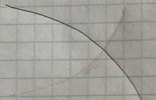
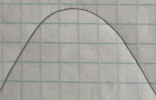
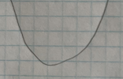

# Local approximations

In many modeling situations with a single input, you can get very close to a good modeling function $f(x)$ by selecting one of eight simple shapes. I've sketched these out and annotated them with their properties and examples of function forms that have that shape.

Straight-line functions

sloping upward  | sloping downward
-------------------------|---------------------------
     | 
not concave, slopes up, monotonic  | not concave, slopes down, monotonic
$a x + b$   | $b - ax$


shallow then steep 

concave down | concave up
-------------|-------------
 | 
monotonic      | monotonic
$a - b e^{kx}$ | $a + b e^{kx}$

steep then shallow

concave down | concave up
-------------|-------------
 | 
monotonic     | monotonic
$\ln(x)$ | $e^{-kx}$
$-1/x$   | $1/x$


local extremum

maximum  | minimum   
---------|----------
 | 
not monotonic  | not monotonic
$a x^2$ | $-a x^2$
$\hump(x)$ $-\hump(x)$

To choose among these shapes, consider your modeling context:

- is the relationship positive (slopes up) or negative (slopes down)
- is the relationship monotonic or not
- is the relationship concave up, concave down, or neither

For instance, in micro-economic theory there are ***production functions*** that describe how much of a good is produced at any given price, and ***demand functions*** that describe how much of the good will be purchased as a function of price. 

As a rule, production increases with price and demand decreases with price. In the short term, production functions tend to be concave down, since it's hard to squeeze increased production out of existing facilities. In the long term, production functions can be concave up as new businesses are established to meet demand. 

For demand in the short term, functions will be concave up when there is some group of consumers who have no other choice than to buy the product. An example is the consumption of gasoline versus price: it's hard in the short term to find another way to get to work. In the long term, consumption functions can be concave down as consumers find alternatives to the high-priced good. For example, high prices for gasoline may, in the long term, prompt a switch to more efficient cars, hybrids, or electric vehicles. This will push demand down steeply.

Cooling water or radio-activity as functions of time concave up and steep-then-shallow. The incidence of an out-of-control epidemic versus time is concave up, but shallow-then-steep. As the epidemic is brought under control, the decline is steep-then-shallow and concave up. Over the whole course of an epidemic, there is a maximum incidence. And experience shows that epidemics can have a phase where incidence reaches a local minimum: a decline as people practice social distancing followed by an increase as people become complacent.

How many minutes can you run as a function of speed? Concave down and shallow-then-steep; you wear out faster if you run at high speed. How far can you walk as a function of time? Steep-then-shallow and concave down; you're pace slows as you get tired?   How much fuel is consumed by an aircraft as a function of distance? For long flights the function is concave up and shallow-then-steep; fuel use increases with distance, but the amount of fuel you have to carry also increases with distance and heavy aircraft use more fuel per mile. How does the stew taste as a function of saltiness. The taste improves as the amount of salt increases ... up to a point after which it's downhill.

All these are examples of scenarios where the modeler knows about the derivative and concavity of the relationship being modeled. It's often the case that your knowledge of the system comes in this form. 

As you see, there are often multiple basic modeling functions that can be used to construct a model that follows the appropriate slope and curvature pattern. But there is one function, the low-order polynomial, that can be used for any of the eight shapes. That general-purpose modeling function is

$$f(x) = a_0 + a_1 x + a_2 x^2$$ Implementing one simple shape or another is just a matter of choosing appropriate values for the scalars $a_0$, $a_1$, and $a_2$. For instance, to implement the straight-line function set $a_2 = 0$, getting $f(x) = a_0 + a_1 x$. The other six shapes all have $a_2 \neq 0$. 

It's easier to see how to achieve each of the curved shapes by writing the function as a quadratic function of a scaled/shifted input, plus a constant.
$$f(x) = a(x-x_0)^2 + c$$ You may recognize that this is the formula for a parabola which faces upward or downward depending on the sign of $a$. The argmax or argmin of the parabola is at $x=x_0$.  Obviously this formulation can give the shapes with a maximum or a minimum.

It can also achieve the other shapes, at least locally. Suppose you want a shallow-then-steep shape that's concave down. You're interested in a finite domain of $x$, say in $x_a \leq x \leq x_b$. To achieve the shape, select $a_2 < 0$ and $x_b < x_0$. 

FIGURE SHOWING THE OTHER FOUR SHAPES AS PARTS OF THE maximum and minimum.


## From an earlier draft

When facing a modeling problem, it's nice to have a framework that provides a checklist approach: 

1. What is the output quantity and what input quantities are thought to have an important connection to the output? 
2. For each input in (1), what is a 

An important  framework for simple models involves 
A function form often employed in models is the ***low-order polynomial***. In the usual situation, there is region of the domain which is of particular interest, with $x_0$ being a point in that region. The approximating polynomial starts out as $$p(x) \equiv \frac{1}{2} a [x-x_0]^2 + b [x - x_0] + c$$


1. $f(x) = c$, the constant function, which is appropriate when the output of $f()$ doesn't depend on the input. 
2. $f(x) = b x + c$,  the straight-line function, which is the simplest form where the output depends on the input.
3. $f(x) = \frac{1}{2}a x^2 + b x + c$, the quadratic function, which is an appropriate form when there is some input $x$ at which the output is a local maximum or minimum.


In many modeling situations, the construction of a model function can be reduced to a short series of questions:

1. What is the approximate output when the input is fixed  neighborhood of interest?
2. Does the output increase monotonically or is there a maximum or minimum?
3. 

```{r}
slice_plot((x+1)^0.5 ~ x, domain(x=c(0,1))) %>% 
  slice_plot(2*log(x+1) ~ x, color="red") %>%
  slice_plot(.2*exp(x+1) ~ x, color="green") %>%
  slice_plot(2*exp(-(x+1)) ~ x, color="orange") %>%
  slice_plot(1/(x+2) ~ x, color="blue")
```

2 1.5, 1, .5, log(), -.5, 

::: {.objectives}
```{r echo=FALSE, results="asis"}
state_objective("Deriv-5a", "Understand strategy of looking at the behavior of function $f(x)$ around a point $x_0$ by considering a new, possibly simpler function in terms of $x$.")
state_objective("Deriv-5b", "Be able to construct a straight-line function (Linear Approximation) that approximates $f(x)$ around $x_0$")
state_objective("Deriv-5c", "Be able to construct a 2nd-order polynomial (Quadratic Approximation) whose value and derivatives at  match those of a function")
```
:::


::: {.todo}
Example about modeling walking

There's an exercise in DailyDigitals/ 141 DD-35 with some narrative

and the project is in DD-37
:::


::: {.todo}
Harvest the shiny app materials in DailyDigital/daily-digital-38.Rmd.

:::

```{exercise, name="rooster-pink"}
```
<details>`r MC_counter$reset()` `r knitr::knit_child("Exercises/Diff/rooster-pink.Rmd")`</details>

```{exercise, name="rooster-violet"}
```
<details>`r MC_counter$reset()` `r knitr::knit_child("Exercises/Diff/rooster-violet.Rmd")`</details>


```{exercise, name="rooster-red"}
```
<details>`r MC_counter$reset()` `r knitr::knit_child("Exercises/Diff/rooster-red.Rmd")`</details>


```{exercise, name="approx-tan"}
```
<details>`r MC_counter$reset()` `r knitr::knit_child("Exercises/Diff/approx-tan.Rmd")`</details>

```{exercise, name="rooster-blue"}
```
<details>`r MC_counter$reset()` `r knitr::knit_child("Exercises/Diff/rooster-blue.Rmd")`</details>
