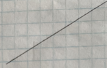
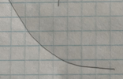

# Local approximations

We have focused in this book on a small set of basic modeling functions and three operations for assembling new functions out of old ones: ***linear combination***, ***multiplication***, and ***composition***. All of these have a domain that is the whole number line, or the positive half of the number line, or perhaps the whole number line leaving out zero or some other isolated point. Consider such domains to be ***global***. `r mark(2750)`

We also discussed the components of ***piecewise functions***. Each component is a function defined on a limited domain, and interval $a \leq x \leq b$. In contrast to the global domains, we'll call the limited domains ***local***.  `r mark(2755)`

In this chapter, we'll explore a simple and surprisingly powerful method to approximate any function ***locally***, that is, over a small domain.  

::: {.why}
Why would you want to approximate a function? Why not just use the function itself? 

It's often the case---in some fields, usually the case---that we don't have a functional form for a relationship. Instead we know about the relationship only through data. It's possible that by deep introspection you or a colleague could construct a theory of the relationship that points to one of the basic modeling functions or a combination of them. Suppose you could? Then anyone else having your theory in mind could approximate your function locally using the methods in this chapter. `r mark(2760)`

The utility of the methods is that you can skip the theoretical relationship and apply the methods directly to the data. Such a skip-the-theory approach is ubiquitous in all fields.
:::

The information that you have about the relationship often takes the form of a data table. Each row shows records one trial in which the values of the inputs have been measured and the corresponding output value recorded. We'll discuss the methods of constructing functions to match such data in Block 4 of this course. `r mark(2765)`

Another common form for the information about the relationship is about derivatives. That is, you know something about the derivative of a relationship even though you don't (yet) have a form for the function describing the relationship. As an example, think about building a model of the sustainable speed of a bicycle as a function of the gear selected and the grade of the road---up or down. `r mark(2770)`

Consider these three questions that any experienced bicyclist can likely answer:

1. On a given grade of road, is there an optimal gear for the highest sustained speed? (Have in mind a particular rider, perhaps yourself.)
2. Imagine that the grade of the road is described by a positive number for uphill and a negative number for downhill: that is, the slope of the road. For a positive (uphill) grade and at a fixed gear, will the bike's sustained speed be higher or lower as a function of the grade? (It's much the same for downhill biking, but you have to keep in mind that a shallow downhill has a higher numerical slope than a steep downhill. That is, the derivative of the hill is near zero for a very shallow grade and far from zero (that is, more negative) for a steep downhill grade.
3. Assuming you answered "yes" to question (1): Does the optimal gear choice depend on the grade of the road? (In concrete terms, would you choose different gears for an uphill climb than for a level road or a downhill stretch?) `r mark(2775)`

Using the methods in this chapter, the answers to those three questions let you choose an appropriate form for the speed(gear, grade) function. Then, using methods in Block 3, you can make a few measurements for any given rider and construct a model customized to that rider. `r mark(2780)`

Note that the three questions all have to do with derivatives. An "optimal gear" is a gear at which $\partial_\text{gear} \text{speed}(\text{gear}, \text{grade}) = 0$. That you ride slower the higher the numerical value of the slope means that  $\partial_\text{grade} \text{speed}(\text{gear}, \text{grade}) < 0$. And we know that $\partial_\text{gear} \text{speed}(\text{gear}, \text{grade})$ depends on the grade; that's why there's a different optimal gear at each grade. `r mark(2785)`

## Eight simple shapes

In many modeling situations with a single input, you can get very close to a good modeling function $f(x)$ by selecting one of ***eight simple shapes***. I've sketched these out and annotated them with their properties and examples of function forms that have that shape. `r mark(2790)`

Straight-line functions

sloping upward  | sloping downward
-------------------------|---------------------------
     | 
not concave, slopes up, monotonic  | not concave, slopes down, monotonic
$a x + b$   | $b - ax$


shallow then steep 

concave down | concave up
-------------|-------------
 | 
monotonic      | monotonic
$a - b e^{kx}$ | $a + b e^{kx}$

steep then shallow

concave down | concave up
-------------|-------------
 | 
monotonic     | monotonic
$\ln(x)$ | $e^{-kx}$
$-1/x$   | $1/x$


local extremum

maximum  | minimum   
---------|----------
 | 
not monotonic  | not monotonic
$a x^2$ | $-a x^2$
$\hump(x)$ $-\hump(x)$

To choose among these shapes, consider your modeling context:

- is the relationship positive (slopes up) or negative (slopes down)
- is the relationship monotonic or not
- is the relationship concave up, concave down, or neither

For instance, in micro-economic theory there are ***production functions*** that describe how much of a good is produced at any given price, and ***demand functions*** that describe how much of the good will be purchased as a function of price.  `r mark(2795)`

As a rule, production increases with price and demand decreases with price. In the short term, production functions tend to be concave down, since it's hard to squeeze increased production out of existing facilities. In the long term, production functions can be concave up as new businesses are established to meet demand.  `r mark(2800)`

For demand in the short term, functions will be concave up when there is some group of consumers who have no other choice than to buy the product. An example is the consumption of gasoline versus price: it's hard in the short term to find another way to get to work. In the long term, consumption functions can be concave down as consumers find alternatives to the high-priced good. For example, high prices for gasoline may, in the long term, prompt a switch to more efficient cars, hybrids, or electric vehicles. This will push demand down steeply. `r mark(2805)`

Cooling water or radio-activity as functions of time concave up and steep-then-shallow. The incidence of an out-of-control epidemic versus time is concave up, but shallow-then-steep. As the epidemic is brought under control, the decline is steep-then-shallow and concave up. Over the whole course of an epidemic, there is a maximum incidence. And experience shows that epidemics can have a phase where incidence reaches a local minimum: a decline as people practice social distancing followed by an increase as people become complacent. `r mark(2810)`

How many minutes can you run as a function of speed? Concave down and shallow-then-steep; you wear out faster if you run at high speed. How far can you walk as a function of time? Steep-then-shallow and concave down; you're pace slows as you get tired?   How much fuel is consumed by an aircraft as a function of distance? For long flights the function is concave up and shallow-then-steep; fuel use increases with distance, but the amount of fuel you have to carry also increases with distance and heavy aircraft use more fuel per mile. How does the stew taste as a function of saltiness. The taste improves as the amount of salt increases ... up to a point after which it's downhill. `r mark(2815)`

All these are examples of scenarios where the modeler knows about the derivative and concavity of the relationship being modeled. It's often the case that your knowledge of the system comes in this form.  `r mark(2820)`

As you see, there are often multiple basic modeling functions that can be used to construct a model that follows the appropriate slope and curvature pattern. But we can simplify the choice as well as the algebra involved in building a model. `r mark(2825)`

## Low-order polynomial

There is a function form that can take on each of the eight forms, a **second-order polynomial** $g(x)$ where
$$g(x) \equiv a + b x + c x^2$$
As you know, the graph of $g(x)$ is a parabola. 

- The parabola opens upward if $0 < c$. That's the shape of a ***local minimum***.
- The parabola opens downward if $c < 0$. That's the shape of a ***local maximum***

Consider what happens if $c = 0$. The function becomes simply $a + bx$, the straight-line function. 

- When $0 < b$ the line slopes upward.
- When $b < 0$ the line slopes downward.

So the form $a + bx + cx^2$ is easily capable of representing four of the ***eight simple shapes***. What about the other four? You can see how this is done by looking at the graphs of the parabolas with $0 < c$ and with $c < 0$, as in Figure \@ref(fig:four-shapes). `r mark(2830)`

```{r four-shapes, echo=FALSE, fig.cap="Four of the ***eight simple shapes*** correspond to the sides of the parabola."}
f1 <- makeFun(a + b*x + c*x^2 ~ x, a=-2, b=1, c=1)
f2 <- makeFun(a + b*x + c*x^2 ~ x, a=-2, b=1, c=-1)
graph_with_boxes(f1, domain = c(-1.1,0.1), my_letters = c("A", "B", "C"), 
                 intervals = tibble(x = c(-1, -.45), xend=c(-.55, 0)))
graph_with_boxes(f2, domain = c(-.3,1.4), my_letters = c("D", "E", "F"),
                 intervals = tibble(x = c(-.2, .55), xend=c(.45, 1.25)))
```


## The low-order polynomial with two inputs

For functions with two inputs, the low-order polynomial approximation looks like this:

$$g(x, y) \equiv a_0 + a_x x + a_y y + a_{xy} x y + a_{yy} y^2 + a_{xx} x^2$$
In reading this form, note the system being used to name the polynomial's coefficients. First, we've used $a$ as the root name of all the coefficients. Sometimes we might want to compare two or more low-order polynomials, so it's convenient to be able to use $a$ for one, $b$ for another, and so on. `r mark(2835)`

The subscripts on the coefficients describes exactly which term in the polynomial involves each coefficient. For instance, the $a_{yy}$ coefficient applies to the $y^2$ term, while $a_x$ applies to the $x$ term.  `r mark(2840)`

Each of $a_0, a_x,$ $a_y,$ $a_{xy}, a_{yy}$, and $a_{xx}$ will, in the final model, be a constant quantity. Don't be confused by the use of $x$ or $y$ in the name that the coefficient is a function of the inputs. It's always a constant, but you may not know exactly the value of that constant until later in in the process of modeling the setting of interest. `r mark(2845)`

It helps to have different names for the various terms. It's not too bad say something like, "the $a_{xy}$ term." (Pronounciation: "a sub x y") But the proper names are: ***linear terms***, ***quadratic terms***, and ***interaction term***. (And a shout out to $a_0$, the ***constant term***.) `r mark(2850)`

$$g(x, y) \equiv a_0 + \underbrace{a_x x + a_y y}_\text{linear terms} \ \ \ + 
\underbrace{a_{xy} x y}_\text{interaction term} +\ \ \  \underbrace{a_{yy} y^2 + a_{xx} x^2}_\text{quadratic terms}$$

```{r saddle2, echo=FALSE, fig.keep="hold", fig.cap="A saddle"}
make_gxy <- function(seed=1) {
  set.seed(seed)
  f <- makeFun(a0 + ax*x + ay*y + axy*x*y + axx*x^2 + ayy*y^2 ~ x + y,
               a0 = runif(1, -1, 1), 
               ax = runif(1, -1, 1), ay = runif(1, -1, 1), 
               axy = runif(1, -1, 1), 
               ayy = runif(1, -1, 1), axx = runif(1, -1, 1)
  )
}
show_poly2 <- function(seed=1, domain=list(x=c(-2, 2), y=c(-2, 2))) {
  f <- make_gxy(seed)
  list(P1 = contour_plot(f(x, y) ~ x + y, domain=domain),
  P2 = interactive_plot(f(x, y) ~ x + y, domain=domain))
}


Four <- show_poly2(104)
Four$P1
Four$P2
```
```
show_poly2(111)
show_poly2(112)
show_poly2(113)
show_poly2(115)
show_poly2(116)
show_poly2(120)
show_poly2(121)
```


## Derivatives of polynomials

::: {.workedexample}
Consider the function $h(t) \equiv A e^{kt} + B$. This is a linear combination of two functions, which we can call $f(t) \equiv e^{kt}$ and $g(t) \equiv 1$.

Of course, $f(t)$ and $g(t)$ are basic modeling functions so we have memorized their derivatives: $f'(t) = k e^{kt}$ and $g'(t) = 0$. 

Putting this together gives $$\partial_t h(t) = A\, k\, e^{kt} + B\times 0= A\, k\, e^{kt}$$
:::

The derivative of a ***polynomial*** follows the linear combination rule. That's because polynomials are a linear combination of monomials, $x^0$, $x^1$, $x^2$, and so on.

The consequence is that the derivative of a polynomial is another polynomial, with each term being reduced by one order.

- $\partial_x x^0 = 0$
- $\partial_x x^1 = x^0 = 1$
- $\partial_x x^2 = 2 x^1 = 2x$
- and so on.

Example:  $f(x) \equiv a + b x +  c  x^2\  \  \implies\ \ \partial_x f(x) \equiv b  + 2 c x$


## Approximations around $x^\star$

Starting with just the pattern-book functions (e.g. $e^t$), you have a small but rich set of mathematical operations that enables you to make a huge variety of functions to suit a big range of modeling needs: `r mark(2855)`

- ***input scaling***, which turns the pattern-book functions into the more directly useful basic modeling functions.
- ***linear combinations*** of functions, e.g. $A + B e^{-kt}$
- ***compositions*** of functions, e.g. $e^{-kt^2}$ which you can recognize as the composition of an exponential with a power-law function.
- ***products*** of functions, e.g., $\sin\left(\frac{2\pi}{P}x\right) e^{-kt}$

Now we want to tame this profusion of possibilities and consider a way to construct stand-ins for any function, using a universal format that needs a minimum of information and can be used for many purposes ***in place of*** the original function. It's helpful to have a name for the stand-ins that reminds us of whom they are stand-ins for. If the original function is $f(x)$, we'll write the names of the stand-ins with a tilde, as in $\widetilde{\,f\ }(x)$.  `r mark(2860)`

The stand-in functions are intended to be much simpler than the original but useable as a substitute for the original. The catch is that the stand-in is warranteed to be a good substitute only ***within a small neighborhood*** of the domain of the origin. `r mark(2865)`

The information we need to construct the stand-ins is very limited. First, we need to specify where the warranteed neighborhood is. We'll tend to use $x_0$ as identifying the center of that neighborhood. We'll also need $f(x_0)$, the output of the original function when the input is $x_0$, and $\partial_x f(x_0)$ and $\partial_{xx} f(x_0)$.  `r mark(2870)`

::: {.takenote}
This is a good time to remind you of the notation conventions that we are using to write about functions and evaluating functions. 

A ***function*** with all its individual characteristics and idiosyncracies is written $f(x)$: the function name and the name of the input or inputs. The ***name of this function*** is $f()$. The name of the input to $f()$ is $x$, or whatever is the input name that was given in the parentheses following the name. `r mark(2875)`

Every function has a derivative function. We could call that derivative function anything we like, but it's sensible to give it a name that states explicitly where it comes from. We're using $\partial_x f(x)$ for this purpose. Similarly, the name we use for the second derivative is $\partial_{xx} f(x)$. `r mark(2880)`

Evaluating a function means to specify a particular value for the input. We use several ways of making it clear when we are talking about a particular value of the input, e.g.
$$\mbox{function output:}\ \ \ f(x = 3)\ \ \ \text{or}\ \ f(3)\ \ \ \text{or}\ \ \left.f(x)\strut\right|_{x=3}$$
The output of such an evaluated function is a quantity. 

Sometimes we want to refer to the output for some particular input, but *we don't have that specific quantity pinned down yet*. Our preferred style for writing this is to use a name that is similar to an input name, but which has a subscript as in $x_0$, $x_1$, $x_i$, $x_\star$ or, occasionally, a superscript as in $x^\star$. The output of the function is then written like this:
$$\mbox{function output:}\ \ \ f(x = x_0)\ \ \ \text{or}\ \ f(x_0)\ \ \ \text{or}\ \ \left.f(x)\strut\right|_{x=x_0}$$
This same style applies when the function has a name like $\partial_x f()$ or $\partial_{xx} f()$, for instance

$$\mbox{function output:}\ \ \ \partial_x f(x = x_0)\ \ \ \text{or}\ \ \partial_x f(x_0)\ \ \ \text{or}\ \ \left.\partial_x f(x)\strut\right|_{x=x_0}$$
:::


Here are two universal formats that can be used to construct a stand-in for *any* function near a particular input $x_0$. Since it's useful to have a name for the stand-in, we'll use a tilde on top of the original function name: `r mark(2885)`

- First-order approximation: $\widetilde{f_1}(x) \equiv f(x_0) + \partial_x f(x_0) (x-x_0)$
- Second-order approximation: $\widetilde{f_2}(x) \equiv f(x_0) + \partial_x f(x_0) [x-x_0] + \frac{1}{2} \partial_{xx} f(x_0) [x - x_0]^2$

Notice that the first two terms of $\widetilde{f_2}(x)$ are identical to $\widetilde{f_1}(x)$, so we could write the second-order approximation as
$$\widetilde{f_2}(x) \equiv \widetilde{f_1}(x) +\frac{1}{2} \partial_{xx} f(x_0) [x-x_0]^2$$ 


The first-order approximation $\widetilde{f_1}(x)$ is nothing more than the straight-line function whose graph is tangent to the graph of $f(x)$ at the input $x=x_0$.

The second-order approximation is a quadratic polynomial. Being quadratic, its graph is the familiar parabola. The graph of $\widetilde{f_2}(x)$ is the parabola that is tangent to the graph of $f(x)$.

::: {.workedexample}
Consider the function $g(x)$ whose graph is shown in Figure \@ref(fig:ds-g).

```{r ds-g, echo=FALSE}
g <- rfun( ~ x, seed=973)
slice_plot(g(x) ~ x, domain(x=c(-3, 3))) %>%
  gf_labs(title="g(x) vs x") %>%
  gf_vline(xintercept=-1, color="blue", alpha=0.1, size=20) %>%
  gf_vline(xintercept=-1, color="blue") %>%
  gf_text(-5 ~ -1.1, label="x0 = -1", color="blue", angle=90) %>%
  gf_theme(theme_minimal)
```
We haven't given you a formula for $g(x)$, but you can see that it isn't any of the basic modeling functions but something more complicated. We're going to construct a first-order and second-order approximation to $g(x)$ in a neighborhood $x_0 = -1$ as marked by the blue shaded area.  `r mark(2890)`

Note that $x_0$ is not an argmin of $g(x)$. You can see that the argmin is a little to the right of $x_0$. 

The "facts" about $g(x)$ that are needed to construct the approximations, beyond the specification of the location of the neighborhood $x_0$, are the values $g(x_0)$, $\partial_x g(x_0)$, and $\partial_{xx} g(x_0)$. These are: `r mark(2895)`

```{r}
x0 <- -1
g(x0)
dx_g <- D(g(x) ~ x)
dxx_g <- D(g(x) ~ x + x)
dx_g(x0)
dxx_g(x0)
```
With these facts, we can construct the first- and second-order approximations:
```{r}
tilde1_g <- makeFun(-23.992 - 2.3493*(x-x0) ~ x)
tilde2_g <- makeFun(tilde1_g(x) + (7.8077/2) * (x-x0)^2 ~ x)
```

Figure \@ref(fig:ds-g2) shows $\widetilde{g_1}(x)$ and $\widetilde{g_2}(x)$, zooming in around $x_0 = -1$.

```{r ds-g2, echo=FALSE, fig.cap="The first-order (green) and second-order (red) approximations to $g(x)$ near $x_0=-1$."}
g <- rfun( ~ x, seed=973)
slice_plot(tilde1_g(x) ~ x, domain(x=c(-2, 0)),
             color="green", size=2, alpha=0.25) %>%
  slice_plot(tilde2_g(x) ~ x, domain(x=c(-2, 0)),
             color="red", size=2, alpha=0.25) %>%

slice_plot(g(x) ~ x, domain(x=c(-2, 0))) %>%
  
  
  gf_labs(title="g(x) vs x") %>%
  gf_vline(xintercept=-1, color="blue", alpha=0.1, size=50) %>%
  gf_vline(xintercept=-1, color="blue") %>%
  gf_text(-20 ~ -1.05, label="x0 = -1", color="blue", angle=90) %>%
  gf_theme(theme_minimal())
```

You can see that $\widetilde{g_2}(x)$ is a good approximation to $g(x)$. In particular, the argmin of $\widetilde{g_2}(x)$ is close to the that of $g(x)$. 

In a previous example, we showed that the argmin of the parabolic function $a_0 + a_1 x + a_2 x^2$ is $x^\star = -\frac{a_1}{2 a_2}$. Using that formula, the argmin of $\widetilde{g_2}(x)$ is  -2.3493/(7.8077/2) = -0.602. `r mark(2900)`
:::

## Solving computationally

::: {.todo}
How to find the zeros of the derivative of a function and how to evaluate the second derivative at those zeros to find out what kind of critical point it is.
:::

::: {.todo}
The cubic bifurcation. Start with a cubic with an argmax followed by an argmin. Then move the parameter to see the two critical points coalesce into a single point then disappear.

Or, maybe, "the problem with polynomials." Linear function always has 1 root and no critical points. Quadratic function always has one critical point (and subject to a constant may have two roots generically). But a cubic might have 1 or 3 solutions and the behavior depends on the constant. It might have one or three critical points. `r mark(2905)`
:::


## From an earlier draft

When facing a modeling problem, it's nice to have a framework that provides a checklist approach: 

1. What is the output quantity and what input quantities are thought to have an important connection to the output? 
2. For each input in (1), what is a 

An important  framework for simple models involves 
A function form often employed in models is the ***low-order polynomial***. In the usual situation, there is region of the domain which is of particular interest, with $x_0$ being a point in that region. The approximating polynomial starts out as $$p(x) \equiv \frac{1}{2} a [x-x_0]^2 + b [x - x_0] + c$$ `r mark(2910)`


1. $f(x) = c$, the constant function, which is appropriate when the output of $f()$ doesn't depend on the input. 
2. $f(x) = b x + c$,  the straight-line function, which is the simplest form where the output depends on the input.
3. $f(x) = \frac{1}{2}a x^2 + b x + c$, the quadratic function, which is an appropriate form when there is some input $x$ at which the output is a local maximum or minimum.


In many modeling situations, the construction of a model function can be reduced to a short series of questions:

1. What is the approximate output when the input is fixed  neighborhood of interest?
2. Does the output increase monotonically or is there a maximum or minimum?
3. 

```{r}
slice_plot((x+1)^0.5 ~ x, domain(x=c(0,1))) %>% 
  slice_plot(2*log(x+1) ~ x, color="red") %>%
  slice_plot(.2*exp(x+1) ~ x, color="green") %>%
  slice_plot(2*exp(-(x+1)) ~ x, color="orange") %>%
  slice_plot(1/(x+2) ~ x, color="blue")
```

2 1.5, 1, .5, log(), -.5, 

::: {.objectives}
```{r echo=FALSE, results="asis"}
state_objective("Deriv-5a", "Understand strategy of looking at the behavior of function $f(x)$ around a point $x_0$ by considering a new, possibly simpler function in terms of $x$.")
state_objective("Deriv-5b", "Be able to construct a straight-line function (Linear Approximation) that approximates $f(x)$ around $x_0$")
state_objective("Deriv-5c", "Be able to construct a 2nd-order polynomial (Quadratic Approximation) whose value and derivatives at  match those of a function")
```
:::


::: {.todo}
Example about modeling walking

There's an exercise in DailyDigitals/ 141 DD-35 with some narrative

and the project is in DD-37
:::


::: {.todo}
Harvest the shiny app materials in DailyDigital/daily-digital-38.Rmd.

:::

`r insert_calcZ_exercise(""XX.XX"", "ckslw", "Exercises/Diff/rooster-pink.Rmd")`

`r insert_calcZ_exercise("XX.XX", "ikdlx", "Exercises/Diff/rooster-violet.Rmd")`

`r insert_calcZ_exercise("XX.XX", "slks", "Exercises/Diff/rooster-red.Rmd")`

`r insert_calcZ_exercise("XX.XX", "bmdrd", "Exercises/Diff/approx-tan.Rmd")`

`r insert_calcZ_exercise("XX.XX", "3dkse", "Exercises/Diff/rooster-blue.Rmd")`


::: {.objectives}
```{r echo=FALSE, results="asis"}
state_objective("Deriv-9a", "Eliminate terms in a possible model by considering simple inputs for which the result is known.")
state_objective("Deriv-9b", "Understand the concept of grade as it relates to elevation change.")
state_objective("Deriv-9c", "Use dimensional analysis to determine the units of terms within a model.")
```
:::
