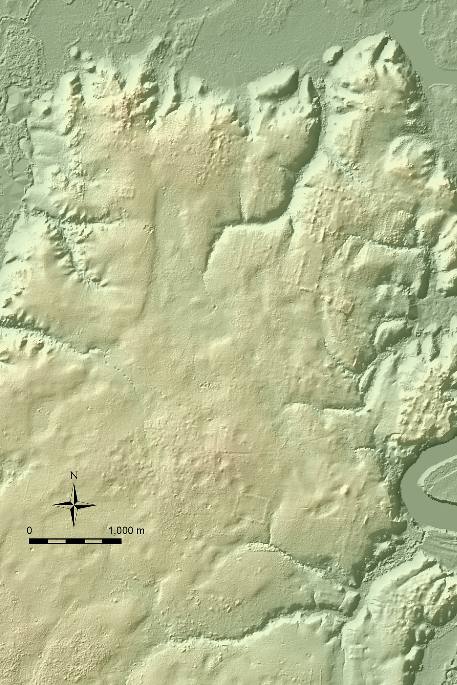

# Instantaneous rate of change

## From average to instant

YOU HAVE KNOWN HOW TO CALCULATE AN AVERAGE RATE OF CHANGE for a long time. But possibly you don't yet fully know what the **use** of such a calculation is other than to help you pass a math test. In this section, we're going to show how to calculate the ***instantaneous rate of change*** function and show some of the many things this is useful for.

To orient you to what's going to happen ...

1. We're going to set up the familiar average-rate-of-change calculation in a new framework.
2. Using that framework, you'll be able to calculate an average-rate-of-change *function*.
3. Then, by turning a knob on the calculation in (2), you'll be able to calculate the ***instantaneous*** rate of change function. By the way, the knob is called $h$.

In short, this section will introduce you to the operation called ***differentiation***.

## The $h$ framework

Calculating an average rate of change involved specifying an interval of the function domain: the left side $t_A$ and the right side $t_B$. Let's change this notation a little:

- Left endpoint of domain: $t_0$
- Right endpoint of domain: $t_0 + h$

There is nothing fundamentally new here. The interval is still specified by two numbers, but now they are called $t_0$ and $h$. The width of the interval is just $h$, which is a little easier to write than $t_B - t_A$, but is still just the width.

The ***average rate of change*** in the new notation is $$\frac{f(t_0 + h) - f(t_0)}{h}\ \ \mbox{rather than}\ \ \frac{f(t_B) - f(t_A)}{t_B - t_A}$$

::: {.why latex-data=""}
Why are you using $t$ instead of $x$?

Remember, the *name* of an input can be anything at all so long as you use it consistently on the left side of $\equiv$ and on the right side. All of these are the same definition:
$$g(t) \equiv e^{kt},\ \ g(x) \equiv e^{kx},\ \ g(y) \equiv e^{ky},\ \ g(\mbox{altitude}) \equiv e^{k\,{\small{\text{altitude}}}}$$
When we work with functions of two or more variables, it will be essential to give easily distinguished names to the inputs. We're trying to get you in the habit of paying attention to the names of inputs and break a *bad habit* from high-school math of calling the input $x$ and the output $y$.
:::

Now we are going to make a small, subtle, and important change. Instead of thinking of the average rate of change *at a specific interval* $t_0$ to $t_0 + h$, we're going to write an average-rate-of-change ***function***. And since we're in the habit of giving *names* to functions, we'll be careful to name average-rate-of-change functions in a way that makes explicit the connection to the function $f(t)$ whose rate of change is being calculated. 

Our convention will be to use two additional components in the names of average-rate-of-change functions. The first component is to lead with a "D" in a caligraphic font: $\cal D$. The second component will be the name of the input whose interval is being used in calculating the rate of change. So ...

$${\cal D}_t\, f(t) \equiv \frac{f(t + h) - f(t)}{h}$$
You can pronounce ${\cal D}_t$ as "difference with respect to $t$." But remember that the function name is the whole deal, ${\cal D}_t\, f()$, which is to be read as "difference with respect to $t$ of $f()$." Admittedly a long name. Don't be surprised later when we start using *nicknames* like Liz (for Elizabeth) or Bill (for William). For instance, later we'll save ink and breath by using the nickname $\dot{f}()$ instead of ${\cal D}_t\, f()$.


FOLLOWING NEEDS TO BE SORTED OUT ...


From the way we've defined ${\cal D}_t f(t)$, it's reasonable to assume that $h$ is a ***parameter***: a symbol naming a numerical value that has to be specified before ${\cal D}_t\, f(t)$ can be evaluated at a specific $t$. 

::: {.workedexample latex-data=""}
Find an average-rate-of-change function with respect to $x$ of $g(x) \equiv x^2$. 

$${\cal D}_x g(x) = \frac{(x + h)^2 - x^2}{h}\\
= \frac{x^2 + 2 x h + h^2 - x^2}{h}\\
= \frac{2 x h + h^2}{h} = 2 x + h$$
:::


I like to think of $h$ as a kind of *tire iron*, a small tool used to stretch the bead of a bicycle tire in order to pull it over the wheel rim. 

```{r echo=FALSE, out.width="30%", fig.cap="A tire iron in use", fig.align="center"}
knitr::include_graphics("www/tire-iron.png")
```

Once the tire iron has done its job, it's removed and you would never know that it was ever there (except that the tire is now successfully mounted on the wheel).

::: {.workedexample latex-data=""}
Find an average-rate-of-change function with respect to $x$ of $g(x) \equiv x^2$, but remove the tire iron $h$ when you're done. 

$${\cal D}_x g(x) 
= \frac{(x + h)^2 - x^2}{h}\ \ \mbox{stretch $x$ a bit}\\
= \frac{x^2 + 2 x h + h^2 - x^2}{h}\ \ \mbox{pull over rim}\\
= \frac{2 x h + h^2}{h} \ \ \mbox{still pulling ...}\\
= 2 x + h \ \ \mbox{success!}$$

Now remove the tire iron to get $${\cal D}_x g(x) = 2x$$.
:::

But this is calculus, not bicycle mechanics. How do we know that removing the tire iron isn't damaging the mathematical wheel? Historically, this has been a serious debate, resolved only with great difficulty more than a century after calculus started being used successfully. 

Still in the spirit of having fun, let's try a more serious metaphor... imagining $h$ is actually a central character in a calculus play. The character $h$ is in the middle of the story but *never appears in the play*, like the missing character Godot in the famous play *[Waiting for Godot](https://en.wikipedia.org/wiki/Waiting_for_Godot#Godot)*. 

::: {.workedexample latex-data=""}
We said that $h$ in the finite rate of change function ${\cal D}_x g()$, so long as $h$ is small, plays both a central role and has hardly any effect. An economizing director re-writes the play to take $h$ out of it, setting $h=0$: a non-speaking, offstage role.

We've already seen using legitimate algebra that $${\cal D}_x g(x) = 2 x + h$$ Re-writing by replacing $h$ with 0 streamlines the play, turning $\Delta g()$ from a dialog involving both $x$ and $h$ into a monologue with $h$ absent: $${\cal D}_x g(x) = 2 x$$. Simple.

And yet ... the director gets a letter from the Bit Players Union. 

> *We observe that you have eliminated the role of $h$ in the final production version of ${\cal D}_x g(x)$. This is a violation of Union regulations. Recall that the rate-of-change function ${\cal D}_x g(x)$ is defined as a ratio: $${\cal D}_x g(x) \equiv \frac{g(x+h) - g(x)}{h}$$ Although the name $h$ does not need to appear in the argument list of ${\cal D}_x g(x)$, eliminating $h$ entirely by replacing her with zero is a **division by zero error** forbidden by Article 3.16§B¶2 of the Unified Laws of Arithmetic. We ask that you comply with this Article by re-instating the role of $h$ in all evaluations of ${\cal D} g(x)$.*

Reading this, the director calls her lawyer. Is there a loophole for removing $h$ without breaking the mathematical prohibition on dividing by zero? 
:::

## The derivative operator

Let's put aside for the moment the issue of the disappearing $h$. Historically, such "putting aside" has incurred a great deal of criticism. In 1734, famous philosopher [George Berkeley](https://en.wikipedia.org/wiki/George_Berkeley) (1685-1753) published a long-titled book: *The Analyst: A Discourse Addressed to an Infidel Mathematician: Wherein It Is Examined Whether the Object, Principles, and Inferences of the Modern Analysis Are More Distinctly Conceived, or More Evidently Deduced, Than Religious Mysteries and Points of Faith*. In *The Analyst*, Berkeley took issue with the arguments of that time that it is legitimate to divide by $h$ when, ultimately, $h$ will be replaced by zero. Calling $h$ an "evanescent increment," he asked, 

> *"And what are these same evanescent Increments? They are neither finite Quantities nor Quantities infinitely small, nor yet nothing. May we not call them the ghosts of departed quantities?"*

Interesting, Berkeley believed that the ghost of $h$ yielded correct results. His objection was that the framers of calculus had made two, canceling errors. 

> *"[B]y virtue of a two fold mistake you arrive, though not at science, yet truth."*

Berkeley was saying that calculus had not yet been put on a solid logical foundation. It was more than a century after Berkeley's death that this work was accomplished. Once accomplished, the results that had been claimed true all along were confirmed.

I propose that we start with the results, which is what everyone *uses*. Later, we can introduce the new concepts on which the new logic was based. The names of the concepts---continuity, smoothness, singularity---are widely and effectively used in talking about functions, but the names, like many words in English, can be put to good and accurate use without memorizing the precise definitions.

On to the results ...

1. Every "smooth" function $h(x)$ has a corresponding function that is its derivative $\partial_x h(x)$.
2. Finding the algorithm for $\partial_x h(x)$, called ***differentiating $h()$***, is *automatic* in the sense that it can be done by computer without human intervention or judgment. 
3. When there is an algebraic formula for $h(x)$, the computer can find the algebraic formula for $\partial_x h(x)$. This is called ***symbolic differentiation***.
4. When there is no algebraic formula for $h()$, the computer can use ***numerical differentiation*** which involves a non-zero $h$. The results of numerical differentiation on functions with formulas can differ subtly from the results from symbolic differentiation. Usually the difference is too small to notice, but in extreme cases it is not. It's important for the user of numerical differentiation to know how to identify extreme cases and deal with them.

YOU WERE HERE.


Often, we use a function so briefly that it's not worth naming. For instance, rather than saying

> "Consider the function $h(x) = \sin(2\pi x/P)$ and the corresponding average rate of change function ${\cal D}_x h(x)$ ..."

We'll write: ${\cal D}_x [\sin(2\pi x/P)]$

## Evanescent $h$

The word "evanescent" means, "lasting for only a short time, then disappearing quickly and being forgotten." ([Source](https://dictionary.cambridge.org/us/dictionary/english/evanescent)) Another dictionary definition is "tending to vanish like vapor." ([Source](https://www.merriam-webster.com/dictionary/evanescent)) I've used metaphors for $h$: tire irons, dramatic characters who never appear or speak. Here's another one: the solvent in ink or paint. Ink and paint are liquid yet become solid when brushed on a surface. This can happen because the solid pigments are suspended in liquid. Exposed to the air, the liquid vaporizes and is forgotten. The solid pigment remains on the surface.

We can easily evaluate an ***average rate of change function***, for instance ${\cal D}_t g(t)$ by evaluating $g(t)$ at two different inputs and dividing by the distance between the inputs:
$${\cal D}_t g(t) = \frac{g(t+h) - g(t)}{h}$$
So if you know $g()$, you know ${\cal D}_t g(t)$. By making $h$ very small, the "average" starts to look like "instantaneous." Over a small interval of length $h$, every smooth function looks like a straight line. For a straight line, the average rate of change is exactly the same as the instantaneous rate of change.

We'd like to take $h$ out of the picture, imagining that it is zero but not dealing with "divide by zero" if we can avoid it. To signify this idea of neglecting $h$, we'll use a new notation. Rather than ${\cal D}_t g(t)$ which has that pesky $h$ in it, we'll write $\partial_t g(t)$, using the lower-case $\partial$. The function $\partial_t g(t)$ can properly be called the ***instantaneous rate of change*** of $g(t)$. But everyone calls it the ***derivative of $g(t)$ with respect to $t$***  Many people leave out the "with respect to" part, which I suppose is fine for a function like $g(t)$ which has only one input. But functions constructed in modeling generally have multiple inputs, so it's a bad habit to neglect to identify which one the derivative is "with respect to." We'll always sneak the "with respect to" by putting the little subscript on $\partial_t$.

We lose something by letting $h$ vaporize. There is an easy formula for ${\cal D}_t g(t)$, but without $h$ we can't write down such a formula for the derivative. Mathematicians like to bridge the gap between ${\cal D}$ and $\partial$, that is between average and instantaneous rates of change, by writing the formula for the derivative with a little "caution" sign out front.
$$\partial_t g(t) = \lim_{h\rightarrow 0} \frac{g(t+h) - g(t)}{h}$$
The caution sign is mysterious to newcomers because it is saying something absurd: "Remember to forget $h$."

There are people who do actual calculations with $\lim_{h\rightarrow 0}$ but nobody needs to any more unless they invent a brand-new function that can't be written with existing functions. If you do happen to invent such a brand-new function, please remember that you should also invent the derivative of that function. Fortunately for us, the inventors of the past have done the work for us. Here's a list of what they found for the mathematical functions that underlie our basic modeling functions:

* $\partial_x e^x = e^x$
* $\partial_x x^0 = 0$
* $\partial_x x^p = p\, x^{p-1}$. unless $p=0$. 
* $\partial_x \sin(x) = \cos(x)$
* $\partial_x \cos(x) = -\sin(x)$
* $\partial_x \mbox{sigmoid}(x) = \mbox{hump}(x)$

We're going to leave $\partial_x \mbox{hump}(x)$ alone for now until we have a more complete understanding of derivatives. But other than that, notice that the derivative of every one of these mathematical functions---exponential, power-law, sinusoid---is also in the set of the basic functions.

::: {.workedexample latex-data=""}
How can we know that these formulas are right? Let's start by comparing them to the functions computed from the ${\cal D}_x$ formula when $h$ is very small.

Consider $\partial_x e^x$, which is claimed to be $e^x$. Figure \@ref{fig:exp-h} plots $e^x$ (in green) as well as a function ARC$(x, h)$ (**A**verage **R**ate of **C**hange) that takes both $x$ and $h$ as inputs: $$\mbox{ARC}(x, h) \equiv {\cal D}_x e^x = \frac{e^{x+h} - e^x}{h} = e^x \frac{e^h - 1}{h}$$

```{r exp-h, echo=FALSE}
colors <- heat.colors(5)
ARC <- makeFun(exp(x)*(exp(h)-1)/h ~ x + h)
factor <- makeFun((exp(h)-1)/h ~ h)
P1 <- slice_plot(exp(x) ~ x, domain(x=c(-2,2)), 
           size=3, color="green", alpha=0.4) %>%
  slice_plot(ARC(x, h=1) ~ x, color=colors[1],
             label_text="h=1", label_x=1) %>%
  slice_plot(ARC(x, h=0.5) ~ x, color=colors[2],
             label_text="h=0.5", label_x=1) %>%
  slice_plot(ARC(x, h=0.1) ~ x, color=colors[3],
             label_text="h=0.1", label_x=0.9) %>%
  slice_plot(ARC(x, h=0.01) ~ x, color=colors[4],
             label_text="h=0.01", label_x=0.8) %>%
  slice_plot(ARC(x, h=0.001) ~ x, color=colors[5],
             label_text="h=0.001", label_x=7)
P1
```

You can see at a glance that $\mbox{ARC}(x, h)$ gets closer and closer to the claimed derivative, $e^x$, as $h$ gets smaller. 

A better view of things comes from recognizing that $$\mbox{ARC}(x, h) = e^x \left[\frac{e^h - 1}{h}\right]$$
Let's look at the quantity in brackets as $h$ gets small. If that goes to 1 for small $h$, then $\mbox{ARC}(x, h)$ goes to $e^x$.

$h$ | $\frac{e^h - 1}{h}$ 
:----|-------------------
1   | `r format(factor(1), digits=15)`
0.1   | `r format(factor(0.1), digits=15)`
0.01   | `r format(factor(0.01), digits=15)`
0.001   | `r format(factor(0.001), digits=15)`
0.0001   | `r format(factor(0.0001), digits=15)`
0.00001   | `r format(factor(0.00001), digits=15)`
0.000001   | `r format(factor(0.000001), digits=15)`
0.0000001   | `r format(factor(0.0000001), digits=15)`
0.00000001   | `r format(factor(0.00000001), digits=15)`
0.000000001   | `r format(factor(0.000000001), digits=15)`


:::

NEXT STEP. The linear expansion ...

$f(x + h) \approx f(x) + h \partial_x f(x)$


D f(g(x)) = f(g(x+h)) - f(g(x)) = f


How we 
When we are interested in an ***instantaneous rate of change function***, 


YOU GOT HERE.

## The $\Delta$ operator

CHANGE THIS TO ${\cal D}$ and introduce it once you have gotten rid of $h$.

Up until now, we used only functions that take numerical quantities as inputs and produce a numerical quantity as an output. It's time now to broaden our perspective a bit.

Imagine a function named $\Delta()$ defined like this:
$$\Delta(f) \equiv \frac{f(x+h) - f(x)}{h}$$
$\Delta()$ takes as input a **function**. You might have guessed this because the definition uses the name $f$ for the input to $\Delta()$, but the name of an input does not matter so long as it is used consistently in the body of the function. Looking at the body, you can that the name $f$ is being used (twice!) in the position of a function's name.

For instance:

- $\Delta(\sin) = \frac{\sin(x+h) - \sin(x)}{h}$
- $\Delta(x^2) = \frac{(x+h)^2 - x^2}{h}$
- $\Delta(a + b x) = \frac{a + b(x + h) - \left(a + b x\right)}{h}$

::: {.why latex-data=""}
Why did you use $=$ in the above statements rather than the $\equiv$ ?

$\equiv$ means "is defined as" or "is the name of." When we wrote $$\Delta(f) \equiv \frac{f(x+h) - f(x)}{h}$$ we were giving a name to a function. But writing $\Delta(a + b x)$ means to apply the already defined function $\Delta$ to an input, that input being the straight-line function $a + b x$. Rather than *defining* what is $\Delta(a + b x)$ we are *deducing* it from objects that have already been defined.
:::

What is the output of $\Delta()$? It takes a *function* as an input and returns ... a function as an output.

We might choose to give a name to the output, for example fred() or betty() or, more helpfully, $\mbox{rate}_{\sin}$ or $\Delta \sin$, but our naming conventions, particularly the use of $x$ indicate that \frac{\sin(x+h) - \sin(x)}{h}$ is a function.

In calculus, there are a handful of celebrity functions that take a function as input and return a function as output. Notice that the word "function" appeared three times in the previous sentence. To avoid this sort of sleep-inducing repetition, we'll call such functions ***operators***. 

> An ***operator*** (as we will use the word) is a function that, like all functions, has an input and an output. The input is itself a function, the output is also a function, typically (but not always) different from the input.

::: {.objectives latex-data=""}
```{r echo=FALSE, results="asis"}
state_objective("Diff-1a", "Understand the relations between position, velocity, and acceleration as \"change relations.\"")
```
:::

# Difference and change
    
    Readings: 347-360
    
    Objectives:
    

    #. (Deriv-1b) Know how to calculate the value at a single point of a derivative function.
    #. (Deriv-1c) Understand that differentiation is an operator that produces a function called the derivative.
    
::: {.todo}

ROUGH ROUGH ROUGH

Lidar measured distance to ground. The function value doesn't really matter. What matters is how the value at a point relates to the values at nearby points. Seeing this difference is how you can spot the Maya ruins.


```{r echo=FALSE}

```


Instituto Nacional de Estadística y Geografía/Nacional Center for Airborne Laser Mapping

"The map, published in 2011 by Mexico’s National Institute of Statistics and Geography, covered 4,440 square miles in the Mexican states of Tabasco and Chiapas. It was made as part of the institute’s mission to create accurate maps to be used by businesses and researchers.

"Dr. Inomata learned about the map from Rodrigo Liendo, an archaeologist at the National Autonomous University of Mexico. The resolution of the map was low. But the outlines of countless archaeological sites stood out to Dr. Inomata. So far, he has used it to identify the ruins of 27 previously unknown Maya ceremonial centers that contain a type of construction that archaeologists had never seen before. These sites may hold insights into the origins of Maya civilization."


[NYTimes article](https://www.nytimes.com/2019/10/08/science/archaeology-lidar-maya.html)
:::

<!--

2. **Average and Instantaneous Rates of Change**

    
    Readings: 365-379
    
    Objectives:
    
    
    #. (Deriv-2b) Understand how calculating the slope (using a small value of h) of a function reflects the instantaneous rate of change of the function at that point.
    #. (Deriv-2c) Understand what the signs of 1st and 2nd derivative tell you about the original function.

3. **Smoothness and Curvature**
    
    Readings: N/A
    
    Objectives:
    
    i. (Deriv-3a) Understand the physical analogs of continuity and smoothness.
    #. (Deriv-3b) Determine if a function is continuous by thinking about the “pencil stays on paper” technique
    #. (Deriv-3c) Understand smooth of degree 1 as “Function is continuous, derivative is continuous”
    #. (Deriv-3d) Understand smooth of degree  as “Smooth of degree  and th derivative is continuous”

4. **Partial Change**
    
    Readings: 440-457
    
    Objectives:
    
    i. (Deriv-4a) Understand that there are many different slopes at any point of a non-constant function of 2 or more variables.
    #. (Deriv-4b) Calculate partial derivatives on a contour plot
    #. (Deriv-4c) Understand “partial derivative” as “changing one input while holding constant all the other inputs.”
    #. (Deriv-4d) Know the three properties of gradient vectors (pg. 572)

5. **Approximation Around a Point**
    
    Readings: 407-417
    
    Objectives:
    
    i. (Deriv-5a) Understand strategy of looking at the behavior of function  around a point  by considering a new, possibly simpler function in terms of .
    #. (Deriv-5b) Be able to construct a straight-line function (Linear Approximation) that approximates f() around
    #. (Deriv-5c) Be able to construct a 2nd-order polynomial (Quadratic Approximation) whose value and derivatives at  match those of a function

6. **Limits and the Infinitesimal**
    
    Readings: 461-468; 471-473
    
    Objectives:
    
    i. (Deriv-6a) Recognize the various types of discontinuities
    #. (Deriv-6b) Understand limit notation and what  means
    #. (Deriv-6c) Understand how a limit is used to find the derivative at a single point
    #. (Deriv-6d) Calculate limits for horizontal asymptote problems

7. **Basic Derivative Rules**
    
    Readings: 388-404
    
    Objectives:
    
    i. (Deriv-7a) Apply the basic derivative shortcuts to find the derivative of a function

8. **Advanced Derivative Rules**
    
    Readings: 407-417; 425-434
    
    Objectives:
    
    i. (Deriv-8a) Apply the advanced derivative shortcuts (Product and Chain Rule) to find the derivative of a function
    #. (Deriv-8b) Calculate partial derivatives by “changing one input while holding constant all the other inputs.”
    #. (Deriv-8c) Master derivatives of basic modeling functions

9. **Mathematical Modeling Applications**
    
    Readings: 518-531
    
    Objectives:
    
    i. (Deriv-9a) Eliminate terms in a possible model by considering simple inputs for which the result is known
    #. (Deriv-9b) Understand the concept of grade as it relates to elevation change
    #. (Deriv-9c) Use dimensional analysis to determine the units of terms within a model

10. Optimization
    
    Readings: 480-495; 500-513
    
    Objectives:
    
    i. (Deriv-10a) Understand and distinguish between max (min) and argmax (argmin)
    #. (Deriv-10b) Visually identify max (min) and argmax (argmin) in graphs of functions of one and two variables.
    #. (Deriv-10c) Find max and min of a quadratic function using calculus and algebra
    #. (Deriv-10d) Understand how Newton’s method uses an iterative process to find where the function is 0
    #. (Deriv-10e) Distinguish between two basic strategies “walk uphill” and “differentiate and solve for zero.”

11. **Optimization Application**
    
    Readings: N/A
    
    Objectives:
    
    i. (Deriv-11a) Convert a word problem into an Objective function and constraint
    #. (Deriv-11b) Convert a multivariate objective function to a univariate objective function using the constraint
-->
 

