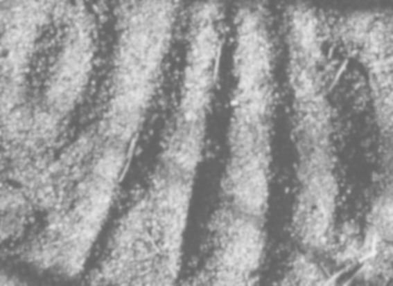

# (PART) Block 2: Differences and differentiation {.unnumbered}

# Functions and patterns

As you know, a function takes one or more inputs and returns a value as output. The functions we examine in CalcZ take *quantities* as inputs and return a *quantity* as an output. 
The algorithm that forms the body of the function describes arithmetic and other calculations that can turn the inputs into the output. 

On the other hand, we can also use ***tables*** as functions. With a table, you specify the input, look up that input in one of the colums of the table which brings you to the right row. Then read out from that row the value in another column to be the output. The quantitative operation needed for table lookup is simple comparison. The floor/corridor/door metaphor describes table lookup as well as function evaluation. 

In the previous block, we constructed functions to represent the patterns seen in data. In one example, we constructed a function $g(t) = A + B e^{-k t}$ to represent the temperature of water cooling in a mug as a function of time. In another example, we summarized the pattern of rising and falling tides. 

It's common sense that data is stored in tables. But we could easily represent any smooth mathematical function, such as our basic modeling functions, as a table look-up problem. Indeed, in the era before computers, many mathematical functions were used in exactly this manner: a printed table in which a person could search for a match to the input and retrieve a value for the output.

[Picture of some nice old table.]

In the computer era, we still routinely represent functions this way: data stored in computer files. For instance, an MP3 file is not much more than a sequence of numbers that record a complicated function of time: the air pressure variations of sound. Similarly, digital images record functions of $x$ and $y$ over a limited domain. Given $x$ and $y$ as input, you can look up the output by going to the right pixel.

We humans of course, don't perceive the numerical output of either sound or image functions: we **hear** a sound and we **see** an image. We've got special biological equipment for this!

Consider the image in Figure \@ref{fig:sand-1}. It is a picture of some indentations in a small area of sand, about two inches wide in the middle of a hiking trail. The dots are individual grains of sand.

```{r sand-1, echo=FALSE, out.width="50%", fig.align="center"}

```

Can you see three almost parallel furrows? How about the small crater in the upper left?

You can see the individual grains of sand because they contrast sharply with their neighbors. Or, more precisely, you can see a few dozen grains **because** they contrast sharply with their neighbors.


You can think of the surface of the sand as a function of $x$ and $y$. It's lower in some places and higher in others. But, in fact, you can't see the height of an individual point in the photograph. In the right light, you wouldn't notice the furrows at all. But the way the picture is lighted, raking sunlight from the left, the surface is translated into broad regions of brightness and shadow. In the light regions, the surface slants toward the sun. In the shadows, the surface slants away from the sun. 

What you're mainly seeing in the photo is the ***slant*** or ***slope*** of the surface. The light has transformed *elevation* as a function of $x$ and $y$ into *slant* as a function of $x$ and $y$ and then encoded the slant as brightness, in much the same way the background of a contour plot encodes the output of the function as a color. 

The moral here is that sometimes the data in a function is not in the right form for us to extract useful information. But by transforming that data to represent contrast or difference or slope, the information can be revealed.

This Block is about transforming functions to show difference and slope. Such transformation, accomplished by mathematics rather than the raking light of the sun, can take a pattern that we're presented with and turn it into another pattern that can tell us what we want to know. 

## Modeling a model

At the core of what we will do in this block to represent a function ***locally*** as a straight-line function. For instance, the exponential function has a curving shape. But let's look what happens when we zoom in on the function in different local domains.

```{r echo=FALSE}
Pts <- tibble::tibble(
    x = c(-1.5, 0, 1.5),
    y = exp(x)
)
slice_plot(exp(x) ~ x, domain(x=c(-2, 2))) %>%
    gf_labs(title="An exponential function") %>%
    gf_point(y ~ x, data = Pts, color="red")
```

```{r echo=FALSE, out.width="20%", fig.show="hold", warning=FALSE, message=FALSE}
slice_plot(exp(x) ~ x, domain(x=c(-2, -1)), size=2) %>%
    gf_point(y ~ x, data = Pts[1,], color="red", size=4) %>%
    gf_lims(y=c(0,7.2))
BlankImage
slice_plot(exp(x) ~ x, domain(x=c(-0.5, 0.5)), size=2) %>%
    gf_point(y ~ x, data = Pts[2,], color="red", size=4) %>%
    gf_lims(y=c(0,7.2))
BlankImage
slice_plot(exp(x) ~ x, domain(x=c(1, 2)), size=2) %>%
    gf_point(y ~ x, data = Pts[3,], color="red", size=4) %>%
    gf_lims(y=c(0,7.2))
```

```{r echo=FALSE, out.width="13%", fig.show="hold", warning=FALSE, message=FALSE}
slice_plot(exp(x) ~ x, domain(x=c(-1.625,-1.375)), size=4) %>%
    gf_point(y ~ x, data = Pts[1,], color="red", size=8) %>%
    gf_lims(y=c(0,7.2))
BlankImage
BlankImage
slice_plot(exp(x) ~ x, domain(x=c(-0.125, 0.125)), size=4) %>%
    gf_point(y ~ x, data = Pts[2,], color="red", size=8) %>%
    gf_lims(y=c(0,7.2))
BlankImage
BlankImage
slice_plot(exp(x) ~ x, domain(x=c(1.375, 1.625)), size=4) %>%
    gf_point(y ~ x, data = Pts[3,], color="red", size=8) %>%
    gf_lims(y=c(0,7.2))
```


The straight-line function $a + b x$ is, naturally a ***global***

## Difference

::: {.objectives latex-data=""}
```{r echo=FALSE, results="asis"}
state_objective("Deriv-2a", "Understand that specifying two different inputs to a function defines an input. The length of that interval between the \"run\". The \"rise\" is the difference in output at the two input points.  calculating a \"rise over run\" as a ratio gives the ***average rate of change*** of a function over the interval")
```
:::

Comparing the value of a function $f()$ at two inputs is a matter of evaluating the function at two inputs, say $x_0$ and $x_1$. Often, our interest is in comparing the output at two ***nearby*** inputs. To convey this idea of nearby, we can write the two nearby inputs as $x_0$ and $x_0 + h$. The lower-case letter $h$ will be used throughout these notes to signify a ***small*** increment, typically positive, in the input to a function. (Note: The function $h()$ is not necessarily about small increments. It's just a generic pronoun for a function.)

The ***finite difference*** between function outputs at the two nearby inputs is $f(x_0 + h) - f(x_0)$. We could just as well consider $f(x_0) - f(x_0 - h)$. Are these two differences the same? That depends on the function $f()$.

::: {.workedexample latex-data=""}
Consider the simple A/B combination of a power-law function and a constant function: $g(x) \equiv x^2 + 3$. Taking $h$ to be 0.1 and $x_0$ to be 1, what is the finite difference of $g(x)$? How about for $h=0.01$?

The finite difference  is $$g(x_0 + h) - g(x_0) = (x_0 + h)^2 + 3 - \left(x_0^2 + 3\right)$$
When $h=1$ this gives $$1.1^2 + 3 - (1.1 +3) = 1.21 - 1.1 = 0.21$$ When $h=1.01$ it is $$1.01^2 - 1.01 = 1.0201 - 1.01 = 0.0101$$
:::

We will often need to consider the finite difference as a function. This involves making a tiny change in notation. Instead of $x_0$, which by our notation convention suggests a *specific value* for the input, we'll write $x$ as in $$f(x+h) - f(x)$$ 

::: {.workedexample latex-data=""}
Continuing the previous example ... What is the finite difference function for $g(x)$? Evaluate it at $x = 1$ and $2$ with $h=0.10$ and $h=0.01$ 

The formula, as we have seen, is $$(x+h)^2 + 3 - \left(x^2 + 3\right) = x^2 + 2h x + h^2 + 3 - (x^2 + 3) = 2h x + h^2$$

Evaluating this:

* At $x=1$: 

    - For $h=0.10$ the finite difference function evaluates to $2 \times 0.1 \times 1 + 0.1^2 = 0.2 + 0.01 = 0.21$. 
    - Setting $h=0.01$  gives $2 \times 0.01 \times 1 + 0.01^2 = 0.0201$.

* At $x=2$: 

    - For $h=0.10$ the finite difference function evaluates to $2 \times 0.1 \times 2 + 0.1^2 = 0.4 + 0.01 = 0.041$. 
    - For $h=0.01$, it is $2 \times 0.01 \times 2 + 0.01^2 = 0.0401$.

As you can see, the value of the finite difference function depends both on $x$ *and on* $h$. Not a surprize. When $h=0.01$ the values are roughly 10-times smaller than for $h=0.10$.
:::

This idea of a ***finite-difference function*** is mainly just a step on the path to another kind of function that will be of primary importance in calculus, the ***finite rate of change***, often called the ***average rate of change***: $$\frac{f(x + h) - f(x)}{h}$$
Recognize this as "rise over run," in other words a "slope."

Let's give this particular function a name to help us talk about it. A tradition is to use a Greek letter, $\Delta$ ("delta"), here. The finite rate of change function for $f()$ is $$\Delta f(x) \equiv \frac{f(x+h) - f(x)}{h}$$ In computer notation, we might write `delta_f()`. Remember, $\Delta f$ is just the **name** we've given to the function. Any other name could have been used.

::: {.workedexample latex-data=""}
Find the finite rate of change function for $g(x)$ and evaluate it at $x=1$ for $h=0.1$ and $h=0.01$.

Following the $\Delta$ naming convention, we'll call the finite rate of change function $$\Delta g(x) \equiv \frac{g(x+h) - g(x)}{h} = \frac{2 h x + h^2}{h} = 2 x + h$$

Evaluating $\Delta g(1)$ for $h=0.10$ and $h=0.01$, we get:

- $h=0.10$ gives $2 + 0.10 = 2.10$
- $h=0.01$ gives $2 + 0.01 = 2.01$

In contrast to the finite difference function, where $h$ strongly shapes the output, for the finite rate of change function $h$ hardly matters at all!
:::

From the way we've defined $\Delta f(x)$, it's reasonable to assume that $h$ is a ***parameter***: a symbol naming a numerical value that has to be specified before $\Delta f(x)$ can be evaluated at a specific $x$. But $h$ actually is a character in the play of calculus, a character that plays a central role but whose numerical value is usually of no interest whatsoever besides being "small." 

::: {.workedexample latex-data=""}
We said that $h$ in the finite rate of change function $\Delta g()$, so long as $h$ is small, plays both a central role and has hardly any effect. An economizing director, re-writes the play to take $h$ out of it, setting $h=0$: a non-speaking role. With this choice, what's $\Delta g(x)$?

We've already seen that $$\Delta g(x) = 2 x + h$$ Re-writing by replacing $h$ with 0 streamlines the play, turning $\Delta g()$ from a dialog into a monologue: $\Delta g(x) = 2 x$. Simple.

And yet ... the director gets a letter from the Actors Equity Union. 

> *We observe that you have eliminated the role of $h$ from your play. This is in violation of Union regulations. Recall that a finite rate of change function $\Delta g(x)$ is defined as a ratio: $$\Delta g(x) \equiv \frac{g(x+h) - g(x)}{h}$$ Although the name $h$ does not need to appear in the argument list of $\Delta g(x)$, eliminating $h$ entirely by replacing her with zero is a **division by zero error** forbidden by Article 3.16§B¶2 of the Unified Laws of Arithmetic. We ask that you comply with this Article by re-instating the role of $h$ in all evaluations of $\Delta g(x)$.*

Reading this, the director calls her lawyer. Is there a loophole to deal with Article 3.16§B¶2 without $h$?
:::

## The $\Delta$ operator

Up until now, we used only functions that take numerical quantities as inputs and produce a numerical quantity as an output. It's time now to broaden our perspective a bit.

Imagine a function named $\Delta()$ defined like this:
$$\Delta(f) \equiv \frac{f(x+h) - f(x)}{h}$$
$\Delta()$ takes as input a **function**. You might have guessed this because the definition uses the name $f$ for the input to $\Delta()$, but the name of an input does not matter so long as it is used consistently in the body of the function. Looking at the body, you can that the name $f$ is being used (twice!) in the position of a function's name.

For instance:

- $\Delta(\sin) = \frac{\sin(x+h) - \sin(x)}{h}$
- $\Delta(x^2) = \frac{(x+h)^2 - x^2}{h}$
- $\Delta(a + b x) = \frac{a + b(x + h) - \left(a + b x\right)}{h}$

::: {.why latex-data=""}
Why did you use $=$ in the above statements rather than the $\equiv$?

$\equiv$ means "is defined as" or "is the name of." When we wrote $$\Delta(f) \equiv \frac{f(x+h) - f(x)}{h}$$ we were giving a name to a function. But writing $\Delta(a + b x)$ means to apply the already defined function $\Delta$ to an input, that input being the straight-line function $a + b x$. Rather than *defining* what is $\Delta(a + b x)$ we are *deducing* it from objects that have already been defined.
:::

What is the output of $\Delta()$? It takes a *function* as an input and returns ... a function as an output.

We might choose to give a name to the output, for example fred() or betty() or, more helpfully, $\mbox{rate}_\sin$ or $\Delta \sin$, but our naming conventions, particularly the use of $x$ indicate that \frac{\sin(x+h) - \sin(x)}{h}$ is a function.

In calculus, there are a handful of celebrity functions that take a function as input and return a function as output. Notice that the word "function" appeared three times in the previous sentence. To avoid this sort of sleep-inducing repetition, we'll call such functions ***operators***. 

> An ***operator*** (as we will use the word) is a function that, like all functions, has an input and an output. The input is itself a function, the output is also a function, typically (but not always) different from the input.

::: {.objectives latex-data=""}
```{r echo=FALSE, results="asis"}
state_objective("Diff-1a", "Understand the relations between position, velocity, and acceleration as \"change relations.\"")
```
:::

# Difference and change
    
    Readings: 347-360
    
    Objectives:
    

    #. (Deriv-1b) Know how to calculate the value at a single point of a derivative function.
    #. (Deriv-1c) Understand that differentiation is an operator that produces a function called the derivative.
    
::: {.todo}

ROUGH ROUGH ROUGH

Lidar measured distance to ground. The function value doesn't really matter. What matters is how the value at a point relates to the values at nearby points. Seeing this difference is how you can spot the Maya ruins.


```{r echo=FALSE}
knitr::include_graphics("www/mayan-ruins.jpg")
```


Instituto Nacional de Estadística y Geografía/Nacional Center for Airborne Laser Mapping

"The map, published in 2011 by Mexico’s National Institute of Statistics and Geography, covered 4,440 square miles in the Mexican states of Tabasco and Chiapas. It was made as part of the institute’s mission to create accurate maps to be used by businesses and researchers.

"Dr. Inomata learned about the map from Rodrigo Liendo, an archaeologist at the National Autonomous University of Mexico. The resolution of the map was low. But the outlines of countless archaeological sites stood out to Dr. Inomata. So far, he has used it to identify the ruins of 27 previously unknown Maya ceremonial centers that contain a type of construction that archaeologists had never seen before. These sites may hold insights into the origins of Maya civilization."


[NYTimes article](https://www.nytimes.com/2019/10/08/science/archaeology-lidar-maya.html)
:::

<!--

2. **Average and Instantaneous Rates of Change**

    
    Readings: 365-379
    
    Objectives:
    
    
    #. (Deriv-2b) Understand how calculating the slope (using a small value of h) of a function reflects the instantaneous rate of change of the function at that point.
    #. (Deriv-2c) Understand what the signs of 1st and 2nd derivative tell you about the original function.

3. **Smoothness and Curvature**
    
    Readings: N/A
    
    Objectives:
    
    i. (Deriv-3a) Understand the physical analogs of continuity and smoothness.
    #. (Deriv-3b) Determine if a function is continuous by thinking about the “pencil stays on paper” technique
    #. (Deriv-3c) Understand smooth of degree 1 as “Function is continuous, derivative is continuous”
    #. (Deriv-3d) Understand smooth of degree  as “Smooth of degree  and th derivative is continuous”

4. **Partial Change**
    
    Readings: 440-457
    
    Objectives:
    
    i. (Deriv-4a) Understand that there are many different slopes at any point of a non-constant function of 2 or more variables.
    #. (Deriv-4b) Calculate partial derivatives on a contour plot
    #. (Deriv-4c) Understand “partial derivative” as “changing one input while holding constant all the other inputs.”
    #. (Deriv-4d) Know the three properties of gradient vectors (pg. 572)

5. **Approximation Around a Point**
    
    Readings: 407-417
    
    Objectives:
    
    i. (Deriv-5a) Understand strategy of looking at the behavior of function  around a point  by considering a new, possibly simpler function in terms of .
    #. (Deriv-5b) Be able to construct a straight-line function (Linear Approximation) that approximates f() around
    #. (Deriv-5c) Be able to construct a 2nd-order polynomial (Quadratic Approximation) whose value and derivatives at  match those of a function

6. **Limits and the Infinitesimal**
    
    Readings: 461-468; 471-473
    
    Objectives:
    
    i. (Deriv-6a) Recognize the various types of discontinuities
    #. (Deriv-6b) Understand limit notation and what  means
    #. (Deriv-6c) Understand how a limit is used to find the derivative at a single point
    #. (Deriv-6d) Calculate limits for horizontal asymptote problems

7. **Basic Derivative Rules**
    
    Readings: 388-404
    
    Objectives:
    
    i. (Deriv-7a) Apply the basic derivative shortcuts to find the derivative of a function

8. **Advanced Derivative Rules**
    
    Readings: 407-417; 425-434
    
    Objectives:
    
    i. (Deriv-8a) Apply the advanced derivative shortcuts (Product and Chain Rule) to find the derivative of a function
    #. (Deriv-8b) Calculate partial derivatives by “changing one input while holding constant all the other inputs.”
    #. (Deriv-8c) Master derivatives of basic modeling functions

9. **Mathematical Modeling Applications**
    
    Readings: 518-531
    
    Objectives:
    
    i. (Deriv-9a) Eliminate terms in a possible model by considering simple inputs for which the result is known
    #. (Deriv-9b) Understand the concept of grade as it relates to elevation change
    #. (Deriv-9c) Use dimensional analysis to determine the units of terms within a model

10. Optimization
    
    Readings: 480-495; 500-513
    
    Objectives:
    
    i. (Deriv-10a) Understand and distinguish between max (min) and argmax (argmin)
    #. (Deriv-10b) Visually identify max (min) and argmax (argmin) in graphs of functions of one and two variables.
    #. (Deriv-10c) Find max and min of a quadratic function using calculus and algebra
    #. (Deriv-10d) Understand how Newton’s method uses an iterative process to find where the function is 0
    #. (Deriv-10e) Distinguish between two basic strategies “walk uphill” and “differentiate and solve for zero.”

11. **Optimization Application**
    
    Readings: N/A
    
    Objectives:
    
    i. (Deriv-11a) Convert a word problem into an Objective function and constraint
    #. (Deriv-11b) Convert a multivariate objective function to a univariate objective function using the constraint
-->
 

