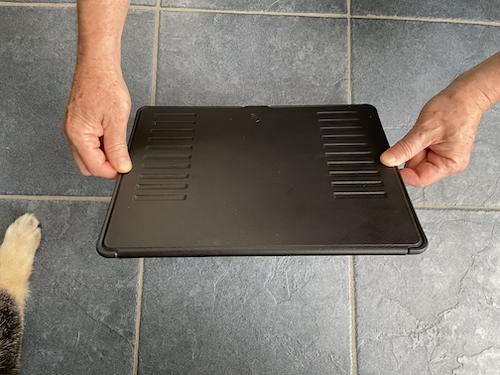

# Partial change

This is a good time to point out something we have been doing all along, but which has likely been such a persistent component of your mathematics education that you may not have realized that it is a construction. `r mark(2600)`

We have two ways by which we represent functions:

1. As a ***computational algorithm*** for generating the output from an input(s), typically involving arithmetic and the such. 
2. As a geometrical entity, specifically the graph of a function which can be a ***curve*** or, for functions of two inputs, a ***surface***.

These two modes are sometimes intertwained, as when we use the name "line" to refer to a computational object: $\line(x) \equiv a x + b$.

Unfortunately for functions of two inputs, a ***surface*** is hard to present in the formats that are most easily at hand: a piece of paper, a printed page, a computer screen. That's because a curved surface is naturally a 3-dimensional object, while paper and screens provide two-dimensional images. Consequently, the graphics mode we prefer for presenting functions of two variables is the contour plot, which is not a single geometrical object but a set of many objects: contours, labels, colored tiles.  `r mark(2605)`

We've been doing calculus on functions of one variable because it is so easy to exploit both the computational mode and the graphical mode. And it might fairly be taken as a basic organizing theme of calculus that  `r mark(2610)`

> a line segment can be as good an approximation to a curve as you choose to make it. 

When figuring out the derivative function $\partial_x f(x)$ from a graph of $f(x)$, we find the tangent to the graph at each of many input values, record the slope of the line (and throw away the intercept) and then write down the series of slopes as a function of the input, typically by representing the slope by position along the vertical axis and the corresponding input by position along the horizontal axis. Figure \@ref(fig:segment-deriv) shows the process. `r mark(2615)`

```{r segment-deriv, echo=FALSE, fig.cap="The **slope** of the function $f(x)$ at any given input becomes the **value** of the derivative at that input.", fig.show="hold", warning=FALSE}
f <- rfun(~ x, seed=977)
df <- D(f(x) ~ x)
dom = c(-3, 3)
touches = seq(dom[1] + 0.3, dom[2] - 0.3, by = 0.25)
Pts <- tibble(x = touches, y = f(x), dy = df(x), 
              label=LETTERS[1:length(x)],
              slope = df(x), slopeval = signif(slope,2),
              slope_color = ifelse(slope < 0, "red", "blue"),
              color = rainbow(length(x), start=0.6)) 
Segments <- Pts %>%
  mutate(xend = lag(x), y = dy, yend=lag(y))
graph_with_tangents(f, domain=dom, 
                    touches = touches,
                    offsets=rep(1, length(touches))) %>%
  gf_text(y-1 ~ x, data=Pts, color=~slope_color, label=~ slopeval) %>%
  gf_labs(y="f(x)", title="(A) Graph of function f(x)")

gf_point(dy ~ x, data = Pts, color = ~ color) %>%
  gf_refine(scale_color_identity()) %>%
  gf_segment(dy + yend ~ x + xend, data = Segments, color = ~ color) %>%
  gf_lims(x = c(-3,3)) %>%
  gf_text(dy ~ I(x+0.2), data=Segments, color=~slope_color, label=~ slopeval) %>%
  gf_text(dy ~ -3, data=Segments, color=~slope_color, label=~ slopeval) %>%
  gf_labs(y="Slope of f(x)", title="(B) Graph of derivative of f(x)") %>%
  gf_text(I(dy+1) ~ x, data = Segments, color=~ color, label=~label)
```

Consider the top panel (A). At the input $x=0$---the point labeled "L"---the value of the function is $f(0) \approx 25$. This is practically the same as the value at "K." The slope of the short line segment labeled "L" is $\partial_x f(0) = -3.4$ Now look at the same input in the bottom panel (B). This shows $\partial_x f(x)$ on the vertical axis. The slope of $f()$ at $x=0$ was negative, even though $f(0)\approx 25$.On the graph of $\partial_x f()$, the position of "L" is in negative territory. And it's quite different from the position of its neighbor "K". `r mark(2620)`

## Calculus on two inputs

To think about derivatives of functions of two inputs, we need to have some way to approximate the surface at each point with a small linear form that is tangent to the surface at that point. 

An applet written by Alfredo Sánchez Alberca lets you visualize the ***tangent plane*** to a surface. (Instructions: Check "tangent plane" then rotate the view. Move the (x,y) coordinate of the point to see how the tangent plane differs from place to place.) `r mark(2625)`

<a href="https://www.geogebra.org/m/wTh7KKd3" target="_blank"></a>

The tangent plane is infinite in extent. Let's use the word ***facet*** to refer to a little patch of the tangent plane centered at the point of contact. The facet is flat. (It's part of a plane!) Figure \@ref(fig:melon-facets) shows some facets tangent to a curved surface. No two of them are oriented the same way. `r mark(2630)`


```{r melon-facets, echo=FALSE, fig.cap="A melon as a model of a curved surface such as the graph of a function of two inputs. Each tangent facet has its own orientation. (Disregard the slight curvature of the small pieces of paper. Summer humidity has interfered with my attempt to model a flat facet with a piece of Post-It paper!"}

```

Better than a picture of a summer melon, pick up a hardcover book and place it on a curved surface that's convex facing away from the cover. The cover will match the orientation of the surface at the point of tangency. Change the orientation of the cover and you will find that the point of tangency will change correspondingly.  `r mark(2635)`

For the purposes of computation by eye, a contour graph of a surface can be easier to deal with. Figure \@ref(fig:whole-plot) shows the contour graph of a smoothly varying function. Three points have been labeled A, B, and C.  `r mark(2640)`


```{r echo=FALSE}
g <- rfun(~ x + y, seed=382)
Pts <- tibble::tribble(
  ~ x, ~ y, ~ label,
  -1, 1, "A",
  1.5, 1.2, "B",
  -1.7, -1.7, "C"
)
P <- contour_plot(g(x, y) ~ x + y, domain(x=c(-3,3), y=c(-3,3))) %>%
  gf_text(y ~ x, data = Pts, color="red", label=~label) %>%
  gf_refine(coord_fixed())
dx <- D(g(x, y) ~ x)
dy <- D(g(x, y) ~ y)
xA <- -1
yA <- 1
gA <- function(x, y) {g(xA, yA) + dx(xA, yA)*(x-xA) + dy(xA,yA)*(y-yA)}
PA <- contour_plot(gA(x, y) ~ x + y, domain(x=xA + 3*c(-.1, .1), y=yA +3*c(-.1, .1))) %>%
  gf_text(y ~ x, data = Pts %>% filter(label=="A"), label=~label, color="red", size=12)%>%
  gf_refine(coord_fixed())
PzA <- contour_plot(g(x, y) ~ x + y, domain(x=xA + 3*c(-.1, .1), y=yA +3*c(-.1, .1))) %>%
  gf_text(y ~ x, data = Pts %>% filter(label=="A"), label=~label, color="red", size=12)%>%
  gf_refine(coord_fixed())

xB <- 1.5
yB <- 1.2
gB <- function(x, y) {g(xB, yB) + dx(xB, yB)*(x-xB) + dy(xB,yB)*(y-yB)}
PB<-   contour_plot(gB(x, y) ~ x + y, domain(x=c(xB-.1, xB+.1), y=c(yB-.1, yB+.1))) %>%
  gf_text(y ~ x, data = Pts %>% filter(label=="B"), label=~label, color="red", size=12)%>%
  gf_refine(coord_fixed())
PzB <- contour_plot(g(x, y) ~ x + y, domain(x=xB + 1*c(-.1, .1), y=yB +1*c(-.1, .1))) %>%
  gf_text(y ~ x, data = Pts %>% filter(label=="B"), label=~label, color="red", size=12)%>%
  gf_refine(coord_fixed())

xC <- -1.7
yC <- -1.7
gC<- function(x, y) {g(xC, yC) + dx(xC, yC)*(x-xC) + dy(xC,yC)*(y-yC)}
PC <- contour_plot(gC(x, y) ~ x + y, domain(x=c(xC-.1, xC+.1), y=c(yC-.1, yC+.1))) %>%
  gf_text(y ~ x, data = Pts %>% filter(label=="C"), label=~label, color="red", size=12)%>%
  gf_refine(coord_fixed())
PzC <- contour_plot(g(x, y) ~ x + y, domain(x=xC + 1*c(-.1, .1), y=yC +1*c(-.1, .1))) %>%
  gf_text(y ~ x, data = Pts %>% filter(label=="C"), label=~label, color="red", size=12)%>%
  gf_refine(coord_fixed())

```

```{r whole-plot, echo=FALSE, fig.cap="A function of 2 inputs with 3 specific inputs marked A, B, and C"}
P
```


Zooming in on each of the marked points presents a simpler picture for each of them, although one that is different for each point. Each zoomed-in plot contains almost parallel, almost evenly spaced contours. If the surface had been exactly planar over the zoomed-in domain, the contours would be *exactly* parallel and exactly evenly spaced. `r mark(2645)`

```{r zoomed-plot, echo=FALSE, out.width="33%", fig.show="hold", fig.cap="Zooming in on the neighborhoods of A, B, and C in Figure \\@ref(fig:whole-plot) shows a simple, almost planar, local landscape."}
PzC
PzA
PzB
```

Just as the function $\line(x) \equiv a x + b$ describes a straight line, the function $\text{plane}(x, y) \equiv a + b x + c y$ describes a plane whose orientation is specified by the value of the parameters $b$ and $c$. `r mark(2650)`

In Figure \@ref(fig:facet-plot), the facets tangent to the original surface at A, B, and C are displayed. Comparing Figures \@ref(fig:zoomed-plot) and \@ref(fig:facet-plot) you can see that each facet has the same orientation as the surface; the contours face in the same way. `r mark(2655)`


```{r facet-plot, echo=FALSE, out.width="33%", fig.show="hold", fig.cap="The facets around the points are linear functions, each aligned with the contours near that point in Figure \\@ref(fig:whole-plot)"}
PC
PA
PB
```

Remember that the point of constructing such facets is to generalize the idea of a derivative from a function of one input $f(x)$ to functions of two and more inputs such as $g(x,y)$. Just as the derivative $\partial_x f(x_0)$ reflects the ***slope*** of the *line* tangent to the graph of $f(x)$ at $x=x_0$, our plan for the "derivative" of $g(x_0,y_0)$ is to represent the ***orientation*** of the facet tangent to the graph of $g(x,y)$  at $(x=x_0, y=y_0)$. The question for us now is what information is needed to specify an orientation. `r mark(2660)`

One clue comes from the formula for a function whose graph is a plane oriented in a particular direction:

$$\text{plane}(x,y) \equiv a + b x + cy$$

::: {.scaffolding}
To explore the roles of the parameters $b$ and $c$ in setting the orientation of the line, open a `r sandbox_link()`. The scaffolding code generates a particular instance of $\text{plane}(x,y)$ and plots it in two ways: a contour plot and a surface plot. Change the numerical values of $b$ and $c$ and observe how the orientation of the planar surface changes in the graphs. You can also see that the value of $a$ is irrelevant to the orientation of the plane, just as the intercept of a straight-line graph is irrelevant to the slope of that line. `r mark(2665)`

```{r}
plane <- makeFun(a + b*x + c*y ~ x + y, a = 1, b = -2.5, c = 1.6)
interactive_plot(plane(x, y) ~ x + y, domain(x=c(-2, 2), y=c(-2, 2)))
contour_plot(plane(x, y) ~ x + y, domain(x=c(-2, 2), y=c(-2, 2))) %>%
  gf_refine(coord_fixed())
```
As always it can be difficult to extract quantitative information from a surface plot. For the example here, you can see that the high-point on the surface is when $x$ is most negative and $y$ is most positive. Compare that to the contour plot to verify that that two modes are displaying the same surface. `r mark(2670)`


(Note: The `gf_refine(coord_fixed())` part of the contour-plot command makes numerical intervals on the horizontal and vertical axes have the same length.)
:::

An instructive experience is to pick up a rigid, flat object, for instance a smartphone or hardcover book. Hold the object level with pinched fingers at the mid-point of each of the short ends, as shown in Figure \@ref(fig:hold-book) (left).  `r mark(2675)`

```{r hold-book, echo=FALSE, out.width="33%", fig.show="hold", fig.cap="Combining two simple movements can tip a plane to all sorts of different orientations."}



```
You can tip the object in one direction by raising or lowering one hand. (middle picture) And you can tip the object in the other coordinate direction by rotating the object around the line joining the points grasped by the left and right hands. (right picture) By combining these two motions, you can orient the surface of the object in a wide range of directions. `r mark(2680)`

The purpose of this lesson is to show that two-numbers are sufficient to dictate the orientation of a plane: the amount that one hand is raised relative to the other and the angle of rotation around the hand-to-hand axis. `r mark(2685)`

Similarly, in the formula for a plane, the orientation is set by two numbers, $b$ and $c$ in $\text{plane}(x, y) \equiv a + b x + c y$.

How to find the right $b$ and $c$ for the tangent facet to a function $g(x,y)$ at a specific input $(x_0, y_0)$? Taking slices of $g(x,y)$ provides the answer. In particular, these two slices:
$\text{slice}_1(x) \equiv g(x, y_0) = a + b\, x + c\, y_0 \ \ \text{and}\ \ \text{slice}_2(y) \equiv g(x_0, y) = a + b x_0 + c y$

Look carefully at the formulas for the slices. In $\text{slice}_1(x)$, the value of $y$ is being held constant at $y=y_0$. Similarly, in $\text{slice}_2(y)$ the value of $x$ is held constant at $x=x_0$.  `r mark(2690)`

The parameters $b$ and $c$ can be read out from the derivatives of the respective slices:

$$b = \partial_x \text{slice}_1(x)\left.\strut\right|_{x=x_0} \ \ \text{and}\ \ c=\partial_y \text{slice}_2(y)\left.\strut\right|_{y=y_0}$$
These derivatives of slice functions are called ***partial derivatives***. The word "partial" refers to examining just one input at a time. Here, we're evaluating the partial derivative functions at a specific inputs, $x=x_0$ or $y=y_0$. `r mark(2695)`

You don't need to create the slices explicitly in order to calculate the partial derivatives. 
Simply differentiate $g(x, y)$ with respect to $x$ in order to get parameter $b$ and differentiate $g(x, y)$ with respect to $y$ to get parameter $c$. To demonstrate, we'll make use of the ***sum*** rule:
$$\partial_x g(x, y) = \underbrace{\partial_x a}_{=0} + \underbrace{\partial_x b x}_{=b} + \underbrace{\partial_x cy}_{=0} = b$$
Similarly, $$\partial_y g(x, y) = \underbrace{\partial_y a}_{=0} + \underbrace{\partial_y b x}_{=0} + \underbrace{\partial_y cy}_{=c} = c$$

::: {.takenote}
Get in the habit of noticing the subscript on the differentiation symbol $\partial$. When taking, for instance, $\partial_y f(x,y,z, \ldots)$, all variables other than $y$ are to be ***held constant***. Some examples: `r mark(2700)`

$$\partial_y 3 x^2 = 0\ \ \text{but}\ \ \ 
\partial_x 3 x^2 = 6x\\
\ \\
\partial_y 2 x^2 y = 2x^2\ \ \text{but}\ \ \
\partial_x 2 x^2 y = 4 x y
$$
:::


## All other things being equal ...

Recall that the derivative of a function of one variable, say, $\partial_x f(x)$ tells you, at each possible value of the input $x$, how much the output will change proportional to a small change in the value of the input. This is exactly what the first-order polynomial approximation (that is, the ***linear approximation***), is saying: for small $dx$, $$f(x+dx) = f(x) + \partial_x f(x) \times dx$$
The same logic applies for functions of two inputs:
$$g(x + \color{blue}{dx}, y) = g(x,y) + \color{blue}{\partial_x} g(x,y) \times \color{blue}{dx}\\
\text{and} \\
g(x, y+\color{red}{dy}) = g(x,y) + \color{red}{\partial_y} g(x,y) \times \color{red}{dy}$$

Each of these statements is about *changing one input* while *holding the other input(s) constant*. Or, as the more familiar expression goes, "The effect of changing one input  **all other things being equal**. `r mark(2705)`


::: {.objectives}
```{r echo=FALSE, results="asis"}
state_objective("Deriv-4a", "Understand that there are many different slopes at any point of a non-constant function of 2 or more variables.")
state_objective("Deriv-4b", "Calculate partial derivatives on a contour plot")
state_objective("Deriv-4c", "Understand \"partial derivative\" as \"changing one input while holding constant all the other inputs.\"")
state_objective("Deriv-8b", "Calculate partial derivatives by \"changing one input while holding constant all the other inputs.\"")
state_objective("Deriv-4d", "Know the three properties of gradient vectors")
```
:::

Everything we've said about differentiation rules applies not just to functions of one input, $f(x)$, but to functions with two or more inputs, $g(x,y)$, $h(x,y,z)$ and so on. In this chapter, we'll consider the interpretation and applications of derivatives of functions with multiple inputs. `r mark(2710)`

## Gradient vector

For functions of two inputs, there are two partial derivatives. For functions of three inputs, there are three partial derivatives. We can, of course, collect the partial derivatives into coordinate form. This collection is called the ***gradient vector***. `r mark(2715)`

Just as our notation for differences ($\cal D$) and derivatives ($\partial$) involves unusual typography on the letter "D," the notation for the gradient involves such unusual typography although this time on $\Delta$, the Greek version of "D." For the gradient symbol, turn $\Delta$ on its head: $\nabla$. That is,
$$\nabla g(x,y) \equiv \left(\stackrel\strut\strut\delta_x g(x,y), \ \ \delta_y g(x,y)\right)$$

Note that $\nabla g(x,y)$ is a function of both $x$ and $y$, so in general the gradient vector differs from place to place in the function's domain.

The graphics convention for drawing a gradient vector for a particular input, that is, $\nabla g(x_0, y_0)$, puts an arrow with its root at $(x_0, y_0)$, pointing in direction $\nabla g(x_0, y_0)$, as in Figure \@ref(fig:one-grad-arrow). `r mark(2720)`

```{r one-grad-arrow, echo=FALSE, fig.cap="The gradient vector $\\nabla g(x=1,y=2)$. The vector points in the steepest uphill direction. Consequently, it is perpendicular to the contour passing through it's root.", cache=TRUE}
graw <- rfun( ~ x + y, seed=562)
g <- makeFun(graw(x, y)  ~ x & y)
contour_plot(g(x, y+.2) ~ x + y, domain(x=c(-2,2), y=c(0, 4))) %>%
  gf_text(2 ~ 1, label= ~"(x=1,y=2)", color="red", hjust=0, vjust=-0.50) %>%
  gradient_plot(g(x, y) ~ x + y, domain(x=c(1,2), y=c(2, 3)), npts=1, color="red", alpha=1) %>%
  gf_refine(coord_fixed())
```

A ***gradient field*** (see Figure \@ref(fig:gradient-field-A)) is the value of the gradient vector at each point in the function's domain. Graphically, in order to prevent over-crowding, the vectors are drawn at discrete points. The lengths of the drawn vectors are set proportional to the numerical length of $\nabla g(x, y)$, so a short vector means the surface is relatively level, a long vector means the surface is relatively steep.  `r mark(2725)`

```{r gradient-field-A, echo=FALSE, fig.cap="A plot of the gradient field $\\nabla g(x,y)$.", cache=TRUE}
contour_plot(g(x, y+.2) ~ x + y, domain(x=c(-2,2), y=c(0, 4))) %>%
  gradient_plot(g(x, y) ~ x + y, color="red", alpha=1) %>%
  gf_refine(coord_fixed())
```
Since each gradient vector points uphill, start at a point and follow the vectors as you go, you will get to a local maximum!

```{exercise, name="partial-purple"}
```
<details>`r MC_counter$reset()` `r knitr::knit_child("Exercises/Diff/partial-purple.Rmd")`</details>

```{exercise, name="partial-tan"}
```
<details>`r MC_counter$reset()` `r knitr::knit_child("Exercises/Diff/partial-tan.Rmd")`</details>

```{exercise, name="partial-doctor"}
```
<details>`r MC_counter$reset()` `r knitr::knit_child("Exercises/Diff/partial-doctor.Rmd")`</details>


## Gradient vector

```{exercise, name="gradient-field-red"}
```
<details>`r MC_counter$reset()` `r knitr::knit_child("Exercises/Diff/gradient-field-red.Rmd")`</details>

```{exercise, name="gradient-field-blue"}
```
<details>`r MC_counter$reset()` `r knitr::knit_child("Exercises/Diff/gradient-field-blue.Rmd")`</details>

```{exercise, name="gradient-field-orange"}
```
<details>`r MC_counter$reset()` `r knitr::knit_child("Exercises/Diff/gradient-field-orange.Rmd")`</details>

```{exercise, name="gradient-field-pink"}
```
<details>`r MC_counter$reset()` `r knitr::knit_child("Exercises/Diff/gradient-field-pink.Rmd")`</details>

```{exercise, name="gradient-field-violet"}
```
<details>`r MC_counter$reset()` `r knitr::knit_child("Exercises/Diff/gradient-field-violet.Rmd")`</details>


```{exercise, name="partial-house"}
```
<details>`r MC_counter$reset()` `r knitr::knit_child("Exercises/Diff/partial-house.Rmd")`</details>

```{exercise, name="spider-blow-lamp"}
```
<details>`r MC_counter$reset()` `r knitr::knit_child("Exercises/Diff/spider-blow-lamp.Rmd")`</details>

```{exercise, name="grass-grows-red"}
```
<details>`r MC_counter$reset()` `r knitr::knit_child("Exercises/Diff/grass-grows-red.Rmd")`</details>

```{exercise, name="grass-grows-blue"}
```
<details>`r MC_counter$reset()` `r knitr::knit_child("Exercises/Diff/grass-grows-blue.Rmd")`</details>


`r insert_calcZ_exercise("XX.XX", "uifJjv", "Exercises/Diff/aspen-let-cotton.Rmd")`

## Algorithmic optimization


`r insert_calcZ_exercise("XX.XX", "kcblMf", "Exercises/Diff/pony-run-bed.Rmd")`
