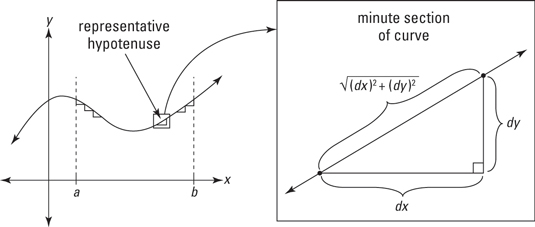

```{r include=FALSE}
library(mosaic)
library(mosaicCalc)
library(etude2)
```

Imagine you have a curve on a plane. We'll look at curves that can be represented by functions of one variable, $f(x)$, so the curve is simply the graph of $f(x)$ versus $x$.

We'd like to find the length of the curve described by $f()$ over the domain $a < x < b$.

If $f()$ is linear, the answer is simple. The slope of the function is $\partial_x f(x)$ which will be a constant, call it $p$. The curve itself is the hypothenuse of a right triangle. The length of one leg is $\Delta x \equiv b-a$. The length of the other leg is $p \cdot \Delta x$. So the length of the hypothenuse is
$$s = \sqrt{(\Delta x)^2 p^2 + (\Delta x)^2} = \sqrt{(p^2 + 1) (\Delta x)^2} = \Delta x \sqrt{p^2 + 1}$$

Now for a slightly more complex case where the curve is not linear, as in the diagram [[source](https://www.dummies.com/education/math/calculus/how-to-calculate-arc-length-with-integration/)]:
```{r echo=FALSE, out.width="80%", fig.align="center"}

```


You've heard the phrase, "Think globally, act locally." The spirit of differential modeling is, "model locally and let integration deal with the global stuff." The region in the little box on the left panel of the diagram represents any local area of the curve. That region is magnified in the right panel. Because **any curve looks linear over a small enough domain**, it's easy to find the length of the curve over the little segment of horizontal length $dx$ and vertical height $dy$. 

(OK, when we said, "any curve looks linear" we should have said, "any **differentiable** curve looks linear." If you're not sure where the "differentiable" comes in, think about what a non-differentiable curve might look like. Recall that "differentiable" means continuous plus a continuous first derivative.)

Of course, the vertical height of the segment of the curve is the differential, slope times height $$dy = \partial_x f(x) dx$$ Plugging this in the the expression for the *length* of the short segment gives us another differential $$ds = \sqrt{\left[\partial_x f(x)\right]^2 + 1}\, dx$$ 
The overall length of the curve (over the domain a to b) is just the sum of the many differentials of length, that is:
$$s = \int_a^b ds = \int_a^b \sqrt{\left[\partial_x f(x)\right]^2 + 1}\, dx$$

**Problem 1**: Find the length of the function $$f(x) \equiv \sqrt{1 - x^2}$$ over the domain $-1 < x < 1$. The sandbox contains the command to graph the function. You can see that the function describes the upper half of a circle of radius $r=1$.

```{r ld1, exercise=TRUE, exercise.cap="The half circle", exercise.nlines=6, eval=FALSE}
f <- makeFun(sqrt(1 - x^2) ~ x)
slice_plot(f(x) ~ x, domain(x=c(-1, 1)), npts=500) %>%
  gf_refine(coord_fixed())
```
How long is the curve? You can answer this readily by remembering that the circumference of a full circle is $2 \pi r$. We've got half a circle here, so ...

But let's do it with integration. We'll use `antiD()` just so that you can see the logic step by step:

```{r ld2, exercise=TRUE, exercise.cap="Length of the half circle", exercise.nlines=8, eval=FALSE}
f <- makeFun(sqrt(1 - x^2) ~ x)
f <- makeFun(sin(2*pi*x/16) ~ x)
df <- D(f(x) ~ x)  # slope as a function of x
# differential of length
ds <- makeFun(sqrt(df(x)^2 + 1) ~ x)
S <- antiD(ds(x) ~ x)
S(1) - S(-1)
S(32) - S(0)
```

As an illustration of a curve length application, let's look at "The Gardens" at the University of Virginia, opened in 1824.  

```{r echo=FALSE, out.width="50%", fig.align="center"}

```

Behind the white bench is a brick wall. It's called a "serpentine" wall because instead of being flat, it consists of alternating convex-in and convex-out sections. 

The wall was designed by Thomas Jefferson. Below is a planning document, *in Jefferson's own hand*, showing the path of the wall as seen from above. In this document, Jefferson calculates the number of bricks needed to build the serpentine wall and compares to an alternative of a flat wall with supporting pillars every 8 feet.

```{r echo=FALSE, out.width="100%"}
knitr::include_graphics("www/jefferson-serpentine.jpg")
```

The serpentine wall is longer, but it doesn't require pillars for support.

How long is the serpentine wall?

First, construct a mathematical model of the shape of the wall. We'll use a sine curve: $$f(x) \equiv A \sin(2\pi x/P)$$

Each grid in the graph paper represents one foot, so we'll measure $x$ in feet.

```{r ld3, echo=FALSE, results="markdown"}
askMC(
  "What's the period $P$ of the sine wave representing the wall?", 
  "4 feet",
  "8 feet",
  "+16 feet+",
  "32 feet",
  random_answer_order = FALSE,
  id = knitr::opts_current$get()$label
)
```

```{r ld4, echo=FALSE, results="markdown"}
askMC(
  "What's the amplitude $A$ of the sine wave representing the wall?", 
  "+1 foot+",
  "2 feet",
  "3 feet",
  random_answer_order = FALSE,
  id = knitr::opts_current$get()$label
)
```

```{r ld5, echo=FALSE, results="markdown"}
askMC(
  "What's the length of the serpentine wall running 32 feet in a straight line from one end to the other, as shown in the drawing? Replace the function $f()$ and the limits of integration in the previous sandbox to get your answer.", 
  "+33.2 feet+",
  "34.1 feet",
  "36.7 feet",
  random_answer_order = FALSE,
  id = knitr::opts_current$get()$label
)
```
