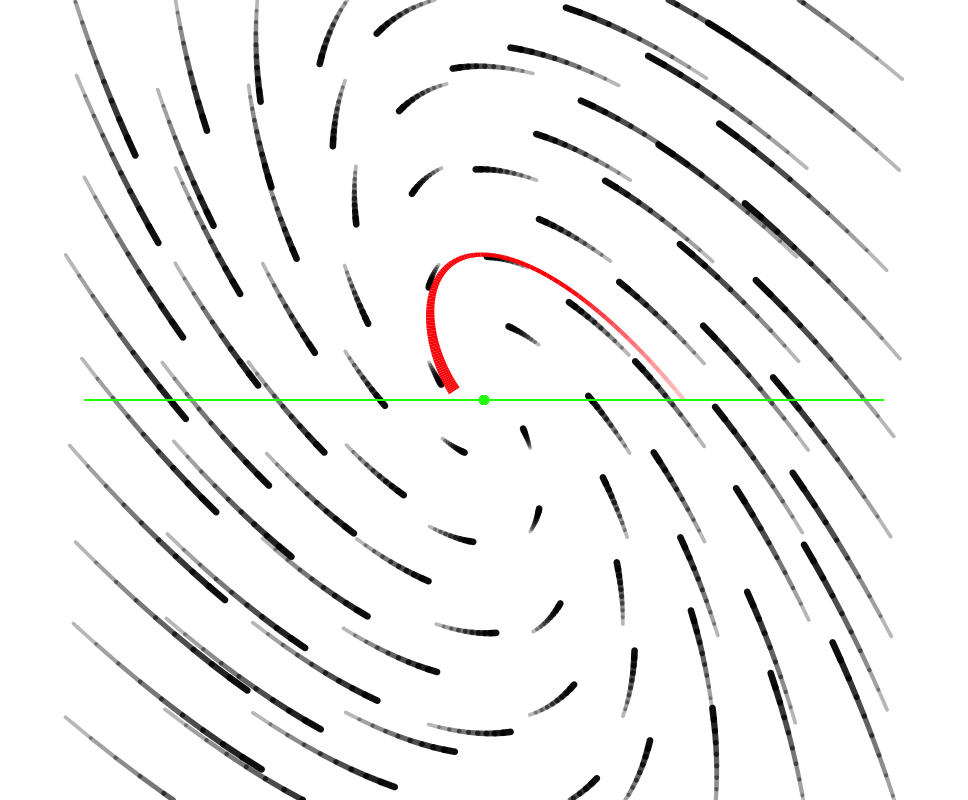
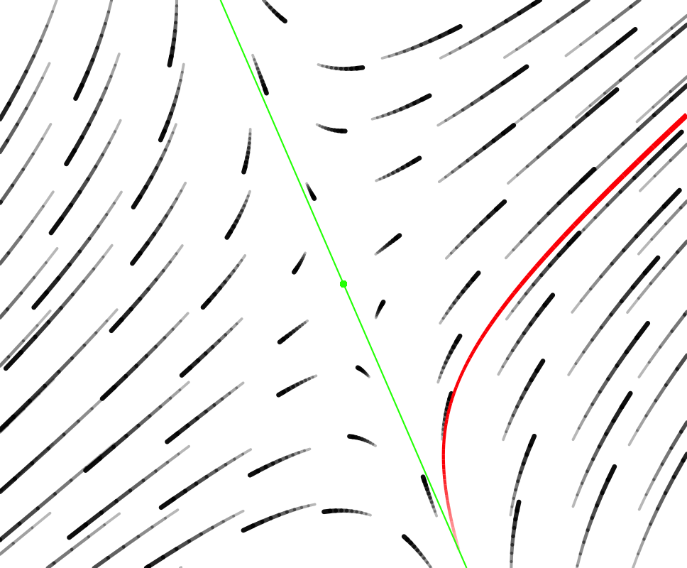

```{r include=FALSE}
etude2::load_learnr_safely()
library(etude2)
library(mosaic)
library(mosaicCalc)

```

The concept of "trajectory" is very closely related to that of "solution." The difference is most easily seen in terms of their graphs.

A *solution* will be graphed on axes where the vertical axis is one of the state components and the horizontal axis is time.

A *trajectory* will be graphed such that each component of the state has its own axis and time is not represented explicitly. This is mainly useful in thinking about differential equations whose state has two (or more) components. 

```{r echo=FALSE, out.width="50%", fig.show="keep"}
y <- makeFun(exp(-t) * sin(3*t + 1) ~ t)
x <- makeFun(exp(-t) * sin(3*t + 3) ~ t)
slice_plot(x(t) ~ t, domain(t=c(0,5)), label_text = "x(t)", label_x = 0.1) %>%
  slice_plot(y(t) ~ t, color="dodgerblue", label_text = "y(t)", label_x=0.3) %>%
  gf_labs(y="=x(t) and y(t)", title="Solutions x vs t and y vs t")
Pts <- tibble::tibble(t = seq(0,5, by=0.01)) %>%
  mutate(x = x(t), y = y(t))
gf_path(y ~ x, data = Pts) %>%
  gf_label(y ~ x, label=~ paste0("t = ", t), data = Pts %>% filter(t %in% 0:4), color="dodgerblue", fill=NA, hjust=1) %>%
  gf_point(y ~ x, color="dodgerblue", data = Pts %>% filter(t %in% 0:4)) %>%
  gf_labs(y = "y(t)", x = "x(t)", title="Trajectory")
```

Many (most?) people have an easier time making sense of shapes than of algebraic notation. So being able to describe a family of solutions to a differential equation as a shape---spiral in, spiral out, circular orbit, ...--- can be an effective way to communicate. Of course, such shapes of trajectories have an equivalent description in terms of solutions: exponentially decaying oscillations, exponentially growing oscillations, steady sinusoidal oscillations.

A pretty and effective way to display a dynamical rule is by drawing many short trajectories starting from many different points in the state space. Typically, this is used for systems with 2-dimensional state. These are called **flow fields**. The examples below each show flow fields in black and a single trajectory in that field in red. The initial condition is the starting point of the trajectory---the thin end of the tail.

```{r echo=FALSE, out.width="50%", fig.show="keep"}


```
