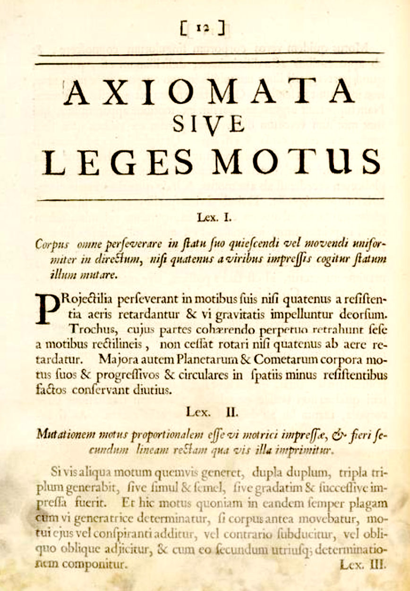

<style type="text/css">
.explanation-note {
  padding: 1em 1em 1em 4em;
  margin-bottom: 10px;
  border: 2px brown;
  border-radius: 10px;
  background: #f5f5f5 5px center/3em no-repeat;
}
</style>

```{r include=FALSE}
library(etude2)
library(mosaic)
library(mosaicCalc)
```

Here is a page from the 1686 edition of Isaac Newton's *Philosophiæ naturalis principia mathematica*, one of the most influential texts in the history of science. This is the page where Newton lays out his "Laws of Motion" (*Leges Motus*) and you can see the three laws (*Lex. I*, *Lex. II*, and *Lex. III*) set out in order.

```{r echo=FALSE, fig.cap="The laws of motion from the *Principia Mathematica* [Source](https://cudl.lib.cam.ac.uk/view/PR-ADV-B-00039-00001/9)"}

```


Since the text is in Latin, it's not so readily accessible to today's student. But even in English, it's not so easy. Legend has it that Newton overhear a Cambridge University student saying, "There goes a man that writ a book that he nor anyone else understands."

The 1792 translation into English of *Lex. II* is:

> **LAW II: The alteration of motion is ever proportional to the motive force impressed; and is made in the direction of the right line in which that force is impressed.**

"Alteration of motion" is what we call "acceleration." Generations of students have learned a much more compact notation $${\mathbf F} = m {\mathbf a}$$
In this notation, ${\mathbf F}$ and ${\mathbf a}$ are vectors, but to keep things simple, we'll consider only movement and forces along a straight line. 

Acceleration, as you know, is the second derivative with respect to time of position. Denoting position by $x$, we can write the second law as a differential equation $$m \ddot{x} = F$$ 

One famous setting for the second law is an oscillating spring-mass system. Robert Hooke (1635-1703) formulated a Law for the force exerted by a spring, $F = -k x$, where $x$ is measured from the position where the spring exerts zero force. 

```{r echo=FALSE}
knitr::include_graphics("www/Animated-mass-spring.gif")
```

[Source: Svjo](https://commons.wikimedia.org/wiki/File:Animated-mass-spring.gif) [CC BY-SA](https://creativecommons.org/licenses/by-sa/3.0) via Wikimedia Commons

Now that you know some calculus, you might think that the word "Law" is a bit pompous, since any continuous function can be approximated locally as $f(x) \approx a_0 + a_1 x$, and if $f(0) = 0$ the approximation is even simpler: $f(x) \approx a_1 x$. To a modern cynic, Hooke's contribution might be described as noticing that the coefficient $a_1 < 0$, which is to say that when you stretch a spring it pulls back and when you compress a spring it pushes back.

Putting Newton's 2nd Law and Hooke's Law together is  like mixing peanut butter and chocolate into a candy: it's found almost everywhere. The system it creates (the two Laws, not the candy) turns out to be a fundamental description of so many physical systems that it's at the heart of dynamics:
$$m \ddot{x} = -\kappa x \ \ \ \ \text{or, more simply,}\ \ \ \ \ddot{x} = bx$$ where $b = -\kappa/m$. Since mass $m$ and the spring elasticity $\kappa$ are positive, $b$ will be negative. 

This is a differential equation, although perhaps as yet unfamiliar since it involves a second derivative with respect to time rather than just a first derivative. We'll call it a "force-balance" format, since $m \ddot{x}$ is in balance with the spring force $-\kappa\, x$.

Looking at the animated picture of the spring-mass system in motion, you can see the sustained oscillations. Of our modeling functions, the sinusoids are the ones that oscillate steadily.

In terms of the differential equation $\ddot{x} = b x$, the solution will be a function $x(t)$ whose second derivative with respect to time is proportional to $x(t)$ but with a minus sign (because $b < 0$). Happily, the sinusoids have exactly this property.

The *ansatz* we'll propose for $\ddot{x} = b\,x$ is $x(t) = \sin(\omega t)$. Plugging in this ansatz to the differential equation gives: $$-\omega^2 \sin(\omega t) = b \sin(\omega t)$$
This will be true so long as $$\omega = \sqrt{\strut -b} = \sqrt{\strut\kappa/m}$$ The motion of the simple spring-mass system is not just *like* a sinusoid, but *is* a sinusoid.

Now on to something that will likely surprise you and probably discomfort you as well. 

It is clear that exponential functions are fundamentally different from sinusoidal functions. Sinusoids oscillate up and down and up and down, whereas exponentials just keep growing (or decaying---which is growth backwards in time). And we know that the spring-mass system oscillates up and down, just like the sinusoid. So it will seem pointless even to try an exponential form of ansatz. But we procede nevertheless and try $x(t) = e^{kt}$ which gives us $$k^2 e^{kt} = b e^{kt}\ \ \implies\ \ k = \sqrt{\strut b} = \sqrt{\strut -\kappa/m} = i \sqrt{\strut\kappa/m} = i \omega$$ 
where we've used our earlier notation $\omega^2 = \kappa/m$. And, following convention, we've written $\sqrt{-1}$ as $i$.

In other words, $e^{i \omega t}$ is a sinusoid with angular frequency $\omega$.


