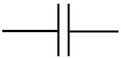

<style type="text/css">
.explanation-note {
  padding: 1em 1em 1em 4em;
  margin-bottom: 10px;
  border: 2px brown;
  border-radius: 10px;
  background: #f5f5f5 5px center/3em no-repeat;
}
</style>

```{r include=FALSE}
library(etude2)
```

An engineer's version of Hooke's Law might read: "Strain is proportional to stress." In everyday speech, "stress" and "strain" are synonyms, but engineers use them more precisely: "stress" is a *force* and "strain" is a change in shape, for instance stretching or *extension*.

The frictionless equation $\ddot{x} =  b\, x$ and it's friction-ful cousin $\ddot{x} = a\, \dot{x} + b\, x$ are much more general and apply in situations that were not foreseeable in Hooke's time.  

To see how general is the second-order, linear, single-variable system $\ddot{x} = a \dot{x} + b x$, let's relate it to the first-order, linear, two-dimensional system 
$$ \left[\begin{array}{c}\dot{x}\\\dot{y}\end{array}\right] = 
\left[\begin{array}{cc}a & b\\c & d\end{array}\right] \left[\begin{array}{c}x\\y\end{array}\right]$$


Recall that in the force-balance system, $x$ is position, $\dot{x}$ is velocity, and $\ddot{x}$ is acceleration. We'll start by giving velocity it's own name:
$$\dot{x} \equiv v$$
Next, we notice that acceleration $$\ddot{x} = \dot{v}$$ With this, we can re-write the force balance equation as
$$\dot{v} = a v + b x$$
And remember that $$\dot{x} = v + 0x$$ where the $0x$ puts the equation in the same format as the equation for $\dot{v}$. Altogether, the equations for $\dot{x}$ and $\dot{v}$ give us
$$\begin{array}{cc}\dot{v} & = a v + b x\\\dot{x} & = v + 0x  \end{array}\ \ \ \ \text{or}\ \ \ \ \left[\begin{array}{c}\dot{v}\\\dot{x}\end{array}\right] = 
\left[\begin{array}{cc}a & b\\1 & 0\end{array}\right] \left[\begin{array}{c}v\\x\end{array}\right]$$

This is the [ab10] first-order, linear, two-dimensional differential equation. So, what started historically as an attempt to mathematicize the bobbing of springs and the swinging of pendulums became a general description of all sorts of dynamics near a fixed point. The result is that you see the "damped harmonic oscillator" all throughout science as a representation of any sort of dynamics near equilibrium, that is, near a fixed point.

**Example: Passive electrical circuits**

One of the [ab10] of particular importance to science and technology is electrical circuits. In a step outside of calculus (meaning: you won't be examined on it) it's worth pointing out the correspondence between concepts of motion (acceleration, velocity, position) and electrical circuits (voltage, current, charge).

There are three classical idealized passive components of circuits:

* capacitor, denoted 
* resistor, denoted 
* inductor, denoted 

In every case, we will be interested in the *voltage* across the two ends of the component. And we'll think about the dynamics of the circuit in terms of electrical *charge* which we'll denote $x$.

* For a capacitor the voltage is proportional to *charge* $x/C$, where $C$ is the "size" of the capacitor. 
* For a resistor the voltage is proportional to the flow of charge, that is, *current* $r \dot{x}$, where $R$ is the amount of resistance, basically the "size" of the resistor.
* For an inductor the voltage is proportional to the change in the flow of charge, that is, $L \ddot{x}$, where $L$ is the inductance.

Only a capacitor is capable of holding a voltage on its own. The other circuit elements can carry a voltage when they are part of a *circuit*.  We're going to explore a simple circuit. 

```{r echo=FALSE, out.width="40%", fig.align="center"}
knitr::include_graphics("www/lrc.png")
```

To prime the circuit, we're going to connect the two dots at the bottom of the circuit with a battery. This will charge up the capacitor in much the same way as we "charge up" a spring by pulling on it. Next remove the battery and get ready to observe the motion. Complete the circuit by closing the switch between the two dots. Doing so establishes the circuit, analogous to setting up the dynamics of the system. The initial condition is the amount of charge $x$ on the capacitor and, at the instant the switch is closed, no flow of current, giving $\dot{x} = 0$.

The "force-balance" is the requirement that the sum of the voltages across the circuit elements be zero.  This amounts to

$$L \ddot{x} = -R\, \dot{x} - \frac{1}{C} x $$ 


Consider a circuit with inductance $L=1$, resistance $R=3$ and capacitance $C = 1$. What will be the eigenvalues of the dynamics? Will the fixed point at $x=0$ be stable or not?

Solution: $\lambda_{1,2} = \frac{1}{2}\left[-3 \pm \sqrt{\strut 9 - 4 }\right] = (-3 \pm \sqrt{5})/2$ so $\lambda_1 \approx -0.382$ and $\lambda_2 \approx -2.618$. Since both eigenvalues are negative, the fixed point is stable.

```{nos2, echo=FALSE, results="markup"}
askMC(
  "Let's decrease the the resistence to $R=2$ and the capacitance to $C = 1/2$. What are the eigenvalues of the dynamics?",
  "+$\\lambda_1 = -1 + 1i$ and $\\lambda_2 = -1 - 1i$+",
  "$\\lambda_1 = -1 + 1i$ and $\\lambda_2 = 1 - 1i$"
  "$\\lambda_1 = 1 + 1i$ and $\\lambda_2 = 1 - 1i$+"
)
```
