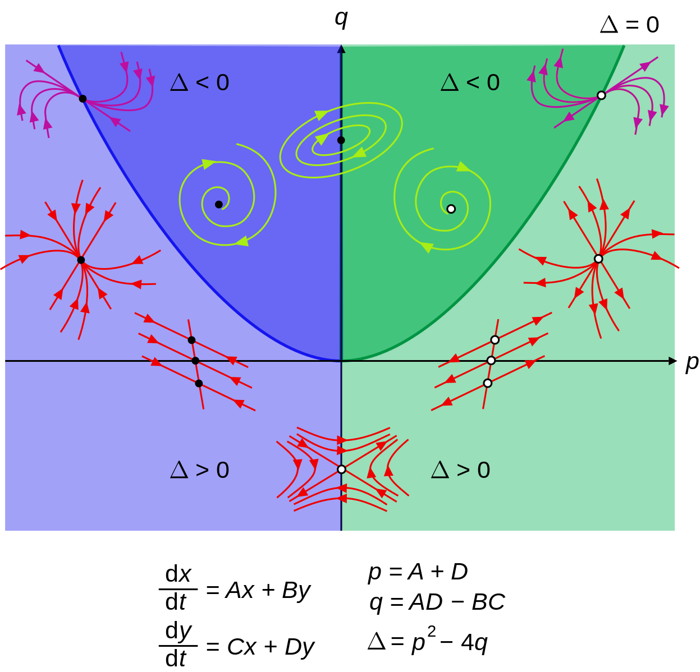
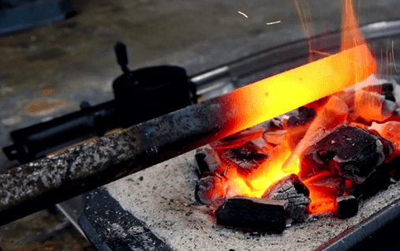

```{r include=FALSE}
library(mosaic)
library(mosaicCalc)
library(quantmod)
library(ggplot2)
```


```{r echo=FALSE, cache=TRUE, warning=FALSE, message=FALSE, eval=FALSE}
## Run this to create the www/Prices.rda file
tickers = c("AAPL", "NFLX", "AMZN", "TSLA", "F", "GM", "K", "O")
getSymbols(tickers,
           from = "2017-01-01",
           to = "2021-03-15")
Prices <- purrr::map(tickers,function(x) Ad(get(x)))
with_dates <- lapply(Prices, 
                     function(x) {
                       x <- as.data.frame(x)  
                       x$date <- row.names(x) 
                       row.names(x) <- NULL
                       x
                       } 
                     )
All <- with_dates[[1]] 
for (k in 2:length(tickers)) {
  All <- All %>% merge(with_dates[[k]])
}

colnames(All) <- c("date", tickers)
All$date <- lubridate::ymd(All$date)
Prices <- All
save(Prices, file = "www/Prices.rda")
```

# Wrapping up dynamics

- We've systematically covered linear dynamics (local modeling) in one and two dimensional state spaces.
- We've talked a little bit about nonlinear dynamics (global modeling) using low-order polynomials. 
- The next logical topic in terms of importance of use would be **linear dynamics with inputs**, e.g. the transient movement of a car suspension when hitting a series of bumps in the road or the principles for building a control system for dealing with such inputs. You will see this in "systems engineering" type courses, but we don't have time to cover it here in CalcZ. (Which is to say, "We have more important things to cover that traditionally are not we'll treated in downstream engineering courses even though the concepts of crucial to any kind of quantitative design work in fields from engineering to public health.)

\newpage

# Are you where you need to be?

If you can make sense of the following diagram, you are in a good place. 

```{r echo=FALSE, out.width="50%", fig.align="center"}

```

[Source](https://commons.wikimedia.org/wiki/File:Phase_plane_nodes.svg)

\newpage

# Today's topic: Diffusion and random processes

- The classical topics of calculus were developed from about 1700 to 1850. 

- We've added some others that are more recent (and so don't appear in most calculus texts), e.g.

    - eigenvalues and eigenvectors 
    - linear combinations and least squares
    - computing
    
\newpage
    
# Is diffusive motion calculus?    
    
Today we're going to cover a new topic that isn't in calculus textbooks, **diffusive motion**.

This was not anticipated by the people who developed calculus in 1700 to 1850 for a simple reason: Diffusion occurs on very small length and mass scales: from 100$\mu m$ (0.1 mm) down to molecular size.

- The molecular theory of matter started to be accepted broadly only around 1900.
- Experimental techniques for directly observing diffusive motion was developed only after 1900. (The 1926 Nobel Prize in Physics was awarded to [Jean Baptiste Perrin](https://en.wikipedia.org/wiki/Jean_Baptiste_Perrin) (1870–1942) for this work, which was based on a revolutionary 1905 theoretical paper by Albert Einstein.)

This kind of process turns out to be fundamental to **statistics** and to **finance**.


# What kind of dynamics?

What kind of dynamics might be behind this time series?

```{r echo=FALSE, out.width="80%", fig.align="center"}
load("www/prices.rda")
P <- gf_line(F ~ date, data = Prices) %>%
  gf_labs(y = "?") %>%
gf_line(GM/3 ~ date, color="dodgerblue") %>%
gf_line(TSLA/40 ~ date, data = Prices, color="green") 
P
```


# Using semi-log axes

```{r echo=FALSE, out.width="80%", fig.align="center"}
P %>%
  gf_refine(scale_y_log10())
```


# Tools for understanding such randomness

1. The "normal" distribution, which we have adopted in CalcZ for our standard hump function.
    a. parameters: mean and variance (and standard deviation $= \sqrt{\strut\text{variance}}$)
    b. shape: bell-shaped, characteristic length of tails. Z-scores
2. A new differential equation, the **diffusion equation**: $\partial_t C(x, t) = \partial_{xx} C(x, t)$
    a. The shape of the "normal" distribution is like a fixed point: It stays the same. But the variance changes with time in a simple, characteristic way.
3. A "molecular-level" perspective on diffusion: random walks.
    a. Applications to matter.
    b. Applications to finance. ("*volatility*")
4. Combining deterministic exponential dynamics with random walks: the basis of Black-Sholes.
5. Black Swans


# Our standard hump function

Hump functions are all of a kind, so as long as they are smooth and local there's not much reason to worry about the details.

- The hump function we have been using, which we typically call `hump()` is actually called a **Gaussian** which has this algebraic form: $$g(x) = \underbrace{\frac{1}{\sqrt{\strut2 \pi \sigma^2}}\ \ \ }_{\text{Just a number}}  \exp\left[- \frac{(x-m)^2}{2 \sigma^2}\right]$$

# What you need to know ... 1. Bell shaped

```{r}
g <- makeFun((1/sqrt(2*pi*sigma^2)) *
                 exp(- (x - m)^2 / (2*sigma^2)) ~ x, 
                 m = 2, sigma = 1)
```
    
```{r warning=FALSE, echo=FALSE}
    
slice_plot(g(x) ~ x, domain(x = c(-2, 6))) %>%
    gf_hline(yintercept = .3989/exp(1/2), alpha = 0.5, 
             size=2, color="orange3") %>%
    gf_vline(xintercept = c(0, 1, 3, 4), 
             color="dodgerblue", size=2, alpha = 0.35)
```

# 2. Two parameters
    
i. mean $m$: location of peak (that is, $\arg\!\max_{x} g(x)$)
ii. variance $\sigma^2$
        - $\text{Standard deviation} = \sqrt{\strut\text{variance}}$ is half-width of mountain at height $exp(-1/2)$ of peak height.

# 3. Often called "normal distribution"

Particular in the social sciences

# 4. $\int_{-\infty}^x g(x) dx$ is a lovely sigmoid.

```{r warning=FALSE, out.width="50%", fig.align="center"}
G <- antiD(g(x) ~ x, lower.bound = -Inf)
slice_plot(G(x) ~ x, domain(x=c(-2, 6))) %>%
  gf_vline(xintercept = c(0, 1, 3, 4), color="dodgerblue", size=2, alpha = 0.35)
```

# Differential dynamics of heat diffusion

```{r echo=FALSE, out.width="70%", fig.align="center"}

```

[*Source of image*](https://www.brilliantdiy.com/tabletop-charcoal-forge/)

# Temperature as a function of x

```{r echo=FALSE, message=FALSE, out.width="60%", fig.align="center"}
n <- 100
Pts <- tibble::tibble(
  x = seq(0, 50, length=n),
  x2 = x+50/n,
  y = 200,
  hot = viridis::magma(n, dir=1)
)
gf_segment(100 + 1250 ~ 0 + 50) %>%
  gf_text(250 ~ c(35, 40, 45), label=c("C", "B", "A")) %>%
  gf_labs(x="Position in rod x (cm)",
         y="Temperature of rod (deg C)",
         title="T(x, t=100s)") %>%
  gf_segment(y +y ~ x + x2, color = ~ hot, data = Pts, size=5, inherit=FALSE) %>%
  gf_refine(scale_color_identity())
```

The temperature changes with position $x$ and time $t$ and is a function $T(x, t)$.

# Time evolution of $T(x, t)$

We're interested in $\partial_t T(x, t)$

- $\partial_t T(x, t)$ is set by a balance between "fluxes"
    - heat moving from neighboring hotter places to $x$ $$\partial_x T(x+h, t)$ 
    - heat moving from $x$ to neighboring cooler places. $$\partial_x T(x, t)$$
- Net flux is $\partial_{xx} T(x, t)$

# Diffusion Equation

$$\partial_t T(x, t) = D \partial_{xx} T(x, t)$$
Constant $D$ is called the **diffusion coefficient**.

[Note, you are not expected to be able to solve this algebraically. Such equations are dealt with under the name *partial differential equations* which is an advanced college-level math course.]

But you can understand the dynamics *qualitatively*:

# Where will it go up? down?


```{r echo=FALSE}
show_gauss <- function(t, ytop= 0.2, mean=2, xlen=5) {
  g <- makeFun((1/sqrt(2*pi*sigma^2)) *
                 exp(- (x - m)^2 / (2*sigma^2)) ~ x, 
               m = 2, sigma = sqrt(t))
  Dat <- tibble(
    x = seq(mean-xlen, mean+xlen, length=500),
    y = g(x)
  )
  gf_line(y ~ x, data=Dat, alpha=0.5, size=2) %>%
    gf_hline(yintercept = g(2)/exp(1/2), alpha = 0.5, 
             size=2, color="orange3") %>%
    gf_vline(xintercept = 2 + sqrt(t)*c(-2, -1, 1, 2), color="dodgerblue", size=2, alpha = 0.35) %>%
    gf_refine(
      coord_cartesian(xlim=c(mean-xlen, mean+xlen), 
                      ylim=c(0, ytop), 
                      clip="off")) %>%
    gf_labs(title = paste("time =", t))
}
```

```{r echo=FALSE, fig.align="center", out.width="60%", warning=FALSE}
show_gauss(1, ytop=0.4)
```

# At several times

```{r out.width="30%", fig.show="hold", echo=FALSE, warning=FALSE}
show_gauss(.01, ytop=4)
show_gauss(1, ytop = .45)
show_gauss(2, ytop = .35)
```

```{r out.width="30%", fig.show="hold", echo=FALSE, warning=FALSE}
show_gauss(3, ytop=.23)
show_gauss(4)
show_gauss(5)
```

# Longer times

```{r out.width="30%", fig.show="hold", echo=FALSE, warning=FALSE}
show_gauss(50, xlen=15, ytop=0.1)
show_gauss(51, xlen=15, ytop=0.1)
show_gauss(52, xlen=15, ytop=0.1)
```


[Link to Movie showing evolution]{www/gaussian.gif}

# Take-home point

- Typical distance travelled by a diffusing particle is $$\sqrt{\strut D \, t}$$
- D is **diffusion coefficient**
- Velocity over this time is 

$$\sqrt{\frac{\strut D}{\strut t}}$$

Diffusion becomes very *slow* as time goes by.

# Example: Ionic and Molecular diffusion

The diffusion coefficient for **sodium ions** in water is about $$2 \times 10^{-5} cm^2/s$$ 
whereas for a big molecule like **glucose** the coefficient is about $$6 \times 10^{-6} cm^2/s$$ 

If diffusion were the sole mechanism of spread, how long would it take a sugar molecule to travel 1cm, about half the distance from a sugar cube to the side of a teacup?

**Paradox** Nothing changes in the dynamics of an individual particle, but statistically it gets slower!

# Random Walks microscopically

Taking the perspective of individual particles ...

Videos of particles undergoing random walks

[Early 1900s movie here](https://www.rigb.org/our-history/bragg-film-archive/other-films/brownian-motion) 

[Diffusion of pollen grains](https://www.youtube.com/watch?v=R5t-oA796to)


# Random walks mathematically

```{r echo=FALSE, out.width="70%", fig.align="center"}
set.seed(102)
ntrajs <- 50
dt <- 0.05
step_size <- 9/sqrt(40/dt) # to match time t=40 in the other graphs
tpts <- seq(0,40, by=dt)
colors <- hcl.colors(ntrajs)
Trajs <- list()

for (k in 1:ntrajs) {
  Trajs[[k]] <- tibble::tibble(
    t = tpts,
    dx = rnorm(length(t), 0, step_size),
    x = cumsum(dx),
    color = colors[k]
  )
}

gf_line(x ~ t, data = bind_rows(Trajs), 
                     color = ~ color, alpha=0.25) %>%
  gf_line(x ~ t, data = bind_rows(Trajs[c(1, round(ntrajs/4), round(ntrajs/2))]), color=~color) %>%
  gf_refine(scale_color_identity())
```


# Example: Stock Prices

- A random walk is the standard model of stock prices.
- Usually, the deterministic trend per day (if any) is much smaller than the random daily variation.

- Typical day-to-day variation in stock prices is about 1%.
- Typical year-to-year variation is therefore ...? (250 trading days in a year)

# Volatility: $\sigma$

The *volatility* of an asset (such as a stock price) is the standard deviation of the daily return over many days: 
$$\text{daily return} \equiv  \text{price}_{t+1}/\text{price}_{t}$$
Or, in terms of diffusion coefficient, 
$$\text{volatility} \equiv \sqrt{\strut D \cdot 1 \text{day}}$$
Volatility depends on the time scale


# Deterministic growth

Our simplest, non-trivial differential equation is $$\dot{x} = \alpha x \ \ \ \implies\ \ \ x(t) = A e^{\alpha t}$$

In terms of investment, $\alpha$ is the daily return.


# Random shock growth

The shocks accumulate to a random walk, with dynamics:

$$\dot{x} = \sigma W$$ where $W$ is the derivative of a random walk. 

# Exponential growth with random shocks 

$$\dot{x} = (\alpha + \sigma W) x$$ 

# The solution to $\dot{x} = (\alpha + \sigma W)x$

Solving this "stochastic differential equation" is beyond the scope of this course, but you should be able to understand the result.

You might think it would be $$x(t) = A e^{\alpha t + \text{random walk}}$$

But this is not the case. The actual solution is $$x(t) = A \exp\left[(\alpha - \frac{\sigma^2}{2})t\right] + \text{random walk}$$
Volatility takes a systematic bite out of deterministic returns.

# Simulating many investments $\alpha = 0\%$ and $\sigma = 75\%$.

- red line is deterministic return (no gain or loss)
- blue line shows expected return with volatility included.

# On linear axes

```{r echo=FALSE, cache=TRUE, out.width="70%", fig.align="center"}
#set.seed(111)
dt <- 0.001
r <- 0.00
S_0 <- 100
tpts <- seq(0, 3, by=dt)
N <- length(tpts)
ntrajs <- 100
colors <- hcl.colors(ntrajs)
sigma <- 0.75
Trajs <- list()
x_sum <- 0
for (k in 1:ntrajs) {
  increments <- exp((r - 0.5*sigma^2)*dt + sigma*sqrt(dt)*rnorm(N,0,1))
  Trajs[[k]] <- tibble::tibble(
    t = tpts,
    x = S_0 * cumprod(increments),
    color = colors[k]
  )
  x_sum <- x_sum + S_0*cumprod(increments) # for the average return
}

deterministic <- tibble::tibble(
  t = tpts,
  x = S_0*exp(r*t),
  x_rand = S_0*exp(r -t*sigma^2/2),
  color = "orange3",
  x_ave = x_sum/ntrajs
)

P <- gf_line(x ~ t, data = bind_rows(Trajs),  color= ~ color, alpha=0.1) %>%
  gf_line(x ~ t, data = bind_rows(Trajs[c(1, round(ntrajs/2), ntrajs)]),
          color= ~ color) %>%
  gf_line(x ~ t, data = deterministic, color=~ color) %>%
  gf_line(x_rand ~ t, data = deterministic, color="dodgerblue") %>%
  gf_refine(scale_color_identity()) %>%
  gf_labs(x="Time (years)", y="Value of investment") 
P 

  
```

# On semi-log axes

```{r echo=FALSE, warning=FALSE, message = FALSE, out.width="70%", fig.align="center"}
P %>%
  gf_refine(scale_color_identity(), scale_y_log10()) 
```

# Investment basics

**Options traders**, or at least the systematically successful ones, use the blue line to evaluate the value of an option. The method is called the **Black-Sholes** formula. 

In 1997, Myron Sholes and Robert Merton won the Nobel Prize in Economics for this work.

# Black Swans

```{r echo=FALSE, out.width="70%", fig.align="center"}
P <- gf_line(F ~ date, data = Prices) %>%
  gf_labs(y = "?") %>%
  gf_line(GM/3 ~ date, color="dodgerblue") %>%
  gf_line(TSLA/40 ~ date, data = Prices, color="green")
P %>%
  gf_refine(scale_y_log10())
```

<!--
What are the rules of the dynamics around this?

History: Fourier, Brown, Bachelier, Einstein, Wiener, ...

Flux: flows down a gradient of temperature or concentration

Net flux: flow is both in to a region and away from it, take the difference between gradients on either side of a point, a.k.a, the second derivative. [Note: I don't have to do much thinking to associate this with the second derivative. You may associate it with the "curvature"  or "concavity" of the graph of a function, which is a good way to think of it. But think of it as a change in gradient to either side of a $\vee$-shaped function or a $\wedge$-shaped function. Except we are taking the limit as $h \rightarrow \infty$, so that something shaped like a $\cup$ or a $\cap$  or $\int$ has have a net flux continuously changing in space]

Basic rule: $\partial_t C(x, t) = D \partial_{xx} C(x, t)$

- the $\vee$s get filled in, the top of a $\cup$ erodes to the sides. 

If you start with $C(x, 0)$ like a spike or a $\vee$, it will gradually spread out. Remarkably, the shape that will eventually result is a specific form of function: a Gaussian.

- Center called the mean.
- Width measured in a particular way called the "standard deviation." But note that in the formula, the spatial distribution involves only the square of the standard deviation, called the "variance". About 2/3rds of the area is within $\pm \sigma$ of $\mu$.

If I had a bunch of particle positions, how to calculate the corresponding mean and variance.

- sample mean: $\hat{\mu} \equiv \frac{1}{n}\sum_{i=1}^n x_i$
- sample standard deviation: $\hat{\sigma} \equiv \frac{1}{n} \sum_{i=1}^n (x_i - \mu)^2$ , average of the square differences from the mean.
    - NB. A source of confusion for many students is that the statisticians write the formula differently: $\hat{\sigma} \equiv \frac{1}{n-1} (x_i - \hat{\mu})^2$. The change to $n-1$ is due to the use of the sample mean $\hat{\mu}$ in the formula. The statisticians assume that we don't know $\mu$, only $\hat{\mu}$. For large $n$, it hardly makes a difference.
    
Spread of particles under the diffusion equation: $\sigma^2 = D t$ with the disquieting consequence that $\sigma = \sqrt{D}\sqrt{\strut t}$

Diffusion coefficient, examples of diffusive motion. For matter, diffusion is important only over very small length scales. 

Molecular theory of gasses: thinking about individual particles.

Random walks. Application to investment.

Volatility measured as the standard deviation of returns.

How volatility scales with time. 

The Black-Sholes machine for making money: Pricing out derivatives. The ability to make a profit comes from the information asymmetry of the buyer and seller. One part of that asymmetry is knowing about diffusion, random walks, ...

Note that the diffusion/random-walk theory of stock prices is **just a model**. It provides helpful information in some contexts and is misleading in others. One way that it's misleading in finance is that the tails of the gaussian curve appear to be too short. This leads people using the theory to do calculations that don't include the rare, large events (sometimes called "Black Swans") that are seen in practice. The financial crisis of 2008 (the "Great Recession") was caused in large part because people took their gaussian models too seriously. Using the model allows a value to be assigned to a very complex asset, so these assets, especially one called a "credit default swap" were created by banks and sold. People and institutions bought these assets as investments, thinking they knew what the value was. But the impact of black swans was amplified by the structure of the asset and eventually large volumes of assets became worthless, leading to a virtual collapse of the financial markets as one default led to others.

-->
