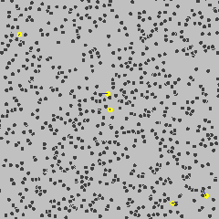

We have used differential equations as the format for modeling motion such as the swinging of a pendulum or the (theoretically) parabolic arc of a ball. This has given us four emblematic shapes for motion, corresponding to five variations on the theme of linear differential equations. You should make sure you are comfortable with all five and can easily shift back-and-forth between the differential equation and the solution.

0. This one is trivial and so we've labelled it motion (0). Velocity is zero: $\dot{x} = 0$. This is the motion at a fixed point, that is, no motion at all.

1. Velocity is constant: $\dot{x} = c$. Since there is no $x$ on the right-hand side, solving for $x(t)$ is a simple matter of anti-differentiation:
$$x(t) = c\, t + x(0)$$ Of course, $x(0)$ is just the *constant of integration* which we've usually called $C$ but which amounts to the initial position $x(0)$.

2. Acceleration is constant: $\ddot{x} = a$. Again, there is no $x$ on the right-hand side, so $x(t)$ can be found by two stages of anti-differentiation:
$$v(t) \equiv \dot{x} = \int \ddot{x} dt =  a\,t + v(0)\ \ \ \text{followed by}\ \ \ x = \int \dot{x} dt = \frac{1}{2} a\, t^2 + v(0) t + x(0)$$
Here the constant of integration is being denoted by $v(0)$, since it corresponds to the initial velocity. That we need two initial conditions---$v(0)$ and $x(0)$---reflects that the state underlying $\ddot{x} = a$ is two-dimensional.

3. Velocity is proportional to position: $\dot{x} = \alpha x$. We've already seen the solution: $$\dot{x} = \alpha x\ \ \ \implies\ \ \ x(t) = x(0) e^{\alpha t}$$

4. Acceleration is proportional to position: $\ddot{x} = b x$. When $b < 0$, this corresponds physically to the back and forth of a spring or a pendulum, a sinusoid, which we've written both as $\cos(\omega t)$ and the real part of a complex exponential $e^{i\omega t}$.

    We saw as well that there is are kinds of motion "in between" (3) and (4), which occur when the acceleration is a linear combination of functions proportional to position $x$ and velocity $\dot{x}$, that is: $$\ddot{x} = \alpha \dot{x} + b x$$ which produces exponentially damped or growing oscillations or the kinds of combination of real exponential motion identified with the words "saddle", "source", or "sink." (Recall that the method of eigenvalues was used to sort out what variety of motion stems from different values of $\alpha$ and $b$.)

Historically, all this was worked out mathematically mostly by 1800 with the eigenvalue theory added in over the next century.

It turns out that there is a kind of motion in between (0) and (1). Hints of this were published by the botanist Robert Brown in 1827 and named after him: *Brownian motion*. Brown speculated that the motion was related to the actions of living beings, but worked out experimentally that non-living particles also display this motion.

Brownian motion is the foundation of what we call today the "kinetic theory of gasses." Around 1900, when (believe it or not) the atomic theory of matter was controversial and rejected by some esteemed scientists, Einstein constructed a theory of what motion of gas "particles"/molecules would look like in the setting of Brownian motion. His 1905 paper *Über die von der molekularkinetischen Theorie der Wärme geforderte Bewegung von in ruhenden Flüssigkeiten suspendierten Teilchen* (English: "On the movement of small particles suspended in a stationary liquid demanded by the molecular-kinetic theory of heat" is one of three published that year that reshaped physics, the other two being about special relativity and the photoelectric effect.

In 1906, Einstein's kinetic theory was confirmed experimentally by Jean Perrin, who was awarded the 1926 Nobel Prize in Physics for this work. Einstein himself won the Nobel Prize in 1922.

<a href="https://creativecommons.org/licenses/by-sa/3.0" title="Creative Commons Attribution-Share Alike 3.0">CC BY-SA 3.0</a>, <a href="https://commons.wikimedia.org/w/index.php?curid=19140415">Link</a>
