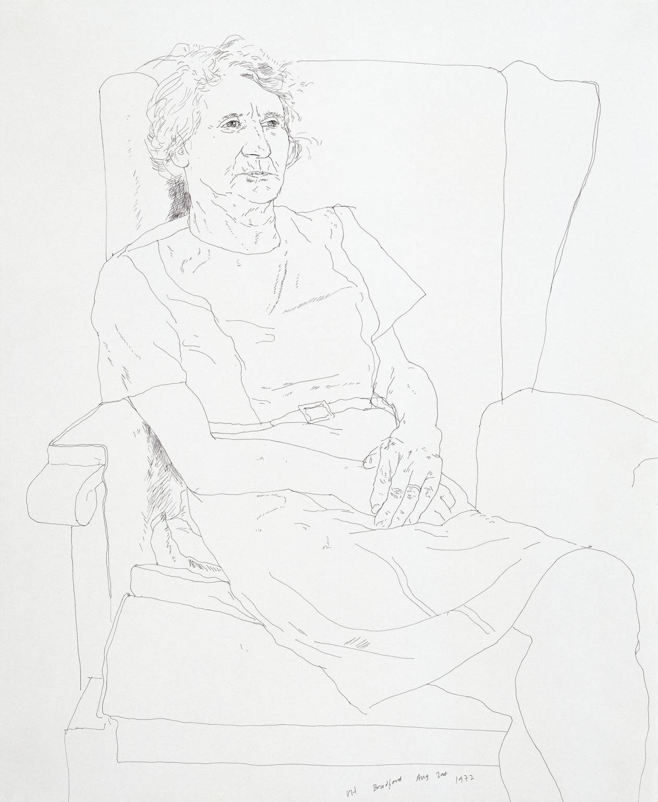

```{r include=FALSE}
library(etude2)
library(mosaic)
library(mosaicCalc)
```

A major theme of this course is the selection and construction of functions. We started the course by introducing a small set of basic modeling functions that generations of experience has shown to be good models in a wide variety of circumstances. We introduced methods to derive new functions from the basic modeling ones: linear combinations, inversion, differentiation, integration. Low-order polynomial functions are useful for expressing general modeling ideas such as growth, interaction, and optimality. Sinusoids and their imaginary cousin, exponentials, are often the go-to forms for constructing a function that meets the mandate given by a differential equation. Taylor polynomials were historically an important technique for working with functions; much of their actual utility in today's world is captured by the idea of low-order polynomial models. 

We considered several techniques for constructing functions that are a good match to data: use of log-log and semi-log axes in graphics, solving the "target problem" of linear combinations (which is conventionally called "least squares fitting").

Today's topic is yet another important method for constructing functions that match with data. What's different here from least squares is that we do not consider the data as a "cloud" of points that we want our eventual function to stay close to. Today, each data point will be a **mandate**; the function is required to go through each and every point exactly.

As a motivating example, consider the programming of robotic arms as in the video:

<iframe width="560" height="315" src="https://www.youtube.com/embed/0L7Xk5_s3QQ?start=81" title="Robotic arms" frameborder="0" allow="accelerometer; autoplay; clipboard-write; encrypted-media; gyroscope; picture-in-picture" allowfullscreen></iframe>

This isn't a robots course, so we'll simplify. The arm has a resting position. When a car frame comes into place, the arm moves so that it's welding electrodes are at a specific, known place in space near the car body. Then it moves in sequence to other places where a weld is using and eventually back to its resting position.

Programming the robot might come down to listing in sequence the specific locations where the weld is to be made. This might include helper points to avoid coliding with the work piece when moving between welds. The movement is governed by various joints, gears, and wheels as well as actuators: hydraulics, [stepping motors](https://en.wikipedia.org/wiki/Stepper_motor), etc. We need to tell those actuators what position they should be in at each moment of time.

The problem of converting the discrete list of weld and helper points into a continuous signal for the actuator is an instance of a mathematical process called **interpolation**. Generally, there will be multiple signals going to multiple actuators, but to simplify we'll consider the problem with just one variable $x$ for position and $t$ for time.

Another example ... In [computer-aided design](https://en.wikipedia.org/wiki/Computer-aided_design) (CAD) systems, curved shapes are usually described by a person's placement of isolated points which are then automatically combined into a smooth form. For instance, the outline of a letter in a computer font is often specified by a series of knot points with specified levels of smoothness (or lack thereof), as in this construction of a lower-case "e".


Humans have a natural ability to generate smooth movements. In drawing, there can be artistic value in a lack of smoothness, as illustrated in celebrated artist David Hockney's drawing of his mother. 

```{r echo=FALSE, fig.align="center", out.width="70%"}

```

[Source](https://www.tate.org.uk/art/images/work/T/T11/T11897_10.jpg)

Before the era of digital design and manufacturing, smooth curves were described by clay or wooden models hand-crafted by skilled workers. Material was removed to conform to the models by machine tools directed by cams running over the models, by hand sanding and polishing, as shown in this video of propeller manufacture during World War II.

<iframe width="560" height="315" src="https://www.youtube.com/embed/BwU9quwgYRo?start=190" title="YouTube video player" frameborder="0" allow="accelerometer; autoplay; clipboard-write; encrypted-media; gyroscope; picture-in-picture" allowfullscreen></iframe>

Spline functions and digital actuators have largely replaced such analog models.
