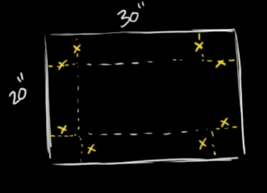

```{r include=FALSE, context="setup"}
library(etude2)
library(mosaic)
library(mosaicCalc)
```

Consider these easy optimization problems:

- Build a road costing $10M per mile. How long should it be to minimize costs.
    * Answer: Zero miles
- Choose the length of the front wall and side walls of a room to maximize the room area.
    * Answer: Make the walls infinitely long.
- Build a spherical tank sliced in a way to have a flat bottom. The goal is to choose how far away from the sphere's center to make the slice in order to maximize the volume. 
    * Answer: Don't make any slice; it reduces the volume!
- Provide funding to a portfolio of public health interventions in order to maximize the number of lives saved.
    * Answer: Spend an infinite amount on each intervention.
    
Each of these problems has an objective function---cost, room area, volume, lives saved. Each also has inputs to that objective function---road length, front and side wall lengths, slice position, funding for the different interventions.

In your career, you may occasionally encounter optimization problems like this, where the answer is obvious. All of them fall into the category of "more is better" (or "less is better"). 

Nontrivial decisions generally involve resolving trade-offs: more is better **up to a point** and then it's worse. Or, "more $x$ is better" except that bigger $x$ means smaller $y$ and smaller $y$ makes things worse. 

An example of a "bigger $x$ means smaller $y$" is the cardboard box problem often found in calculus textbooks. You're given a rectangular piece of cardboard as in the diagram. From the rectangle, you will cut out four squares in the corners (marked in yellow). This creates a central rectangle with four flaps. When we fold these up we get an open-topped box.

```{r echo=FALSE, fig.cap="Creating a box by cutting corners out of a rectangle. (Image from [Khan Academy video](https://www.khanacademy.org/math/ap-calculus-ab/ab-diff-analytical-applications-new/ab-5-11/v/optimizing-box-volume-graphically)) Length units are inches."}

```

The problem is to choose $x$ to maximize the volume of the box.  By making $x$ large, we increase the height of the box. A taller box is a more voluminous box ... at least if all other things are equal. But by making the box taller, we also make the bottom smaller because we still have the same amount of cardboard. 

The volume of the box will be height x length x width, or 
$$V = x (30-x) (20-x)$$
```{r cf2-1, exercise=TRUE, exercise.cap="Sandbox", exercise.nlines=6, eval=FALSE}


```

```{r cf1-1, echo=FALSE, results="markup"}
askMC(
  "What is the value of $x$ and the corresponding $V(x)$ that produces the maximum volume for the box? You can use the sandbox for your calculations (make sure your parentheses match the provided equation).", 
  "$x = 7.8 \\mbox{in}, V = 2112.55 \\mbox{in}^3$",
  "+$x = 7.85 \\mbox{in}, V = 2112.61 \\mbox{in}^3$+",
  "$x = 7.90 \\mbox{in}, V = 2112.73 \\mbox{in}^3$",
  "$x = 7.95 \\mbox{in}, V = 2112.59 \\mbox{in}^3$",
  random_answer_order = FALSE
)
```

A somewhat richer problem is to find the edge length $y$ square of cardboard that will produce the maximum volume when square corners of edge length $x$ are cut out. Here, the volume is $V = x(y-2x)(y-2x)$.

As stated, maximum $V$ is infinite. There's no trade-off between $x$, $y$, and $z$. If a problem is to have a finite argmax, we need to introduce a trade-off. Let's suppose the trade-off is that the area of the initial piece of cardboard should be 600 square-inches, as in the previous problem. Now we have an objective function and a constraint $$\mbox{find argmax}\ \ V(x,y) = (y-2x)^2 x\  \mbox{subject to the constraint}\  y^2 = 600\ \mbox{in}^2$$ 

One perfectly legitimate way to solve this problem is to use the constraint to find a value for $y$, then substitute this value into the objective function, giving $$V(x) = (\sqrt{600} - 2x)^2 x$$

```{r cf1-2, echo=FALSE, results="markup"}
askMC(
  "Use the sandbox to find the optimal value of $x$ in the square-bottomed box problem. Which of these is it?",
  "+$x=4.083$+",
  "$x=4.186$",
  "$x=4.189$",
  "$x=4.210$",
  random_answer_order = FALSE
)
```

We're now going to see a different way of using the constraint in the optimization problem. The idea is to graph the objective function without any constraint, then graph the constraint on top. The sandbox has the appropriate graphing commands for the  square-bottomed box.

```{r cf2-2, exercise=TRUE, exercise.cap="Contours and constraints", exercise.nlines=10, warning=FALSE, message=FALSE}
V <- makeFun(x*(y - 2*x)^2 ~ x)
constraint <- makeFun(y^2 ~ x + y)
contour_plot(V(x, y) ~ x + y, domain(x=c(0,10), y=c(20,30))) %>%
  gf_labs(title="Volume") %>%
  contour_plot(constraint(x, y) ~ x + y, 
               filled=FALSE, contour_color = "red", 
               contours_at = 600) 
```  


Here, the constraint is like a straight road going up and over the flank of a hill. To find the argmax "subject to the constraint," imagine you are riding a bike along the red road. If you start on the left side of the graphic frame and go to the right you will be going uphill. As you approach the crest, the road will level out and then you'll be riding downhill. 

```{r cf1-3, echo=FALSE, results="markup"}
askMC(
  "What is the relationship between the constraint (road) and the objective function (contours) that indicates you are on the crest?",
  "The road intersects a contour at right angles." = "If so, you would be riding in the steepest direction. Remember, the gradient at each point is perpendicular to the contour at that point.",
  "There's no fixed relationship between the road and the steepness of the objective function." = "Yet, ask any bicyclist and they can easily tell you when they have reached the top point on a road.",
  "At the crest, the road is parallel to the nearest contour." = "Almost, but remember that we draw only some of the contours and not others simply to prevent flooding the graph with ink.",
  "+At the crest, the road is parallel to the contour passing through that point on the road.+",
  random_answer_order = FALSE
)
```

```{r cf1-4, echo=FALSE, results="markup"}
askMC(
  "At the optimal point on the road, what is the value of the objective function $V(x,y)$?",
  1000, "+1100+" = "Right. The point is about half-way between the 1000 and 1200 contours.", 
  1200, 1400,
  random_answer_order = FALSE
)
```

Now you have see two completely equivalent approaches to using the constraint

1. Solve the constraint for one variable in terms of the others.
2. Use the constraint to restrict the domain of optimization to those values that satisfy the constraint. (We did this graphically, but it can be done other ways if a graph can't be made, for instance, if there are more than two inputs to the objective function.)

One reason to introduce (2) is to help you develop an intuition about the relationship between a constraint and the objective function. But it turns out that (2) lets us add features to optimization problems that can be important in practice. These are

a. Add additional constraints to the problem.

    For example, in the cardboard box problem we didn't mention two constraints that are so obvious that we left it to common sense: $x > 0$ and $y > 0$. You can't have negative cardboard.

b. Examine what happens if the constraint is changed in some way. 

    Suppose you were trying to convince the cardboard providers to allow a bit more cardboard for the box. How would the output of the objective function respond to this change?  
    
    Often, the effect of changing a constraint is described in terms of a ratio: the change in output of the objective function divided by the change in the constraint value. This is sometimes called a **shadow price** of the constraint. The synonym **Lagrange multiplier** is also widely used.

The next two sections will deal with (a) and (b) in turn.


