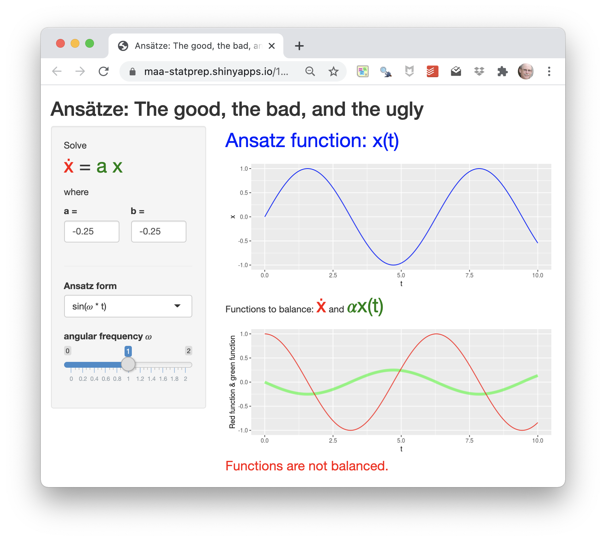

<style type="text/css">
.reminder-note {
  padding: 1em 1em 1em 4em;
  margin-bottom: 10px;
  border: 2px brown;
  border-radius: 10px;
  background: #f5f5f5 5px center/3em no-repeat;
}
</style>

```{r include=FALSE, context="setup"}
etude2::load_learnr_safely()
library(etude2)
library(mosaic)
library(mosaicCalc)
library(math141Z)
```

We're writing the 1-D differential equation as $\dot{x} = f(x)$. Remember that every possible 1-D differential equation can be written this way. The thing that distinguishes one equation from another is the dynamics function $f()$. 

We have examined a few possibilities for $f()$, for instance:

i. $f(x) = a x$ -- the linear function: $f(x)$ is **proportional** to $x$.
ii. $f(x) = a x + b$ -- the straight-line function
iii. $f(x) = r x (1-x/K)$ -- the so-called "logistic" function

There are other forms of $f()$ that a modeler occasionally encounters, such as

iv. $f(x) = a x^2$, or
v. $f(x) = a \sqrt{\strut x}$
vi. ... and many others!

But (i), (ii), and (iii) are by far the most common, so we focus on them.

Each of (i), (ii), and (iii) has a solution in terms of the basic modeling functions we have used throughout CalcZ: sinusoid, sigmoidal, exponential, and so on. These solutions have been known for at least 200 years. This means that an operational ability to solve a differential equation is a matter of memorizing those solutions.

Our goal in this section is to help you understand in general the logic of finding solutions to differential equations. To find a solution means finding a **function** <span style='color: blue; font-size: 30px;'>$x(t)$</span> that satifies

<span style='font-size: 36px;'><span style='color: red'>$\dot{x(t)}$</span> $=$ <span style='color: green'>$f(x(t))$</span>

There are multiple strategies for finding that function $x$. An important one of which is to make a <span style='color: blue;'>guess about the function form</span> (e.g. sinusoid, exponential, etc.) then varying the parameters of that function until the <span style='color: red;'>function on the left side</span> matches the <span style='color: green;'>function on the right side</span>. 

<div class="reminder-note">

**Reminder**:

Following convention, we simplify the notation by leaving out any explicit mention of $t$. 

<span style='font-size: 36px;'><span style='color: red'>$\dot{x}$</span> $=$ <span style='color: green'>$f(x)$</span>

The role of $t$ in the differentiation is made implicit by the **dot** on the $x$. It's so, so easy to forget this and become confused. So be careful to be attentive to the dot in $\dot{x}$ as signalling the derivative of $x(t)$ with respect to $t$.

</div>

An *ansatz* is a guess for a form of $x(t)$ that might balance the <span style='color: red;'>left</span> and <span style='color: green;'>right</span> sides of the differential equation.

To help you form an intuition for the ansatz style of solving differential equations, we provide you with an interactive app:

<a href="https://maa-statprep.shinyapps.io/142Z-balance-derivs/" target="_blank"></a>

As usual, click on the picture of the app to open it in another browser tab, then arrange this tab and that to be side by side on your screen.

In this app, all you are going to do is search for a solution to the simple, 1-D differential equation:

<span style='font-size: 30px;'>$$\dot{x} = a x$$</span>

In the exercises that follow, we are going to specify a numerical value for $a$ (You'll have to set $a$ to the specified value using the little selector underneath the equation in the left-hand panel of the app).

You may have already memorized the solution to this differential equation. But for now, let's pretend that you have not and that you are going to find a solution by the ansatz method.

The equipment you have to aid in your search is:

1. A selector for the **form** of ansatz (e.g. sinusoidal, exponential, etc.). Note that each form has one or two **parameters**.
2. A slider control for each of the parameters in (1).

The action plays out this way:

a. Pick one of the ansatze on offer. The exercises will tell you which one to use. **There is no guarantee that the one we tell you to use will provide a successful solution.** That might seem mean, but we want you to be able to tell when a proposed solution doesn't work out.
b. Gradually move the parameter slider(s). This will change the shape of the candidate function shown in blue in the top graph.
c. Observe the two functions shown in the bottom graph.
    i. The red function is simply the time derivative of the blue function in the top graph. That is, the red function is what goes on the left-hand side of the differential equation.
    ii. The green function is $a x$, that is, the right side of the differential equation.
d. To satisfy the differential equation, the left and the right sides must be the same function. You can easily see if this is the case when the red and green functions lie exactly on top of one another. 

It might be that no matter how you set the parameters, you cannot get the red and green functions to align. This signals that the ansatz being used is not appropriate for this differential equation.

```{r bside1, echo=FALSE, results="markup"}
etude2::etudeQ(
  "Using the ansatz $x(t) = \\sin(\\omega t)$, confirm that the red function is indeed $\\partial_t x$ (a.k.a. $\\dot{x}$). Which of the following is **not** a reason to support this confirmation? (You will want to vary the $\\omega$ slider to see which statements remain true regardless of $\\omega$.)",
  "The period of the blue function is the same as the period of the red function.",
  "+The amplitude of the blue function is the same as the amplitude of the red function.+",
  "The red function is shifted 1/4 cycle in time from the blue function.", 
  "The red function has amplitude $\\omega$ compared to the amplitude 1 of the blue function"
)
```

```{r bside2, echo=FALSE, results="markup"}
etude2::etudeQ(
  "Still using the ansatz $x(t) = \\sin(\\omega t)$, confirm that the green function is what it is supposed to be, namely $a x(t)$. You will want to vary $a$ to see which statements are true regardless of $a$. Which of the following statements is **not** a reason to support the confirmation?",
  "When $a < 0$, the green function is flipped upside-down compared to the blue function.",
  "The green function has the same period as the blue function.",
  "+The red function is shifted 1/4 cycle in time from the blue function.+",
  "The amplitude of the blue function is 1, but the amplitude of the green function is $a$."
)
```


```{r bside3, echo=FALSE, results="markup"}
etude2::etudeQ(
  "Still using the ansatz $x(t) = \\sin(\\omega t)$, search for a value of the parameter $\\omega$ that leads to the blue function and the red function to be the same. What did you find?", 
  "$\\omega = 0.27$ leads to a red/blue match.",
  "There's a red/blue match for some $\\omega > 1.0$.",
  "Large $\\omega$ is heading in the right direction, but the slider doesn't give enough range to make sure.",
  "+It's impossible!+"
)
```


```{r bside4, echo=FALSE, results="markup"}
etude2::etudeQ(
  "Still using the ansatz $x(t) = \\sin(\\omega t)$, modify the differential equation by changing the constant of proportionality $a$. Search for an $(\\omega, a$) combination that balances the red and green functions. What did you find?",
  "When $a=1$, there is an $\\omega$ that does the job.",
  "When $a=0$, any choice of $\\omega$ will work.",
  "+There's no such combination to be found.+"
)
```

```{r bside5, echo=FALSE, results="markup"}
etude2::etudeQ(
 "What's your conclusion after trying out a sinusoidal ansatz?",
 "A sinusoid *almost* works.",
 "A sinusoid is an appropriate ansatz.",
 "+A sinusoid is inappropriate form for a solution.+"
)
```

```{r bside6, echo=FALSE, results="markup"}
etude2::etudeQ(
  "Shift to the sigmoidal ansatz. There are two parameters, `center` and `width`. Finding settings for those parameters that will balance the red and green functions. (You might have to change the value of $a$ to be successful.) What do you conclude?",
  "+A sigmoidal is never an appropriate form for the solution to $\\dot{x} = a x$.+",
  "A sigmoidal is *always* and appropriate form for the solution to $\\dot{x} = a x$.",
  "A sigmoidal works when $a < 0$, but not for $a > 0$."
)
```

```{r bside7, echo=FALSE, results="markup"}
etude2::etudeQ(
  "Shift to the exponentially growing/decaying ansatz. There are two parameters, $k$ and $\\omega$. Finding settings for those parameters that will balance the red and green functions. What do you conclude?",
  "+An exponentially growing/decaying sinusoid is never an appropriate form for the solution to $\\dot{x} = a x$.+",
  "The exponentially growing/decaying sinusoid will work if $k$ and $\\omega$ are carefully chosen.",
  "The exponentially growing/decaying sinusoid will work for all $k$ so long as  $\\omega$ omega is set to a specific value."
)
```

```{r bside8, echo=FALSE, results="markup"}
etude2::etudeQ(
  "To wrap up, shift to the simple exponential ansatz. There is only one parameter: $k$. The good news is that you can make the exponential ansatz work. What is the relationship between $a$ and $k$ that red and green functions that match?",
  "It doesn't depend on $a$, just on $k$.",
  "It doesn't depend on $k$, just on $a$.",
  "When $k = \\ln(a)$ the red and green match.",
  "+When $k = a$ the red and green match.+",
  "When $k = e^a$, the red and green match."
)
```
