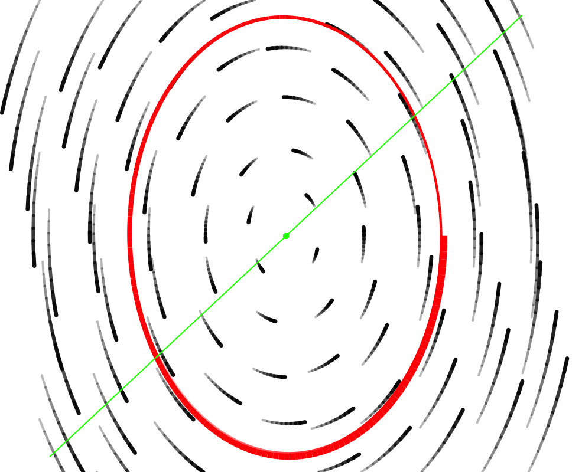

```{r include=FALSE}
etude2::load_learnr_safely()
library(etude2)
library(mosaic)
library(mosaicCalc)
```

There are four differential equation models that are so commonly encountered that you should *memorize* the qualitative solutions. For all but one, you should have the quantitative solution readily at hand.

**Exponential growth/decay** to zero

The model is $$\dot{x} = a x \ \ \implies\ \ \ x(t) = A e^{a t}$$ that is to say the dynamical function is a linear (proportional) function.  The heading gives the description of the qualitative solution: exponential growth and decay. The free parameter $A$ in the quantitative solution will be the numerical value of $x(0)$. 

This is a model of **population growth** and **radioactive decay** among very many other settings. Whether it's growth or decay is set by the parameter $a$: positive for growth, negative for decay.

**Exponential growth/decay to a non-zero fixed point**

The model is $$\dot{x} = -a (x - K) \ \ \implies\ \  x(t) = K + Ae^{-at}$$

This is most famously "Newton's Law of Cooling," where $x(t)$ is the changing temperature as a function of time and $K$ is the ambient (e.g. room) temperature. The object's temperature decays exponentially to the ambient temperature.

**Logistic growth to the carrying capacity $\kappa$**

The model is $$\dot{x} = r x (1 - x/\kappa)\ \ \implies\ \ \ x(t) = \left\{\begin{array}{lcc}\mbox{sigmoidal growth to }\kappa & \mbox{ if } & x(0) < \kappa\\
\mbox{stable at }\kappa & \mbox{ if } & x(0) = \kappa\\
\mbox{exponential decay to }\kappa & \mbox{ if } & x(0) > \kappa
\end{array}\right.$$

In some ways, this is like Newton's Law. Eventually the solution will be approximately exponential decay to the fixed point $\kappa$.

Why "eventually?" Because when $0 < x(0) \ll \kappa$ the solution will at first be exponential growth from zero before settling down to exponential decay to the fixed point $\kappa$.

This model is most famously associated with ecology and the growth of a population in an environment where resources needed for life are limited. The "carrying capacity" is the largest steady population that can be sustained.

**Linear 2-dimensional dynamics near a fixed point**

We're writing this model as 
$$\left\{\begin{array}{l}\strut\dot{x} = a x + b y \\ \strut\dot{y} = x \end{array} \right.$$
and calling it the "[ab10]" model.

The [ab10] model is a kind of clay that can be used to build a model of any phenomenon that potentially involves motion up and down: bobbing springs, swinging pendulums, oscillations in circuits, economic cycles, interacting populations near an equilibrium, vibrations in structures, spread of epidemics, and so on.

The [ab10] model has a fixed point at the origin (that is, $(x=0, y=0)$). This fixed point is either stable or unstable depending on the parameters $a$ and $b$. Also, depending on the values of $a$ and $b$ the flows will have one of just a few different forms:

- a stable "node"
- an unstable "source"
- a "saddle" which is effectively unstable.
- an unstable (outward) "spiral"
- a stable (inward) "spiral"

Each of these behaviors is "generic," which is to say that there is a range of $a$ and $b$ values that will produce each of them.

Another possible behavior is called a "center," something between an unstable and a stable spiral. In other words, the trajectory is a closed loop. To be a center, $a$ must be exactly zero, no plus-or-minus about it. And $b$ has to be less than zero.


Sink | Saddle | Source
:------:|:-------:|:-------:
 |  | 
**stable spiral** | **center** | **unstable spiral**
 |  | 

Eigenvalues provide the tool to figure out which type the flow will be as a function of parameters $a$ and $b$.

### Quiz Questions

```{r q5-4, echo=FALSE, results="markup"}
askMC(
  "Which of the following differential equations represents the statement: *\"The rate at which the radioactive substance decays is directly proportional to the amount of substance remaining.\"*",
"$\\dot {x} =Ce^{-kt}$",
"$x(t)=Ce^{-kt}$",
"+$\\dot x=-kx$+",
"$\\dot x=-k(x-x_0)$",
"$\\dot x = \\int x dx$",
random_answer_order = FALSE
)
```

```{r q5-8b, echo=FALSE, results="markup"}
askMC(
  "Given $\\dot x =0.2x(1-\\frac{x}{50})$ with initial condition $x(0)=70$, is $x(t)$ increasing, decreasing, constant, or cannot be determined?",
"Increasing",
"+Decreasing+",
"Constant",
"Cannot be determined",
random_answer_order = FALSE
)
```

To answer this question, it helps to notice that the given initial condition $x(0) = 70$ is *above* the carrying capacity of 50. So the solution will be exponential decay toward the carrying capacity.


```{r q5-5, echo=FALSE, results="markup"}
askMC(
"Suppose you pull the roast out of the oven when its temperature is $$175^{\\circ}$$F.  The room temperature is $$70^{\\circ}$$F and the roast cools in accordance with Newton’s Law of Cooling.  Let $y(t)$ be the temperature of the roast $t$ minutes after it is removed from the oven. Which of the following is the differential equation that models this situation?",

"+$\\dot y = -k(y-70)$+",
"$\\dot y = -k(y-175)$",
"$\\dot y = 175e^{-kt}-70$",
"$\\dot y = -ky$",
"$y(t)=Ce^{-kt}+175$",
random_answer_order = FALSE
)
```


