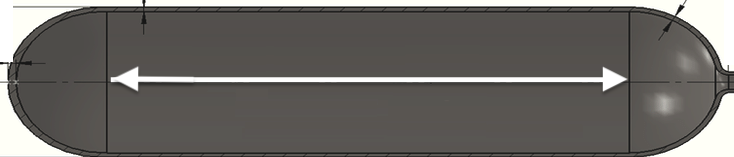

```{r include=FALSE, context="setup"}
library(mosaic)
library(mosaicCalc)
```

Decision making is about choosing among alternatives. In some engineering or policy contexts, this can mean finding the setting for an input variable that will produce the "best" outcome. For those who have studied calculus, it's natural to believe that calculus-based techniques for optimization are the route to solving the problem.

This is a calculus course, so you may be surprised to find out that the next few classes are about developing justified skepticism about the use of calculus-based techniques. Or, to be more precise, we want to emphasize that the optimization techniques covered in the first semester are **only part** of a broader set of techniques for real-world decision-making problems.

In this session, we're going to: 

1. Review the calculus-based techniques and reduce them to an algorithm that can be implemented as an operator like differentiation or integration.
2. Discuss the properties of a mathematical optimum to help you understand the illusion of "best" and how to quantify what is "good enough." 


In a later Daily Digital, we'll introduce the concept of **incommensurate** outcomes and show you that the concept of a "single best solution" is often logically incoherent.

Such talk goes against the grain of many decision makers. They argue with some reason that "only best is good enough," or that looking for "good enough" solutions is a sign of laziness. There are some situations where it is indeed worthwhile to seek to reach an absolute maximum. It takes judgment and experience to recognize when you are in a situation and when you are not---which is more often the case.

## Functions, derivatives and maxima

Recall the setting for calculus-type maximization. You have a function with one or more inputs, say, $f(x)$ or $g(x,y)$ or, often, $h(x, y, z, \ldots)$ where $\ldots$ might be standing for tens or hundreds or thousands of variables or more.

If you can graph the function (feasible for one- or two-input functions), you can often easily scan the graph by eye to find the peak. The calculus-based techniques were developed for situations where such graphing is not possible and, instead, you have a formula for the function. (Such occasions are of great theoretical interest but not all that common in practice.) The basis of the calculus techniques is the observation that, at the argmax of a smooth function, the derivative of the function is 0. (This applies equally well to functions of multiple variables, where we say that the "gradient is zero" which means that each and every component of the gradient vector is zero.)

As an example, consider a problem that often appears in calculus textbooks. ([Example](https://www.dummies.com/education/math/calculus/calculate-the-optimum-volume-of-a-soup-can-practice-question/) You have been tasked to design a container for a volume V of liquid. It is desired to make the weight of the container as little as possible. (This is a *minimization* problem, then.) In classical textbook fashion, you are told that the container is to be a cylinder made out of a particular metal of a particular thickness. 

This is a lovely geometry/calculus problem. Whether it is relevant to any genuine, real-world problem is another question.

```{r echo=FALSE, fig.align="center", out.width="20%"}
knitr::include_graphics("www/cylinder.png")
```

Using the notation in the diagram, the volume and surface area of the cylinder is $$V(r, h) \equiv \pi r^2 h \ \ \ \mbox{and}\ \ \ A(r, h) \equiv 2 \pi r^2 + 2 \pi r h$$

Minimizing the weight of the cylinder is our objective (according to the problem statement) and the weight is proportional to the surface area. Since the volume $V$ is given (according to the problem statement), we want to re-write the area function to use volume:

$$h(r, V) \equiv V / \pi r^2 \ \ \ \implies\ \ \ A(r, V) = 2 \pi r^2 + 2 \pi r V/\pi r^2 = 2 \pi r^2 + 2 V / r$$
Suppose $V$ were specified as 1000 liters. A good first step is to choose appropriate units for $r$ to make sure the formula for $A(r, V)$ is dimensionally consistent. Suppose we choose $r$ in cm. Then we want $V$ in cubic centimeters (cc). 1000 liters is 1,000,000 cc. Now we can plot a slice of the area function:

```{r}
A <- makeFun(2*pi*r^2 + 2*V/r ~ r, V=1000000)
slice_plot(A(r) ~ r, domain(r=c(10, 100))) %>%
  gf_labs(x = "radius (cm)")
```

You can easily see that the minimum is near $r=50$cm. Since $h(r,V) = V/\pi r^2$, the required height of cylinder will be near $10^6 / \pi 50^2 = 127$cm. And, as is clear from the graph, the function's derivative is zero at the optimal $r$.

In calculus courses, the goal is often to find a **formula** for the optimal radius as a function of $V$. So we differentiate the objective function---that is, the area function for any $V$ and $r$ with respect to $r$,
$$\partial_r A(r, V) = 4 \pi r - 2 V / r^2$$
Setting this to zero (which will be true at the optimal $r^\star$) we can solve for $r$ in terms of $V$:
$$4 \pi r^\star - 2 V/(r^
\star)^2 = 0 \ \ \ \implies\ \ \  (r^\star)^3 = \frac{1}{2\pi} V \ \ \ \implies\ \ \  r^\star = \sqrt[3]{V/2\pi}$$

For $V = 1,000,000 cm^3$, this gives $r^\star = 54.1926 cm$ which in turn implies that the corresponding height $h^\star = V/\pi (r^\star)^2 = 108.3852 cm$. 

We've presented the optimum $r^\star$ and $h^\star$ to the nearest **micron**. Does that make sense? Think about it for a moment before reading on. 

## Meaningless precision

A good rule of thumb in modeling is this: "If you don't know what a sensible precision is for reporting your result, you don't have a complete grasp of the problem." Here are two reasonable ways to sort out a suitable precision.

1. Solve a closely related problem which for many practical purposes would have been equivalent.
2. Look at how big a change in the output of the objective function is produced by a change from the argmax.

Approach (2) is always at hand, since you already know the objective function. Let's graph the objective function near $r = 54.1926$ ...

```{r echo=FALSE}
slice_plot(A(r) ~ r, domain(r=c(50, 60))) %>%
  gf_point(A(54.1926) ~ 54.1926, shape="*", size=10) %>%
  gf_labs(x = "radius (cm)")
```

Look carefully at the axes scales. Deviating from the mathematical optimum by about 5cm (that is, 50,000 microns) produces a change in the output of the objective function by about 400 units **out of 55,000**. In other words, about 0.7%. 

It's true that $r^\star = 54.1926$ cm gives the "best" outcome. And sometimes such precision is warranted. For example, improving the speed of an elite marathon racer by even 0.1% would give her a 7 second advantage: easily the difference between silver and gold!

What's different is that you know exactly what is the ultimate objective of a marathon: finish faster. But you may not know the ultimate objective of the system your "optimal" tank will be a part of. For instance, your tank may be part of an external fuel pod on an aircraft. Certainly the designers of the aircraft want the tank to be as light as possible. But they also want to reduce drag as much as possible. A 54 cm diameter tube has about 17% more drag than a 50 cm tube. To save that much drag, it's probably well worth increasing weight by 0.7%.

In reporting the results from an optimization problem, you ought to give the decision maker all relevant information. Here, that might be as simple as including the above graph in your report.

We mentioned another technique for getting a handle on what precision is meaningful: (1) solve a closely related problem. This often requires some insight and creativity to frame the new problem. Here, we note that large capacity tanks often are shaped like a lozenge: a cylinder with hemi-spherical ends.  

```{r echo=FALSE, out.width="40%", fig.align="center"}

```

Using $h$ for the length of the cylindrical portion of the tank, and $r$ for the radius, the volume and surface area are:
$$V(r, h) = \pi r^2 h + \frac{4}{3} \pi r^3 \ \ \ \mbox{and}\ \ \ A(r,h) = 2 \pi r h + 4 \pi r^2$$
Again, $V$ was specified as 1000 liters. So we can solve the $V$ formula for $h(r, V)$, then plug that in for $h$ in the area function to give $A(r, V)$.

```{r tb1-1, echo=FALSE, results="markup"}
etude2::etudeQ(
  "Which of these is correct? (Hint: Only one of the answers is dimensionally consistent.)",
  "+$h(r, V) = (V-4\\pi r^3/3)/ \\pi r^2$+",
  "$h(r, V) = (V-4\\pi r^2/2)/ \\pi r^2$",
  "$h(r, V) = (V-4\\pi r^3/3)/ \\pi r^3$",
  "$h(r, V) = \\sqrt{(V-4\\pi r^3/2)/\\pi r^3}$"
)
```


```{r tb1-2, echo=FALSE, results="markup"}
etude2::etudeQ(
  "Which of these is the correct expression for $A(r, V)$",
  "$A(r, V) = 2 V/r + \\frac{8 \\pi}{3} r^2$",
  "+$A(r, V) = 2 V/r + \\frac{4 \\pi}{3} r^2$+",
  "$A(r, V) = V/r + \\frac{20 \\pi}{3} r^2$",
  "$A(r, V) = V/r + 3 \\pi r^2$"
)
```

```{r tb1-3, echo=FALSE, results="markup"}
etude2::etudeQ(
  "Find $\\partial_r A(r, V)$ and set to zero. Solve for $r^\\star$ in terms of $V$. Which of these is correct?",
  "+$r^\\star = \\sqrt[3]{\\frac{3}{4\\pi} V}$+",
  "$r^\\star = \\sqrt[3]{\\frac{4}{3\\pi} V}$",
  "$r^\\star = \\sqrt[3]{\\frac{3\\pi}{4} V}$",
  "$r^\\star = \\sqrt[3]{\\frac{3}{2\\pi} V}$"
)
```


Find the optimum value of $r$ to minimize $A(r,V)$ when $V = 1000$ liters. 

```{r tb1-4, echo=FALSE, results="markup"}
etude2::etudeQ(
  "What is the optimal value of $r$ in cm to a precision of one micron?",
  "6.2035" = "Check that you were using the right units for $V$.",
  "+62.0351+",
  "52.0351",
  "46.0351"
)
```  

Use the sandbox to plot a graph of $A(r, V)$ for $V = 1000$liters. 

```{r rb2-2, exercise=TRUE, exercise.cap="Sandbox", exercise.nlines=4, eval=FALSE}
#A <- makeFun(function here ~ r, V = 1000000)
#slice_plot(A(r) ~ r, domain(r=c(55,70)))


```

```{r rb2-2-solution, echo=FALSE, eval=FALSE}
A <- makeFun(2*(V - 4*pi*r^3/3)/r + 4*pi*r^2 ~ r, V = 1000000)
slice_plot(A(r) ~ r, domain(r=c(55,70)))
```

```{r tb1-5, echo=FALSE, results="markup"}
etude2::etudeQ(
  "From the graph of $A(r, V)$ at $V=1000$ liters, read off a range of $r$ that produces $A$ no worse than 1% greater than the minimum. How wide is that range, approximately?",
  "$\\pm 0.1$cm$",
  "$\\pm 1$cm$",
  "+$\\pm 5$cm$+",
  "$\\pm 10$cm$",
  random_answer_order = FALSE
)
```


