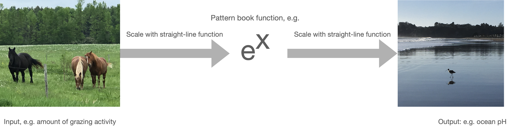

# Parameters for functions {#params-intro}

```{r include=FALSE}
library(mosaic)
library(mosaicCalc)
library(math141Z)
library(lubridate)
```

The naked modeling functions provide the modeler with a collection of shapes. They are not yet fully suited to represent real-world phenomena. To illustrate, consider Figure \@ref(fig:covid-exp) which shows the number of officially confirmed cases in March 2020. `r note(800)`

The outbreak was widely described as "exponential," so alongside the data Figure \@ref(fig:covid-exp) shows the function $e^x$.

```{r covid-exp, echo=FALSE, fig.cap="Cumulative confirmed COVID-19 cases during the month of March, 2020. The red curve is $e^x$", warning=FALSE}
March <- Covid_US %>% filter(month(date)==3) %>%
  mutate(day = mday(date))
gf_point(confirmed ~ day, 
         data = March) %>%
  gf_labs(y = "Cumulative confirmed cases", x = "Day in March, 2020") %>%
  gf_lims(y=c(0,200000)) %>%
  slice_plot(exp(x) ~ x, domain(x=c(0,15)), color="red", label_text = "exp(x)")
```

There's an obvious mismatch between the data and the function $e^x$. Does this mean the COVID pattern is not exponential?

A hint comes from the formula $e^x$. What is $x$? Plotted as it is in the graph, $x$ is the calender day in March. But why shouldn't $x$ be the given in hours or minutes or weeks? 

If we want the input to $\exp()$ to be in hours, we can multiply $x$ by 24. If the input is to be in weeks, the multiplier should be $\frac{1}{7} = 0.1429$. In both cases, the function will be $e^{kx}$, where $k$ would be 24 for hours or 0.1429 for weeks. Exploring a bit, we found that $0.3 \leq k < 0.5$ will produce functions graphs that match the data much better than naked $e^x$.  `r note(810)`

```{r covid-exp2, echo=FALSE, fig.cap="COVID-19 data compared to the exponential functions $e^{kt}$. A variety of possible numerical values for $k$ is shown.", warning=FALSE}
gf_point(confirmed ~ day, data = March) %>%
  gf_labs(y = "Cumulative confirmed cases", x = "Day in March, 2020") %>%
  gf_lims(y=c(0,200000)) %>%
  slice_plot(exp(x/2) ~ x, domain(x=c(0,30)), color="green", label_text = "exp(0.5*x)", label_x=.75) %>%
  slice_plot(exp(0.4*x) ~ x, domain(x=c(0,30)), color="blue", label_text = "exp(0.4*x)", label_x=0.9) %>%
  slice_plot(exp(0.45*x) ~ x, domain(x=c(0,30)), color="orange", label_text = "exp(0.45*x)", label_x=0.9) %>%
    slice_plot(exp(0.30*x) ~ x, domain(x=c(0,35)), color="tomato", label_text = "exp(0.30*x)", label_x=0.95) %>%
  slice_plot(exp(0.20*x) ~ x, domain(x=c(0,35)), color="black", label_text = "exp(0.20*x)", label_x=0.95)
```

The multiplier $k$ in $e^{kx}$ is called a ***parameter*** of the function: a number that we can use to set the ***scale*** of the input. To use the exponential function to model COVID, we've had to stretch out the red curve in Figure \@ref(fig:covid-exp2) by clothing naked $x$ as $k x$. Perhaps it's a matter of personal choice which size of $k$ will be best suited to model the data.

My personal choice is $k=0.30$. My reasoning? The orange curve parallels the COVID data. The flaw with  $k=0.30$ is that the curve lags several the data by several days. But we can fix this by pulling the $k=0.30$ curve to the left. Mathematically this can be accomplished by subtracting a few days from $x$ before multiplying by $k$, that is, using the function $$f(x) \equiv e^{k(x-s)}$$ where $s$ stands for the shift.

```{r echo=FALSE}
mod1 <- fitModel(confirmed ~ exp(0.3*(day-s)),
                 data = March,
         start = list(s=-32))
f1 <- makeFun(mod1)
mod2 <- fitModel(confirmed ~ exp(k*(day-s)),
         data = March,
         start = list(k=0.3, s=-32) )
f2 <- makeFun(mod2)
```

Figure \@ref(fig:covid-exp3) shows the orange curve after pulling it 10 days to the left. It's now a pretty good match to the data. 


```{r covid-exp3, echo=FALSE, fig.cap="COVID-19 data compared to the exponential functions $e^{k(t-s)}$.", warning=FALSE}
gf_point(confirmed ~ day, data = March) %>%
  gf_labs(y = "Cumulative confirmed cases", x = "Day in March, 2020") %>%
  gf_lims(y=c(0,200000)) %>%
  slice_plot(f2(x) ~ x, domain(x=c(0,31)), color="green", label_text = "exp(0.19*(x+32))", label_x=.6) %>%
  slice_plot(f1(x) ~ x, domain(x=c(0,30)), color="orange", label_text = "exp(0.30*(x+10)", label_x=0.9) 
```

Note that once we've aligned the orange curve horizontally, it seems to curve too much. The green curve does much better. It has a much gentler curve, $k=0.19$ and is pulled about a little more than a month to the left.   `r note(820)`

By parameterizing the exponential function as $e^{k(x-s)}$ and finding suitable values for $k$ and $s$, we get a good match to the March data. But models can sometimes tell us more. For the green curve in Figure \@ref(fig:covid-exp3) the value of $s$ is -32 days. 32 days before March 1 is in late January. And even though we didn't have any January or February data to base the green curve on, late January 2020 is regarded as the very beginning of the outbreak.

## Parallel scales

The graphical format we have been using to display functions of one variable places the input on the horizontal axis and the output on the vertical axis. This is not the only way to draw a function. Consider these everyday objects: a thermometer and a ruler.

     

Each object presents a read-out of what's being measured---temperature or length---on two different scales. At the same time, the objects provide a way to convert one scale to another.

A function gives the output for any given input. We represent the input value as a position on a number line---which we call an "axis"---and the output as a position on another output line, almost always drawn perpendicular to one another. But the two number lines can just as well be parallel to one another. To evaluate the function, find the input value on the input scale and read off the corresponding output. The ***inverse function*** can be evaluated just as easily: switch the roles of the input and output scales.  `r note(830)`

Taking the traditional unit scale as the input and the metric scale as the output, the two functions implemented on the objects are:
$$\underbrace{C(F) = \frac{5}{9}(F-32)}_\mbox{Fahrenheit to Celcius}\ \ \ \text{and}\ \ \ \ \underbrace{\text{cm(inches)} = 2.54 \times (\text{inches}-0}_\mbox{inches to cm})$$
These are very simple, straight-line functions, but they play an important role in modeling. 

Each conversion function can be written in the form $h(x) \equiv m (x - x_0)$. Of course, if you multiply the $m$ through both terms in parentheses, you get $h(x) = m x - m x_0$ which can be written even more simply as $mx + b$ by setting $b\equiv m x_0$. So the conversion function is simply the straight-line function.

$m$ and $x_0$ are the ***parameters*** of the straight-line function. In terms of the graph of a straight-line function, they are the slope and x-intercept respectively.

Often, functions can be parameterized in other ways. For instance, you likely learned the parameterization $m x + b$, in which $m$ is (still) the slope of the graph but $b$ is now the y-intercept.

::: {.takenote}
We can call $m(x - x_0)$ the "x-intercept parameterization" and $m x + b$ the "y-intercept parameterization. They are equivalent and equally good ways of parameterizing the straight line. There are still other ways of parameterizing, each style reflecting its own format for specifying the two points that make up a line. 
:::

To turn a naked modeling function into a ***basic modeling function*** all we do is use $h()$ to convert the input *before* applying the naked function.  `r note(840)`

Basic modeling function^[We're leaving the log function out of the list, simply because it's rarely used with $h()$.] | formula
------------------------|----------------------
Exponential             | $e^{h(x)}$
Power-law               | $\left[h(x)\right]^p$
Sinusoid                | $\sin(h(x))$
Hump                    | $\text{dnorm}(h(x))$
Sigmoid                 | $\text{pnorm}(h(x))$
Straight-line           | $h(x())$

As you can see, the straight-line function is a fundamental part of modeling. 

To illustrate the link between basic modeling functions and their naked progenitors, Figure \@ref(fig:covid-scale) shows the model we fit to the COVID-19 data:

```{r covid-scale, echo=FALSE, fig.cap="A graph of the naked modeling exponential with an additional scale displayed (red) to match it to the COVID-19 data"}
add_scale(exp(day) ~ day, domain(day=c(1,25)), 0.19, -32)
```

The function being drawn is simply $e^x$: naked. The black horizontal scale shows $x$.  To match the function to the data, that is, to show the basic modeling function, we simply add a new scale that translates $x$ to "day in March." That's the red scale. So, on March 22, there were about 25,000 COVID cases to date. 

The naked modeling function does not give a good model of the COVID case numbers. But if we scale the input before applying the naked function, we are effectively laying a new axis, stretched and shifted from the original, that let's us read off the number of cases. 

Input scaling empowers the naked modeling functions to model a huge variety of phenomena. There's just one exponential function and it always looks exactly the same. But there is a huge variety of ways to scale the input. With input scaling, the naked modeling function puts on clothes and becomes one of our basic modeling functions.
$$\underbrace{e^x}_\mbox{naked modeling function}\ \ \ \underbrace{e^{k(x-x_0)}}_\mbox{basic modeling function}$$
The straight-line function $h()$ is being written here as $k(x-x_0)$ rather than $m(x-x_0)$. It's traditional to to write some of the basic modeling functions 
You may have noticed that the above uses $k$ instead of $m$ as the multiplier in the straight-line function in the exponent. Of course, you can use whatever name you wish for a parameter. The idiom of mathematical notation has several conventions. Knowing these will help you read mathematics more fluently.  `r note(850)`

The table shows a few of them. Often, there are multiple parameterizations.

Function    | Written form | Parameter 1 | Parameter 2
------------|--------------|-------------|-------------
Exponential | $e^{kt}$     | $k$ "exponential constant"^[] | Not used
Exponential | $e^{t/\tau}$     | $\tau$ "time constant"^[] | Not used
Exponential | $2^{t/\tau_2}$     | $\tau_2$ "doubling time"^[$-\tau_2$ is sometimes called the "half life."] | Not used    
Power-law   | $[x - x_0]^p$    | $x_0$ "center" | Not used
Sinusoid    | $\sin\left(\frac{2 \pi}{P} (t-t_0)\right)$ | $P$ "period" | $t_0$ "time shift" 
Sinusoid | $\sin(\omega t + \phi)$ | $\omega$ "angular frequency" | $\phi$ "phase shift"
Sinusoid | $\sin(2 \pi \omega t + \phi)$ | $\omega$ "frequency" | $\phi$ "phase shift"
Hump     | dnorm(x, mn, sd) | mn "mean" | sd "standard deviation"
Sigmoid  | pnorm(x, mn, sd) | mn "mean" | sd "standard deviation"
Straight-line | $mx + b$ | $m$ "slope" | $b$ "y-intercept"
Straight-line | $m (x-x_0)$ | $m$ "slope" | $x_0$ "center"


## Scale the output

Just as the natural input usually needs to be scaled before it reaches the naked modeling function, so the output from the naked function may need to be scaled before it presents a result suited for interpreting in the real world. 

```{r scaling-nature, echo=FALSE, out.width="100%", fig.cap="Natural **quantities** must be scaled to pure numbers before being suited to the naked modeling functions. The output is a pure number which is scaled to the natural **quantity** of interest."}

```

The overall result of input and output scaling is a smartly dressed modeling function ready to engage the real world.  `r note(860)`


Name        |  Naked form | Dressed for action
------------|-------------|------------------
exponential |  $e^x$      | $A e^{kx} + C$
sinusoid    | $\sin(x)$   | $A \sin(\frac{2 \pi}{P} x) + C$
straight-line | $a x + b$ | $a x + b$

::: {.takenote}
The parameter $C$ is often called the ***baseline*** or the ***offset***. Statisticians call it the "intercept," because it plays the same role as $b$ in the straight-line function.

When working with sinusoids, parameter $A$ is called the ***amplitude***.

Of course, you're already familiar with $a$ and $b$: the slope and intercept of a straight line.

```{r show-sin-params, echo=FALSE, warning=FALSE, fig.cap="Baseline (blue), amplitude (red), and period (green) for the sinusoid."}
# making waveforms for the figure
slice_plot(sin(x) ~ x, domain(x=c(-1, 12))) %>%
  gf_hline(yintercept=0, color="blue") %>%
  gf_refine(theme_void()) %>%
  gf_errorbar(0 + 1 ~ pi/2, color="red") %>%
  gf_errorbar(-1 + 0 ~ 3*pi/2, color="red") +
  geom_errorbarh(aes(y=1/2, xmin=0, xmax=2*pi), color="green", size=.5)
```

```{r show-exp-baseline, echo=FALSE, warning=FALSE, fig.cap="The baseline for the exponential is the horizontal asymptote."}
slice_plot(exp(x) ~ x, domain(x=c(-2, 2))) %>%
  gf_hline(yintercept=0, color = "blue") %>%
  gf_refine(theme_void())
```
:::

::: {.why}
The straight-line function is like a penguin: even when it's naked, it's still fully dressed!

Now we can let you in on a little secret. All along, the straight-line function has been dressed, not naked. The actual naked form is so simple that it can be confusing:

$$\text{identity}(x) \equiv x$$
Clothing the identity function by scaling looks like this:

$$ x \underbrace{\longrightarrow}_\mbox{input scaling} k x + c \underbrace{\longrightarrow}_\mbox{output scaling} A(kx + c) + C$$
A little bit of algebra transforms the scaled function into a more concise form:

$$A(kx + c) + C \longrightarrow \underbrace{Ak}_ax + \underbrace{Ac + C}_b \longrightarrow ax + b$$
Most students have thoroughly explored the straight-line function in their high-school studies, so we thought it ill-advised to start out with the identity function.
:::

<details>
<summary>`r ex.mark(7.3, "uKCIE", fname="Exercises/Fun/scale-input-1.Rmd")` </summary>
`r MC_counter$reset()` `r knitr::knit_child("Exercises/Fun/scale-input-1.Rmd")`
</details>


<details>
<summary>`r ex.mark(7.7, "BLECL", fname="Exercises/Fun/scale-input-2.Rmd")` </summary>
`r MC_counter$reset()` `r knitr::knit_child("Exercises/Fun/scale-input-2.Rmd")`
</details>


::: {.todo}
Each graph shows a basic modeling function written in this style: $\sin(r(t-t_0))$. Your job is to estimate $t_0$ and $r$. 
:::

