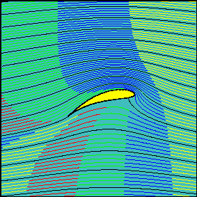

# Dimensions and units

::: {.objectives}
```{r echo=FALSE, results="asis"}
state_objective("Fun-10e", "Know when [mathematical] operations with ~~units~~ [dimension] are valid or undefined.")
state_objective("Fun-10f", "Use dimensional arithmetic to solve for the dimensions of an unknown term")
```
:::


Next time you're at a family gathering with your 10-year old cousin, give her the following math quiz.

1. What's 3 + 2?
2. What's 7 - 3?
3. What's 3 miles + 2 miles?
4. What's 3 miles + 2 kilometers?
5. What's 3 miles + 2 kilograms?

I don't know your cousin, but I suspect she will have an easy time answering (1) and (2) correctly. As for (3), she might give the correct answer, "5 miles," or just say "5." If so, you'll follow up with "5 what?" at which point she'll definitely say "miles."

(4) is a bit harder. You might need to prompt her with the information that 1 kilometer is about 0.6 miles. Then, if she's pretty smart, she'll answer "4.2 miles."

10-year olds are pretty creative, so I'm not sure how she'll answer (5). But if you ask your Ph.D. aunt, she'll answer along the lines of "silly question," or "there's no such thing." That's true.

Consider these everyday quantities:

i. 60 miles per hour: a typical *speed* for driving on a highway
ii. 2106 square feet: the in-bounds *area* for a court used for singles tennis.
iii. 375 cubic centimeters: the *volume* in a canned beverage (in the US).
iv. 2.5 gallons per minute: the US mandated maximum *flow rate* for water through a shower head. 
v. 35 miles per gallon: a typical fuel economy for a small car in the US.
vi. Your body mass index: measure your mass then divide by the square of your height.

Consider how you would measure such things:

i. We ordinarily use a speedometer to measure instantaneous car speed and police use a radar gun. But fundamentally, you measure the distance traveled and the time used and divide distance by time.
ii. Most people would rely on the internet for this information, but you would check your local court by measuring the width (27 feet is the standard) and the length of the course (78). Multiply the two.
iii. Pour the beverage into a measuring cup and read off the volume. But more fundamentally, you could measure the circumference of the can ($2 \pi r$), square it ($4 \pi^2 r^2$) and divide by $4 \pi$ to get the cross section area of the can. Then multiply that by the height of the can.
iv. We don't usually monitor water use by a shower. But if you need to, get a 5-gallon pail (the standard volume of the plastic pails used for so many purposes in construction), put it under the shower head, and measure the time it takes to fill the pail. Divide volume by the time.
v. Record the mileage on the car's odometer when you fill up the car with gas. Drive. When you next get gas, measure the new odometer reading and the volume of gas you purchased. Divide the change in odometer reading by the gas volume. (In Europe, you would divide the gas volume by the change in odometer reading.)
vi. Weigh yourself. The scale is usually graduated in both pounds and kilograms: take your choice. Measure your height; the ruler-in-the-doorway method works well. Then divide your weight by the square of your height.

Evidently, it makes sense to *multiply* and *divide* different types of quantities: feet, gallons, kilometers, kilograms, pounds, hours, .... But you won't ever see a quantity constructed by *adding* or *subtracting* miles and hours or gallons and and square feet. You can square feet and cube centimeters, but can you take the square root of a gallon? Does it make sense to raise 2 to the power of 3 yards? 

This section is about the mathematical structure of combining quantities; which kinds of mathematical operations are legitimate and which are not. 

## Mathematics of quantity

::: {.objectives}
```{r echo=FALSE, results="asis"}
state_objective("Fun-10a", "Know the definition of a fundamental dimension and the notation for the most common ones (definition page 241-242)")
state_objective("Fun-10b", "Understand how derived dimensions are formed from fundamental dimensions (definition page 241-242)")
state_objective("Fun-10c", "Know that units are ways of measuring dimensions and derived dimensions.")
```
:::

The first step in understanding the mathematics of quantity is to make an absolute distinction between two concepts that, in everyday life, are used interchangeably: ***dimension*** and ***unit***.

***Length*** is a dimension. Meters is a unit of length. We also measure length in microns, mm, cm, inches, feet, yards, kilometers, and miles, to say nothing of furlongs, fathoms, astronomical units (AU), and parsecs.

***Time*** is a dimension. Seconds is a unit of time. We also measure time in micro-seconds, milli-seconds, minutes, hours, days, weeks, months, years, decades, centuries, millenia.

***Mass*** is a dimension. Kilograms is a unit of mass.

Length, time, and mass are called ***fundamental dimensions***. This is not because length is more important than area or volume. It's because you can construct area and volume by multiplying lengths together. This is evident when you consider units of area like square-inches or cubic centimeters, but obscured in the names of units like acre, liter, gallon.

We'll use the notation L, T, and M to refer to the fundamental dimensions. (Electrical charge Q is also a fundamental dimension, but we won't have much use for it in our examples.)

## Compound dimensions

There are other dimensions: volume, force, pressure, energy, torque, velocity, acceleration, and such. These are called ***compound dimensions*** because we represent them as combinations of the fundamental dimensions, L, T, and M. The notation for these combinations involves multiplication and division. For instance:

- Volume is L $\times$ L $\times$ L $=$ L$^3$, as in "cubic centimeters"
- Velocity is L/T, as in "miles per hour"
- Force is M L/T$^2$, which is obscure unless you remember Newton's Second Law that $\text{F} = \text{m}\,\text{a}$: "force equals mass times acceleration." In terms of dimension, mass is M, acceleration is L/T$^2$. Multiply the two together and you get the dimension "force."

Multiplication and division are used to construct a compound dimension from the fundamental dimensions L, T, and M.

Addition and subtraction are **never** used to form a compound dimension.

Much of the work in understanding dimensions involves overcoming the looseness of everyday speech. Remember the weight scale graduated in pounds *and* kilograms. The unit kilograms is a way of measuring M, but the unit of pounds is a way of measuring *force*: M L/T$^2$.

Weight is not the same as mass. This makes no sense to most people and doesn't really matter in everyday life. It's only when you venture off the surface of the Earth that the difference shows up. A person in orbit is "weightless" but that person continues to have mass. The weight of a woman on Mars is different from her weight on Earth but her martian mass is exactly the same as her earthly mass.

Another source of confusion carried over from everyday life is that sometimes we measure the same quantity using different dimensions. You can measure a volume by *weighing* water; a gallon of water weighs 8 pounds, a liter of water has a mass of 1 kg. Serious bakers measure flour by weight; a casual baker uses a measuring cup. We can measure water volume with length because water has a (more-or-less) constant mass density. But 8 pounds of gasoline is considerably more than a gallon. It turns out that the density of flour varies substantially depending on how it's packed, on humidity, etc. This is why it matters whether you weigh flour for baking or measure it by volume. You can measure time by the swing of a pendulum. To measure the same time successfully with different pendula they need to have the same length, not the same mass.

A ***unit*** is a conventional amount of a quantity of a given dimension. All lengths are the same dimensionally, but they can be measured with different conventions: inches, hards, meters, ... Units for the same dimension can all be converted unambiguously one into the other. A meter is exactly the same quantity of length as 39.3701 inches, a mile is the same length as 1609.34 meters. Liters and gallons are both units of volume (L$^3$): a gallon is the same as 3.78541 liters.

You will hear it said that a kilogram is 2.2 pounds. That's not strictly true. A kilogram has dimension M and a pound has dimension ML/T$^2$. Quantities with different dimensions cannot be "equal" or even legitimately compared to one another. Unless you bring something else into the game that physically changes the situation, for instance gravity (dimension of acceleration due to gravity (dimension $\text{L}/\text{T}^2$). The *weight* of a kilogram on the surface of the Earth is is 2.2 pounds because gravitational acceleration is (almost) the same everywhere on the surface of the Earth.

It's also potentially confusing that sometimes different dimensions are used to get at the same idea. For instance, the same car that gets 35 miles / gallon in the US (dimension $\text{L}/\text{L}^3 = 1/\text{L}^2$) will use 6.7 liters per 100 kilometers ($\text{L}^3 / L = \text{L}^2$) in Europe. Same car. Same fuel. Different conventions using different dimensions.

::: {.objectives}
```{r echo=FALSE, results="asis"}
state_objective("Fun-10d", "Understand the bracket notation and how it works with dimensional arithmetic.")
```
:::


Keeping track of the various compound dimensions can be tricky. For many people, it's easier to keep track of the physical relationships involved and use that knowledge to put together the dimensions appropriately. Often, the relationship can be described using specific calculus operations, so knowing dimensions and units helps you use calculus successfully. 

We'll use a specific bracket notation to translate between words for the concept and the dimension. For instance, [length] = L, [mass] = M, [time] = T, [inches] = L, ...

Easy compound dimensions that you likely already know:

i. [***Area***] $= \text{L}^2$. Some corresponding units to remind you: "square feet", "square miles", "square centimeters."
#. [***Volume***] $ = \text{L}^3$. Units to remind you: "cubic centimeters", "cubic feet", "cubic yards." (What landscrapers informally call a "yard," for instance "10 yards of topsoil" should properly be called "10 cubic-yards of topsoil.")
#. [***Velocity***] $= \text{L}/\text{T}$. Units: "miles per hour," "inches per second."


Ones that require some physics and whose relationships with others you should remember. Anticipating that you will return to this section for reference, we've also added some relevant calculus operations.

acceleration [Calculus: derivative of velocity with respect to time, 2nd derivative of position with respect to time]
momentum: mass times velocity
force: [Calculus: Derivative of momentum with respect to time]
energy [Calculus: Integral of force with respect to length]
power [Calculus: Derivative of energy with respect to time]

"Density" sounds like a dimension, but is a word to cover many different situations with different dimensions.
mass, charge, people, lineal, areal, volume

Physical constants:

Boltzman's constant
Universal gravitational constant G
Charge of an electron: 1.60217662 × 10-19 coulombs (Dimension Q)


Challenging dimensions:

temperature
voltage
entropy
enthalpy

Non-physics dimensions

"people"/"passengers"/"customers"/"patients"/"children"/"students"/"professors" --- these are different dimensions and not really units: no fixed translation between them as you would have with units.
"money": Units are dollars (in many varieties: US, Canadian, Australian, New Zealand), euros, yuan (synonym: renminbi), yen, pounds (many varieties: UK, Egypt, Syria, Lebanon, Sudan and South Sudan), pesos (many varieties), dinar, franc (Swiss, CFA), rand, riyal, rupee, won, and many others. Conversion rates depend on situation and national policy.

## Naked core functions

::: {.underconstructon}
The basic modeling functions such as $e^{kx}$,  $\sin(\frac{2 \pi}{P} x)$, $\text{hump}(x, \text{center}, \text{spread})$, $\text{sigmoid}(x, \text{center}, \text{spread})$ did not come in to the world fully clothed with parameters. The clothes are needed to deal with a modeling necessity: inputs to functions used for modeling are quantities with dimension and units.

Underneath the clothing of basic modeling function, you'll find what we will frivolously call the ***naked core functions***. These are without parameters: $e^x$, $\sin(x)$, $\text{hump}(x)$, $\text{sigmoid}(x)$. For each of these functions, $x$ must be a ***pure number***, that is, a quantity without physical dimensions.

DEVELOP THIS: $e^x$ and $\sin(x)$, when used for modeling are composed with a proportionality function. $\text{hump}()$ and $\text{sigmoid}()$ are composed with a straight-line function.

The proportionality and straight-line functions handle the conversion from dimensionful quantities with units into the pure numbers.

HOW THE HUMP AND SIGMOID GOT THEIR PARAMETERS: WE'RE ABSTRACTING FROM A COMPLICATED FORMULA, so it's easier to call them out by name.
:::


## Notes from 2020

FROM CLASS NOTES Fall 2020

RULE FOR ADDITION: We can add or subtract only quantities that are the same *kind of thing*. A more specific word for *kind of thing* is **dimension**. 

## Multiplication ...

    

* 4 * 6
* 4 feet * 6 feet gives 24 square feet
* 4 miles * 6 feet 

INSTRUCTOR: Ask students to calculate this area. (5280 feet per mile) gives 126720 square feet which is about 3 acres (2.91, to be more specific. There are 43560 square feet in an acre.

What's different here is that the **dimension** of the result is the **product** of the dimension of the multiplier and the multiplicand. The same is true for the units of the product. 

We could have correctly given the result of "4 miles * 6 feet" as 24 mile-feet. That's an unconventional unit, so it's hard to think about. Conventional units for area of square feet, square miles, and many others. So we would be embarassed to present a result in mile-feet. 

But there are many quantities that have compound units, e.g. 

* acre-foot ("volume" typically of water)
* foot-pound ("torque" typically in the context of engines or wrenches)
* pound per square inch ("pressure")
* meter per square second (idiomatically stated "meter per second squared", which is a measure of the “amount” of gravity, which is acceleration.)
* mile per gallon

These compound units all have specific names

* acre-foot is 
* foot-pound is 
* pound per square inch is "pressure"
* meter per square second, which is 
* miles per gallon, the measure of automobile "fuel economy" used in the US. In other countries they mostly use liters-per-100-km, which is "fuel efficiency"

## Division

It often happens that we have to divide one quantity by another. For instance, when we say "per" in the following, we are talking about division.

* miles per hour ("speed")
* mass per volume ("density")
* dollars per day ("earnings" or "expenditures")
* distance per second per second ("acceleration")

INSTRUCTOR: Ask students for the conventional units for these quantities:

* Yield of corn on a farm. (Bushels per acre)
* Efficiency of a solar electric cell. (Kilowatts per square meter)
* Carrying capacity of public transportation. (Passengers per bus)
* Carbon dioxide emission, worldwide. (Gigatons per year)

## Kinds of quantities

There are many different kinds of quantities and often many names for them., that it sometimes seems to be a folk culture, a new language to learn.

By convention, we have a few **fundamental quantities**, which is to say a selected set of quantities out of which we can build, by multiplication and division, other kinds of quantities.

Here are four simple dimensions:

* Length
* Mass
* Time
* Money

These are simple because we have simple, intuitive ways to **compare** them:

* Length, put them side by side and check if they line up.
* Mass, put them on either side of a scale and check if the scale balances.
* Time, start both at the same time and check if the two finish at the same instant.
* Money, pile them on two tables. See whether two "typical" persons (other weasel words: "reasonable", "informed") are indifferent between the two.

Since we can compare two quantities, we can define a **standard** by which we can quantify the amount.

* Length: a ruler. Symbol $L$
* Mass: a standard object. Symbol $M$
* Time: sand through a sandglass, water leaking from a cup. Later, with Galileo, period of a swinging pendulum of a given design. Symbol $T$
* Money: a standard mass of gold. Symbol $B$

There are other quantities that are fundamental because early in the scientific era we found ways to compare them and develop a standard for them.

* Temperature. Compare by placing the two quantities in touch with one another. The higher quantity will diminish and the lower quantity increase until they are the same. Symbol $\Theta$
    - Standards: Boiling water, water with ice in it
* Electric current. Pass the current through a standard design solenoid and observe the magnetic force generated. (More sophisticated: Wheatstone bridge.) Symbol $I$
* Luminous intensity. Standard candle. Can people distinguish between them? (Works only for visible light.)  Symbol $J$.

Other kinds of quantities, which are usually expressed as combinations of the fundamental dimensions.

- Area: $L^2$
- Volume $L^3$
- Density $M / L^3$ sometimes called "volume density"
- Frequency $1/T$
- Velocity $L/T$
- Acceleration $L/T^2$
- Force $M L/T^2$. Remember, "Force equals mass times acceleration"
- Pressure $(M L / T^2) / L^2 = M / L T^2$
- Energy $L M L /T^2 = M  L^2 / T^2$. Remember, "Work is force over a distance."
- Power $M L^2 / T^3$. Remember, "Power is energy per unit time."

Many people confuse Force, Energy, and Power, so watch out when you read about them in news articles.

## Textbook notation

The book uses a specific notation for the kind-of-thing function.

## Things you should know about dimensions and units

1. A **dimension** is a kind of thing. 
    - Things with the same dimension can be readily compared for equality.
    - Things with different dimensions **cannot** be compared *except in a specific context*. For example: you can express energy as barrels (volume) of oil or cubic feet of natural gas.
2. A **unit** is a specific measure of a specific dimension. There are generally many different units for the same dimension,  e.g. feet and meters, liters and acre-feet, ...
3. In your profession, you should have readily to hand how to express certainly commonly encountered physical quantities in terms of combinations fundamental dimensions. Volume, area, velocity, acceleration, force, energy, power. Some mnemonics for the ones that aren't intuitive
    - acceleration is change  in velocity per unit time.
    - force is mass times acceleration
    - pressure is force per unit area
    - energy is force times distance: force over a distance
    - power is energy per unit time.
    - frequency is a number of events per unit time.

4. In your profession, you should know the most commonly encountered units for these, both their names and magnitudes.
    - A liter of water has a mass of about 1 kg.
    - A liter of air (at sea level) has a mass of about 1 gm.
    - A "Pascal" is a tiny amount of pressure. Atmospheric pressure is about 100,000 Pascal. Bicycle tire pressures are measured in hundreds of kilopascals.
    - Weight and mass are not the same thing. Weight is a force. In traditional units, weight is measured in pounds: a force. 
    - Kilograms are a measure of mass. True enough, everyone uses them to refer to weight, that is force. What they mean (even if they don't know it) is the weight of a mass of one kilogram under the acceleration of gravity at the Earth's surface, which is roughly 9.8 meters-per-second-squared.

## Example: Bernouilli's Equation

One of the important facts about why airplanes stay in the air is that the air pressure on the bottom surface of the wing is higher than the air pressure on the top surface of the wing.

This is **not** because air pressure is higher at low altitudes than at high altitudes: the altitude at the top surface of a wing is hardly different than at the bottom surface.

The reason for the pressure difference is that the path of air is bent as it goes around the wing. This leads to the velocity of the air over the top surface of the wing being greater than the velocity under the bottom surface.

```{r echo=FALSE, fig.align="center", out.width="50%"}

```

[Movie version](tEOj0.gif)

[Source](https://aviation.stackexchange.com/questions/16193/how-do-wings-generate-lift)

The situation is often described by imagining a quantity called "total air pressure" that is the same throughout the volume of air the wing is passing through. Total air pressure has multiple components:

total air pressure = static air pressure + dynamic air pressure

Static air pressure is what the wing "feels." 

Dynamic air pressure is a function  of velocity. **But what sort of function?**

Let's look at the dimensions. We know that in order to add two quantities, they must both have the same dimension.

- [Pressure] = [Force]/[Area] = $(M L / T^2) / (L^2) = M/(L\cdot T^2)$

- [Velocity] = [Length]/[Time] = $L/T$

In order for velocity to generate a pressure-like quantity, we are going to need to find some other quantity to multiply it by that includes a [mass] = $M$,

Air has mass. Let's look at [Air density] = $M/L^3$.

Our goal is to find a way to combine velocity and density to produce a pressure. That is, find integers $a$ and $b$ such that:

$$M  / (L \cdot T^2) = \mbox{[Velocity]}^a \cdot \mbox{[Density]}^b =
L^a \cdot T^{-a} \cdot M^{b} \cdot L^{-3b}$$

The exponents on each distinct fundamental quantity must be equal, so:

- $M = M^b$, so $b=1$
- $L^{-1} = L^{a - 3b}$, so $a-3 = -1 \Rightarrow a = 2$
- $T^{-2} = T^{-a}$, which checks out.

So, the function that turns velocity and density into pressure must be linear in density and go as the square of velocity.

This is Bernouilli's Law

$$\mbox{Total pressure}_{below} = \mbox{Total pressure}_{above}\\\\
\mbox{Static pressure}_{below} + \mbox{Dynamics pressure}_{below} =
\mbox{Static pressure}_{above} + \mbox{Dynamics pressure}_{above} \\\\
\mbox{Static pressure}_{below} + \frac{1}{2} \rho V^2_{below} =
\mbox{Static pressure}_{above} + \frac{1}{2} \rho V^2_{above} 
$$


### Dimensional analysis of a pendulum

We want to relate the **period** (in T) of a pendulum to it's **length** and **mass**. **Gravity** also plays a role. For simplicity, we'll assume that the pendulum cable is massless.

The analysis strategy is to combine the four quantities we think play a role into one total quantity that is **dimensionless**. Since it is dimensionless, it can be constant regardless of the mass, length, period, gravity of each individual situation.

$$\mbox{[Period]}^a \cdot \mbox{[Mass]}^b \cdot \mbox{[Length]}^c \cdot \mbox{[Gravity]}^d = T^a \cdot M^b \cdot L^c \cdot L^d \cdot T^{-2d}$$
To be dimensionless ...

- $c = -d$, cancel out the L
- $a = -2d$, cancel out the T
- $b=0$, there's no other mass term, and we need to cancel out the M

Let $d=1$ and see what happens. 

$$ \frac{\mbox{Gravity}}{\mbox{Length}\cdot \mbox{Period}^2} \equiv c$$
Consequently

$$Period = \sqrt{\frac{\mbox{Gravity}}{\mbox{Length}} }$$
### Test via experiment

String knotted into 4 equal segments (about 1 foot each) with a bolt at the end

o-------o-------o-------o-------B

1. Hang the string from the first knot: length L=4
    - Time 10 oscillations and record result
2. Hang the string from the second knot: length L=3
    - Time 10 oscillations and record result
... and so on

Calculate $c$ in each case. They should all be approximately the same.

## Second day??

##  Square roots (power laws), exponentials, sines, etc.

## Conversion: Flavors of 1

Numbers are dimensionless but not necessarily unitless. Failure to accept this distinction is one of the prime reasons people have trouble figuring out to to convert from one unit to another.

Mole, dozen, square dozen, cubic dozen, myriad, score


## Which 1?


I want to talk to you about the number 1.


1 is a favorite of elementary school students because its multiplication  and division tables are  completely  simple. Anything times one, or anything divided by one, is simply that thing.  Addition and subtraction are pretty simple, too, but that's not my concern here.

When it comes to ***quantities***, there's not just one one but many. And often they look nothing like the numeral 1. Some examples of 1 as a quantity:

- $\frac{180}{\pi} \frac{\text{degrees}}{\text{radians}}$

- $0.621371 \frac{\text{mile}}{\text{kilometer}}$

- $3.78541 \frac{\text{liter}}{\text{gallon}}$

- $\frac{9}{5} \frac{^\circ F}{^\circ C}$

I want to  talk about the **units** of 1.

1 gallon. You could convert this to liters or cups or cubic feet or any other unit of volume. For 1 gallon,  the *dimension* is L^3: volume.

1 km is a kind  of 1, and you can easily convert it to miles or meters or feet or any other kind of length. The *dimension* of 1 km is L: length. The units are km.

But let's talk about a special 1, the kind with no *dimension*. Of  course,  one example of a dimensionless  1 is the  pure number 1. But  there are others. Think about that for a second, it's easy to imagine different kinds of dimensionful  1s: 1 gallon,  1 km, 1 m/sec. But how can there be more than one *dimensionless* 1?


The reason this is possible is that there  can be different units of dimensionless one.

Here  are some examples:

3.4 ft/m

4 cups / pint

60 miles/hour / 88 feet per second

I can see two kinds of objections to my claim  that these examples are dimensionless 1. First, the numbers are 3.4, 0.6, and 4,  none  of which are 1. Second, there are  units and therefore there must be dimension.

But look carefully. In every example, the dimension of  the numerator matches the dimension of the denominator. [feet / meter] is L/L = 1.  [cups / pint] is L^3/L^3 = 1. [miles/hour / ft per sec] = L/T / L/T = 1. Each of these quantities has *units* but it has no *dimension*. 

How can you tell that the three quantities in the example are equal to 1.  Well, 3.281 feet is exactly the same as 1 meter.  When you divide two non-zero quantities that are identical, you always get 1. So 3.281 ft/1 meter is 1.

Similarly, 4 cups is exactly the same as 1 pint. Dividing these two equal things gives us 1, but we write it as 4 cups/pint.

60 miles/hour is exactly the same as 88 feet per second, ... you can see where I'm going here.

Come to think of it, in high-school geometry you were introduced to  dimensionless quantities with units. Consider an angle.

DRAWING OF PIE SLICE: 

The angle is the length of the arc divided by the length of the radius. Length/length ... that's dimensionless. Some units of angle that you've seen include degrees and radians. There are other units of angle used in specialized fields, such as grads or [ask Pete for artillary units.]

I like to call dimensionless quantities that are 1, "flavors of 1." You know vanilla 1 from the days you started counting. 


## Dimensions and linear combinations

The scalar has to do the work of the dimension conversion

## Stress and strain

For the civil engineers, introduce the words stress and strain and talk about the units: [stress] = ML/T2 and [strain] = L).


