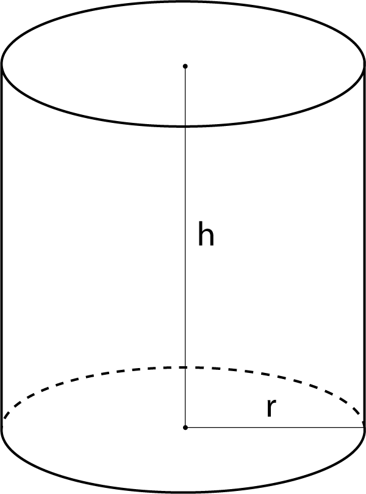
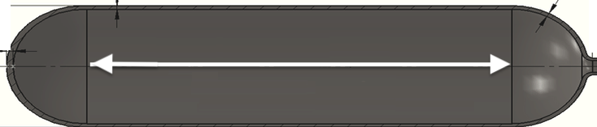

# Optimization {#optim-and-shape}


To "optimize" means to make something as good as possible with the available resources. Optimization problems are common in science, logistics, industry, and any other area where one seeks the best solution to a problem. Some everyday examples: `r mark(2440)`

- When to harvest trees being grown for lumber. Harvest too soon and you might be losing out on the prime growing years. Wait too long and trees will have settled in to slow growth, if any.
- Walking up too steep a slope is tiring and slows you down; that's why hiking trails have switchbacks. When the switchbacks are too shallow, it takes a long time to cover the distance. What's the most efficient angle to enable hikers to get up the hill in the shortest time.
- How much salt to add to a stew. Stews can be too salty, or they can be not salty enough. Somewhere in the middle is the optimum.`r mark(2445)`

## Structure of the problem

In an optimization problem, there is one or more input quantity whose value you have to choose. The amount of salt; the years to wait from planting to harvesting a tree; the angle of the trail with respect to the slope. We'll call this the ***decision quantity***.  `r mark(2450)`

Similarly, there is one or more output quantity that you value and want to make as good as possible. The taste of the stew; the income produced by selling the lumber; the time it takes to walk up the hill. The output quantity is called the ***objective***.  `r mark(2455)`

The model that relates to inputs to the objective output is called the ***objective function***. Solving an optimization problem---once the modeling phase is complete---amounts to finding a value for the decision quantity (the input to the objective function) that produces the best level of the objective (the output from the objective function). `r mark(2460)`

Sometimes the objective is something that you want to ***minimize***, make as small as possible. In the hiking trail problem, we seek to minimize the amount of time it takes to walk up the trail. Sometimes you want to ***maximize*** the objective, as in the wood-harvest problem where the objective is to harvest the most wood per year. `r mark(2465)`

Mathematically, maximization and minimization are the same thing. Every minimization problem can be turned into a maximization problem by putting a negative sign in front of the objective function. To simplify the discussion, in talking about finding the solution to an optimization problem we'll imagine that the goal is to maximize. But keep in mind that many circumstances in the real world, "best" can mean to minimization.   `r mark(2470)`

The solution you seek in a maximization problem is called the ***argmax***. This is a contraction of two words: the *argument* (that is, input) that produces the *maximum* output. (For minimization, the solution is the ***argmin***.) `r mark(2475)`

Once you have found the argmax you can plug that value into the objective function to find the value of the output. That value is the ***maximum***. 

::: {.takenote  data-latex=""}
People often talk about "finding the maximum." This is misleading. The setup for an optimization problem is:

1. Construct (that is, model) the objective function.
2. Now that you know the objective function, find the input to that function---that is, the **argmax**---that produces the maximum output.
:::

To illustrate the setup of an optimization problem, imagine yourself in the situation of a contest to see who can shoot a tennis ball the farthest into a field with a slingshot. During the contest, you will adjust the vertical angle of launch, place the ball into the slingshot's cradle, pull back as far as possible, and let go. To win the contest, you need to optimize how you launch the ball. `r mark(2480)`

The objective is to maximize the distance traveled by the ball. The ***objective function*** models the distance travelled as a function of the quantities you can control, for instance the vertical angle of launch or the amount by which you pull back the slingshot. For simplicity, we'll imagine that the slingshot is pulled back by a standard amount, producing a velocity of the ball at release  of $v_0$. Since $v_0$ is fixed, you'll win or lose based on the angle of launch you choose. `r mark(2485)`

Before you head out into the field to experiment, let's do a bit of preparation for constructing the objective function. Using some principles of physics and mathematics (which you may not yet understand), we'll model how far the ball will travel (horizontally) as a function of the angle of launch $\theta$ and the initial velocity $v_0$. `r mark(2490)`

The mathematics of such problems involves an area called ***differential equations***, an important part of calculus which we'll come to later in the course. Since you don't have the tools yet, we'll just state a simple model of how long the ball stays in the air.
$$\text{duration}(v_0, \theta) = 2 v_0 \sin(\theta)/g$$ $g$ is the acceleration due to gravity, which is about $9.8 \text{m}\text{s}^{-2}$, assuming that the contest is being held on Earth.

The horizontal distance travelled by the tennis ball will be $$\text{hdist}(v_0, \theta) = \cos(\theta) v_0\, \text{duration}(v_0, \theta) = 2 v_0^2 \cos(\theta)\sin(\theta) / g$$
Our objective function is hdist(), and we seek to find the argmax. The input $v_0$ is (we have assumed) fixed, so the only decision quantity is the angle $\theta$.

The best choice of $\theta$ will make the quantity $\cos(\theta)\sin(\theta)$ as large as possible. So in finding the argmax, we don't need to be concerned with $v_0$ or $g$. 

Finding the argmax can be accomplished simply by plotting the function $\cos(\theta)\sin(\theta)$. We'll implement the function so that the input is in units of *degrees*.

```{r ball-theta, fig.cap="The distance travelled by a ball launched at an angle of $\\theta$, according to the simple model is duration of flight and distance travelled.", echo=FALSE, fig.show="hold"}
f <- makeFun(cos(pi*theta/180)*sin(pi*theta/180) ~ theta)
slice_plot(f(theta) ~ theta, domain(theta=c(0,90))) %>%
  gf_labs(x = expression(theta))
```

You can see that the maximum value is about 0.5 and that this occurs at an argmax $\theta$ that's a little bit less than 50$^\circ$.

Zooming in on the $\theta$ axis let's you find the argmax with more precision:

```{r ball-theta-zoom, echo=FALSE, fig.cap="Zooming in on the argmax of the objective function. It's important to look at the scale of the vertical axis. Any value of $\\theta$ between about 40 and 50 gives a very close approximation to the maximum."}
slice_plot(f(theta) ~ theta, domain(theta = c(40, 50))) %>%
  gf_labs(x = expression(theta))
```


From the graph, especially the zoomed-in version, you can read off the argmax as $\theta = 45^\circ$.

Finding the argmax solves the problem. You may also want to present your solution by saying what the value of the output of hdist() is when the argmax is given as input. You can read off the graph that the maximum of $\cos(\theta)\sin(\theta)$ is 0.5 at $\theta = 45^\circ$, so overall the distance will be $v_0^2 / g$ `r mark(2495)`


`r insert_calcZ_exercise("23.02", "0zyL02", "Exercises/Diff/child-iron-laundry.Rmd")`

## Interpreting the argmax

The graphical solution given to the slingshot problem is entirely satisfactory. Whether that solution will win the contest depends of course on whether the model we built for the objective function is correct. There are potentially important things we have left out, such as air resistence. `r mark(2500)`

Solving the optimization problem has prepared us to go out in the field and test the result. Perhaps we'll find that the real-world optimum angle is somewhat steeper or shallower than $\theta = 45^\circ$. `r mark(2505)`

Besides the argmax, another important quantity to read from the graph in Figure \@ref(fig:ball-theta) is the ***precision*** of the argmax. In strict mathematical terms, the argmax is exactly 45 degrees. But in practical terms, it may not matter so much to the outcome if we are a little away from $45^\circ$. For example, according to the model, any angle in the range $40^\circ < \theta < 50^\circ$ would produce an output that is within 1% of the distance reached at the argmax. `r mark(2510)`

Contests are won or lost by margins of less than 1%, so you should not casually deviate from the argmax. On the other hand, $45^\circ$ is the argmax of the *model*. Reality may deviate from the model. For instance, suppose that air resistance or wind might might have an effect of about 1% on the distance. Since the real-world function might deviate by as much as 1% of the model value, we shouldn't expect the real-world argmax to be any closer to 45$^\circ$ than $\pm 5^\circ$, since anywhere in that input domain generates an output that is within 1% of the maximum output for the model. `r mark(2515)`

## Derivatives and optimization

We're now going to reframe the search for the argmax and it's interpretation in terms of  derivatives of the objective function with respect to the decision quantity ($\theta$ in the slingshot problem). For a function of one variable, this will not be an improvement from the look-at-the-graph technique to find the argmax. A genuine reason to use derivatives is to set us up in the future to solve problems with more than one variable, where it is hard to draw or interpret a graph. Also, describing functions in the language of derivatives can help us think more clearly about aspects of the problem, such as the precision of the argmax. `r mark(2520)`

With a graph such as Figure \@ref(fig:ball-theta), it's easy to find the argmax; common sense carries the day. So it won't be obvious at first why we are going to take the following approach:

Let's denote an argmax of the objective function $f(x)$ by $x^\star$. 
Let's look at the derivative $\partial_x f(x)$ in the neighborhood of $x^\star$. Referring to Figure \@ref(fig:ball-theta), where $x^\star = 45^\circ$, you may be able to see that $\partial_x f(x^\star)$ is zero; the line tangent to the function's graph at $x^\star$ is horizontal.   `r mark(2525)`

Seen another way, the slope of $f(x)$ to the left of $x^\star$ is positive. Move a tiny bit to the right (that is, increase $x$ by a very small amount) leads to an increase in the output $f(x)$.  Just to the right of $x^\star$, the slope of $f(x)$ is negative; as you reach the top of a hill and continue on, you will be going downhill. So the derivative function is positive on one side of $x^\star$ and negative on the other, suggesting that it crosses zero at the argmax. `r mark(2530)`

Common sense is correct: Walk uphill to get to the peak, walk downhill to move away from the peak. When you come to the top of a smooth hill, the terrain is level. (Since our modeling functions are smooth, so must be the hills that we visualize the functions with.)

Inputs $x^\star$ such that $\partial_x f(x^\star) = 0$ are called ***critical points***. Why not call them simply argmaxes? Because a the slope will also be zero at an argmin. And it's even possible to have the slope be zero at a point that's neither an argmin or an argmax. `r mark(2535)`

At this point, we know that values $x^\star$ that give $\partial_x f(x^\star) = 0$ are "critical points," but we haven't said how to figure out whether a given critical point is an argmax, an argmin, or neither. This is where the behavior of $\partial_x f(x)$ *near* $x=x^\star$ is important. If $x^\star$ is an argmax, then $\partial_x f(x)$ will be positive to the left of $x^\star$ and negative to the right of $x^\star$; walk up the hill to get to $x^\star$, at the top the hill is flat, and just past the top the hill has a negative slope. `r mark(2540)`

For an argmin, changing $x$ from less than $x^\star$ to greater than $x\star$;  you will be walking down into the valley, then level at the very bottom $x=x^\star$, then back up the other side of the valley after you pass $x=x^\star$. Figure \@ref(fig:d2-hill) shows the situation.  `r mark(2545)`

```{r d2-hill, echo=FALSE, warning=FALSE, fig.show="hold", out.width="50%", fig.cap="Top row: An objective function near an argmax (left) and an argmin (right). Bottom row: The derivative of the objective function"}
f <- makeFun(sin(2*pi*x/4)~ x)
f2 <- D(f(x) ~ x)
slice_plot(f(x) ~ x, domain(x=c(0.5, 1.5))) %>%
  gf_labs(title="Argmax x* = 1") %>%
  gf_vline(xintercept = ~ 1, color="dodgerblue", alpha = 0.25, size=2) %>%
  gf_text(.7 ~ 1, label="x*", size=6, color="dodgerblue")
slice_plot(f(x) ~ x, domain(x=c(2.5, 3.5))) %>%
  gf_labs(title="Argmin x* = 3") %>%
  gf_vline(xintercept = ~ 3, color="dodgerblue", alpha = 0.25, size=2) %>%
  gf_text(-1 ~ 3, label="x*", size=6, color="dodgerblue")
slice_plot(f2(x) ~ x, domain(x=c(0.5, 1.5))) %>%
  gf_labs(title="Argmax x* = 1", y="Derivative of f(x)") %>%
  gf_vline(xintercept = ~ 1, color="dodgerblue", alpha = 0.25, size=2) %>%
  gf_text(-1 ~ 1, label="x*", size=6, color="dodgerblue")
slice_plot(f2(x) ~ x, domain(x=c(2.5, 3.5))) %>%
  gf_labs(title="Argmin x* = 3", y="Derivative of f(x)") %>%
  gf_vline(xintercept = ~ 3, color="dodgerblue", alpha = 0.25, size=2) %>%
  gf_text(-1 ~ 3, label="x*", size=6, color="dodgerblue")
```

The bottom row of graphs in Figure \@ref(fig:d2-hill) shows the derivative of the objective function $f(x)$, that is, $\partial_x f(x)$. You can see that for the argmax of $f(x)$, the derivative $\partial_x f(x)$ is positive to the left and negative to the right. Similarly, near the argmin of $f(x)$, the derivative $\partial_x f(x)$ is negative to the left and positive to the right.  `r mark(2550)`

Stated another way, the derivative $\partial_x f(x)$ has a positive slope near an argmin and a negative slope near an argmax. 

Just as we differentiate $f(x)$ to find it's slope, so to find the slope of the function $\partial_x f(x)$ we can differentiate it. The result is called the ***second derivative***. We could write it $\partial_x \left[\partial_x f(x)\right]$, but for brevity we write it $\partial_{xx} f(x)$.  `r mark(2555)`

The second derivative of the objective function $f(x)$ at a critical point $x^\star$ is what tells us whether the critical point is an argmax, an argmin, or neither. 

Critical point $x^\star$ | $\partial_x f(x^\star)$ | $\partial_{xx} f(x^\star)$
-----------------------|---------------------|-------------------
argmax | 0 | negative
argmin | 0 | positive
neither| 0 | 0


Graphically, we can read the second derivative $\partial_{xx} f(x)$ as the slope of the first derivative $\partial_x f(x)$ or as the ***concavity*** of the function $f(x)$ itself. When $\partial_{xx} f(x) < 0$, then $f(x)$ is ***concave down*** (a frown). Likewise, when $\partial_{xx} f(x) >0$ the $f(x)$ is ***concave up*** (a smile). When $\partial_{xx} f(x) = 0$, then $f(x)$ has no curvature. `r mark(2570)`

::: {.takenote  data-latex=""}
Throughout Block 2, we have translated features of functions that are evident on a graph into the language of derivatives:

i. The **slope** of a function $f(x)$ at any input $x$ is the **value** of the derivative function $\partial_x f(x)$ at that same $x$.
ii. The  **concavity** of a function $f(x)$ at any input is the **slope** of the derivative function, that is, $\partial_x f(x)$.
iii. Putting (i) and (ii) together, we get that the **concavity** of a function $f(x)$ at any input $x$ is the **value of the second derivative** function, that is, $\partial_{xx} f(x)$.
iv. At an argmax $x^\star$ of $f(x)$, the value of the derivative function $\partial_x f(x^\star)$ is zero and the value of the second derivative function $\partial_{xx} f(x^\star)$ is **negative**. (The situation at an argmin is similar, the derivative of the objective function is zero and the second derivative is **positive**.) `r mark(2575)`
:::


`r insert_calcZ_exercise("23.04", "FbJynV", "Exercises/Diff/calf-bring-pants.Rmd")`

`r insert_calcZ_exercise("23.06", "ykelx", "Exercises/Diff/concavity.Rmd")`

`r insert_calcZ_exercise("23.08", "lexkd", "Exercises/Diff/tree-loves-fish.Rmd")`


::: {.workedexample}
What's the critical point?

You're familiar with the quadratic polynomial: $$g(x) = a_0 + a_1 x + a_2 x^2$$
The graph of a quadratic polynomial is a ***parabola***, which might be concave up or concave down. As you know, a parabola has only one critical point, which might be an argmin or an argmax. `r mark(2580)`

Let's find the critical point. We know that the critical point is $x^\star$ such that $\partial_x g(x_0) = 0$. Since we know how to differentiate a power law, we can see that
$$\partial_x g(x) = a_1 + 2 a_2 x$$ and, more specifically, at the critical point $x^\star$ the derivative will be
$$a_1 + 2 a_2 x^\star = 0$$
The above is an equation, not a definition. It says that whatever $x^\star$ happens to be, the quantity $a_1 + 2 a_2 x^\star$ must be zero. Using plain old algebra, we can find the location of the critical point $$x^\star = -\frac{a_1}{2 a_2}$$ `r mark(2585)`

:::

`r insert_calcZ_exercise("23.10", "dwes", "Exercises/Diff/optim-violet.Rmd")`

`r insert_calcZ_exercise("23.12", "whfrt", "Exercises/Diff/optim-pink.Rmd")`


`r insert_calcZ_exercise("23.14", "jgtrds", "Exercises/Diff/optim-red.Rmd")`

`r insert_calcZ_exercise("23.16", "eberg", "Exercises/Diff/optim-blue.Rmd")`


<!--
::: {.todo}
This is probably misplaced. and the `plot_lens()` function would have to be provided.

"Exercises/Diff/optim-purple.Rmd"`
:::
-->

::: {.intheworld  data-latex=""}

In economics, a monopoly or similar arrangement can set the price for a good or commodity. Monopolists can set the price at a level that generates the most income for themselves. 

```{r cournot-demand2, echo=FALSE, fig.cap="Demand as a *function* of price, as first published by Cournot in 1836. (Reproduced from Figure \\@(ref:cournot-demand2).)", out.width="50%"}
knitr::include_graphics("www/cournot-demand-curve.png")
```

In 1836, early economist Antoine-Augustin Cournot published a theory of revenue versus demand based on his conception that demand will be a monotonically decreasing function of price. (That is, higher price means lower demand.) We'll write as $D(p)$ demand as a function of price.

The ***revenue*** generated at price $p$ is $R(p) \equiv p D(p)$: price times demand.

To find the revenue-maximizing demand, differentiate $R(p)$ with respect to $p$ and find the argmax $p^\star$ at with $\partial_p R(p^\star) = 0).$ This can be done with the product rule.

$$\partial_p R(p) = p \ \partial_p D(p) + D(p)$$
At the argmax $p^\star$ we have: $$p^\star \partial_p D(p^\star) + D(p^\star) = 0 \ \ \implies \ \ p^\star = - \frac{D(p^\star)}{\partial_p D(p^\star)}$$

If the monopolist knows the demand function $D(p)$, finding the revenue maximizing price is a simple matter. But in general, the monopolist does not know the demand function in advance. Instead, an informed guess is made to set the initial price $p_0$. Measuring sales $D(p_0)$ gives one point on the demand curve. Then, try another price $p_1$. This gives another point on the demand curve as well as an estimate 
$$\partial_p D(p_0) = \frac{D(p_1) - D(p_0)}{p_1 - p_0}$$
Now the monopolist is set to model the demand curve as a straight-line function and easily to find $p^\star$ for the model. For instance, if the demand function is modeled as $D_1 (p) = a + b p$, the optimal price will be $p^\star_1 = - \frac{a + b p^\star}{b}$ which can be solved as $p^\star_1 = - a/2b$. 

$p^\star_1$ is just an estimate of the optimum price. Still, the monopolist can try out that price, giving a third data point for the demand function from which a better model of the demand function can be constructed. With the better estimate, find a new a argmax $p^\star_2$. This sort of iterative process for finding an argmax of a real-world function is very common in practice. 


<!--

As described in "Marshallian Cross Diagrams and
Their Uses before Alfred Marshall:
The Origins of Supply and Demand Geometry", 
Thomas M. Humphrey, ECONOMIC REVIEW. MARCH-APRIL 1992 [Link to PDF](https://www.richmondfed.org/~/media/richmondfedorg/publications/research/economic_review/1992/pdf/er780201.pdf)

To find the revenue-maximizing price, Cournot
differentiated the revenue function $R(p) = pD(p) = pF(p)$
with respect to price. (Note that the product rule applies here.) He obtained the expression $pF'(p) + F(p)$, where $F'$ is the derivative of the demand function $F(p)$. Setting this expression equal to zero as required for a maximum and rearranging, he got $p = -F(p)/F'(p)$, which says that the revenue maximizing price must equal the ratio of the quantity demanded to the slope of the demand curve at that price.

-->


:::

## Be practical! {#flat-on-top}

Decision making is about choosing among alternatives. In some engineering or policy contexts, this can mean finding the setting for an input variable that will produce the "best" outcome. For those who have studied calculus, it's natural to believe that calculus-based techniques for optimization are the route to solving the problem.

I want to emphasize that the optimization techniques covered in this chapter are **only part** of a broader set of techniques for real-world decision-making problems. In particular, most policy contexts involve ***multiple objectives***. For example, in designing a car one goal is to make it cheap to manufacture, another to make it attractive, and still another to make it safe. These different objectives are often at odds with one another. In Block 4, we'll discuss some calculus techniques that help policy-makers in multi-objective settings. 

For now, sticking with the idealized (and often unrealistic) setting of maximizing a single objective, with one or more inputs.
Recall the setting for calculus-type maximization. You have a function with one or more inputs, say, $f(x)$ or $g(x,y)$ or, often, $h(x, y, z, \ldots)$ where $\ldots$ might be standing for tens or hundreds or thousands of variables or more.

If you can graph the function (feasible for one- or two-input functions), you can often easily scan the graph by eye to find the peak. The calculus-based techniques were developed for situations where such graphing is not possible and, instead, you have a formula for the function. (Such occasions are of great theoretical interest but not all that common in practice.) The basis of the calculus techniques is the observation that, at the argmax of a smooth function, the derivative of the function is 0. (This applies equally well to functions of multiple variables, where we say that the "gradient is zero" which means that each and every component of the gradient vector is zero.)

As an example, consider a problem that often appears in calculus textbooks. ([Example](https://www.dummies.com/education/math/calculus/calculate-the-optimum-volume-of-a-soup-can-practice-question/) You have been tasked to design a container for a volume V of liquid. It is desired to make the weight of the container as little as possible. (This is a *minimization* problem, then.) In classical textbook fashion, you are told that the container is to be a cylinder made out of a particular metal of a particular thickness. 

This is a lovely geometry/calculus problem. Whether it is relevant to any genuine, real-world problem is another question.

```{r echo=FALSE, fig.align="center", out.width="20%"}

```

Using the notation in the diagram, the volume and surface area of the cylinder is $$V(r, h) \equiv \pi r^2 h \ \ \ \text{and}\ \ \ A(r, h) \equiv 2 \pi r^2 + 2 \pi r h$$

Minimizing the weight of the cylinder is our objective (according to the problem statement) and the weight is proportional to the surface area. Since the volume $V$ is given (according to the problem statement), we want to re-write the area function to use volume:

$$h(r, V) \equiv V / \pi r^2 \ \ \ \implies\ \ \ A(r, V) = 2 \pi r^2 + 2 \pi r V/\pi r^2 = 2 \pi r^2 + 2 V / r$$
Suppose $V$ were specified as 1000 liters. A good first step is to choose appropriate units for $r$ to make sure the formula for $A(r, V)$ is dimensionally consistent. Suppose we choose $r$ in cm. Then we want $V$ in cubic centimeters (cc). 1000 liters is 1,000,000 cc. Now we can plot a slice of the area function:

```{r}
A <- makeFun(2*pi*r^2 + 2*V/r ~ r, V=1000000)
slice_plot(A(r) ~ r, domain(r=c(10, 100))) %>%
  gf_labs(x = "radius (cm)")
```

You can easily see that the minimum is near $r=50$cm. Since $h(r,V) = V/\pi r^2$, the required height of cylinder will be near $10^6 / \pi 50^2 = 127$cm. And, as is clear from the graph, the function's derivative is zero at the optimal $r$.

In calculus courses, the goal is often to find a **formula** for the optimal radius as a function of $V$. So we differentiate the objective function---that is, the area function for any $V$ and $r$ with respect to $r$,
$$\partial_r A(r, V) = 4 \pi r - 2 V / r^2$$
Setting this to zero (which will be true at the optimal $r^\star$) we can solve for $r$ in terms of $V$:
$$4 \pi r^\star - 2 V/(r^
\star)^2 = 0 \ \ \ \implies\ \ \  (r^\star)^3 = \frac{1}{2\pi} V \ \ \ \implies\ \ \  r^\star = \sqrt[3]{V/2\pi}$$

For $V = 1,000,000 cm^3$, this gives $r^\star = 54.1926 cm$ which in turn implies that the corresponding height $h^\star = V/\pi (r^\star)^2 = 108.3852 cm$. 

We've presented the optimum $r^\star$ and $h^\star$ to the nearest **micron**. Does that make sense? Think about it for a moment before reading on. 

## Meaningless precision

A good rule of thumb in modeling is this: "If you don't know what a sensible precision is for reporting your result, you don't have a complete grasp of the problem." Here are two reasonable ways to sort out a suitable precision.

1. Solve a closely related problem which for many practical purposes would have been equivalent.
2. Look at how big a change in the output of the objective function is produced by a change from the argmax.

Approach (2) is always at hand, since you already know the objective function. Let's graph the objective function near $r = 54.1926$ ...

```{r echo=FALSE}
slice_plot(A(r) ~ r, domain(r=c(50, 60))) %>%
  gf_point(A(54.1926) ~ 54.1926, shape="*", size=10) %>%
  gf_labs(x = "radius (cm)")
```

Look carefully at the axes scales. Deviating from the mathematical optimum by about 5cm (that is, 50,000 microns) produces a change in the output of the objective function by about 400 units **out of 55,000**. In other words, about 0.7%. 

It's true that $r^\star = 54.1926$ cm gives the "best" outcome. And sometimes such precision is warranted. For example, improving the speed of an elite marathon racer by even 0.1% would give her a 7 second advantage: easily the difference between silver and gold!

What's different is that you know exactly what is the ultimate objective of a marathon: finish faster. But you may not know the ultimate objective of the system your "optimal" tank will be a part of. For instance, your tank may be part of an external fuel pod on an aircraft. Certainly the designers of the aircraft want the tank to be as light as possible. But they also want to reduce drag as much as possible. A 54 cm diameter tube has about 17% more drag than a 50 cm tube. To save that much drag, it's probably well worth increasing weight by 0.7%.

In reporting the results from an optimization problem, you ought to give the decision maker all relevant information. Here, that might be as simple as including the above graph in your report.

We mentioned another technique for getting a handle on what precision is meaningful: (1) solve a closely related problem. This often requires some insight and creativity to frame the new problem. Here, we note that large capacity tanks often are shaped like a lozenge: a cylinder with hemi-spherical ends.  

```{r echo=FALSE, out.width="40%", fig.align="center"}

```

Using $h$ for the length of the cylindrical portion of the tank, and $r$ for the radius, the volume and surface area are:
$$V(r, h) = \pi r^2 h + \frac{4}{3} \pi r^3 \ \ \ \text{and}\ \ \ A(r,h) = 2 \pi r h + 4 \pi r^2$$
Again, $V$ was specified as 1000 liters. So we can solve the $V$ formula for $h(r, V)$, then plug that in for $h$ in the area function to give $A(r, V)$.

`r insert_calcZ_exercise("23.18", "ph92lT", "Exercises/Diff/walnut-write-futon.Rmd")`

