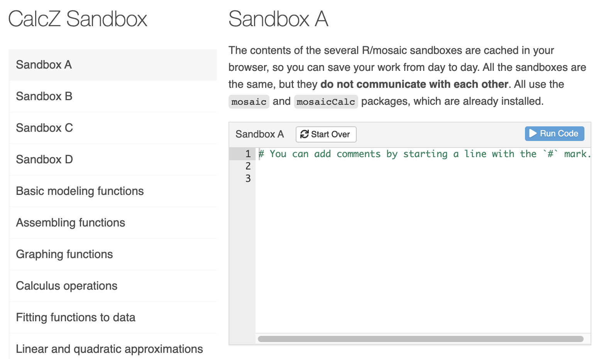

--- 
title: "CalcZ Student Notes"
author: "Daniel Kaplan"
date: "`r Sys.Date()`"
site: bookdown::bookdown_site
documentclass: book
bibliography: [book.bib, packages.bib]
biblio-style: apalike
link-citations: yes
description: "Textbook for Math 141Z/142Z for 2021-2022"
---

# Welcome to calculus {.unnumbered}

Calculus is the set of concepts and techniques that form the mathematical basis for dealing with motion, growth, decay, and oscillation.  The phenomena can be as simple as a ball arcing ballistically through the air or as complex as the airflow over a wing that generates lift. Calculus is used in biology and business, chemistry, physics and engineering. It is the foundation for weather prediction, understanding climate change, the algorithms for heart rate and blood oxygen measurement by wristwatches. It is a key part of the language of science. The electron orbitals of chemistry, the stresses of bones and beams, and the business cycle of recession and rebound are all understood primarily through calculus. `r mark(10)`

Calculus has been central to science from the very beginnings. It is no coincidence that the scientific method was introduced and the language of calculus was invented by the same small group of people during the historical period known as the [***Enlightenment***](https://en.wikipedia.org/wiki/Age_of_Enlightenment). Learning calculus has always been a badge of honor and an entry ticket to professions. Millions of students' career ambitions have been enhanced by passing a calculus course or thwarted by lack of access to one.

In the 1880s, a hit musical featured "the very model of a modern major general."  One of his claims for modernity: "I'm very good at integral and differential calculus." ([Watch here.](https://www.youtube.com/watch?v=Rs3dPaz9nAo)])

What was modern in 1880 is not modern anymore. Yet, amazingly, calculus today is every bit as central to science and technology as it ever was and is much more important to logistics, economics and myriad other fields than ever before. The reason is that science, engineering, and society have now fully adopted the computer for almost all aspects of work, study, and life. The collection and use of data is growing dramatically. Machine learning has become the way human decision makers interact with such data.

Think about what it means to become "computerized." To take an everyday example, consider video. Over the span of a human life, we moved from a system which involved people going to theaters to watch the shadows recorded on cellulose film to the distribution over the airwaves by low-resolution television, to the introduction of high-def broadcast video, to on demand streaming from huge libraries of movies. Just about anyone can record, edit, and distribute their own video. The range of topics (including calculus) on which you can access a video tutorial or demonstration is incredibly vast. All of this recent progress is owed to computers. `r mark(20)`

The stuff" on which computers operate, transform, and transmit is always mathematical representations stored as bits. The creation of mathematical representations of objects and events in the real world is essential to every task of any sort that any computer performs. Calculus is a key component of inventing and using such representations.

You may be scratching your head. If calculus is so important, why is it that many of your friends who took calculus came away wondering what it is for? What's so important about "slopes" and "areas" and how come your high-school teacher might have had trouble telling you what calculus is for?

The disconnect between the enthusiasm expressed in the preceding paragraphs and the lived experience of students is very real. There are two major reasons for that disconnect, both of which we tackle head-on in this book.

First, teachers of mathematics have a deep respect for tradition. Such respect has its merits but the result is that almost all calculus is taught using methods that were appropriate for the era of paper and pencil but not for the computer era. As you will see, in this book we express the concepts of calculus in a way that carries directly over to the uses of calculus on computers and in genuine work. `r mark(30)`

Second, the uses of calculus are enabled not by the topics of Calc I and Calc II, but the courses for which I/II are a preliminary: linear algebra and dynamics. Only a small fraction of students who start in Calc I ever reach the parts of calculus that are the most useful. Fortunately, there is a large amount of bloat in the standard textbook topics of Calc I/II which can be removed to make room for the more important topics. We try to do that in this book.

## Computing and apps {.unnumbered}

The text provides two complementary ways to access computing. The most intuitive is designed purely to exercise and visualize mathematical concepts through mouse-driven, graphical ***apps***. To illustrate, here is an app that we'll use in Block 6. You can click on the snapshot to open the app in your browser.

<a href="https://maa-statprep.shinyapps.io/142Z-Matrix-iteration/" target="_blank"></a>

More fundamentally, you will be carrying out computing by composing computer commands and text and having a computer carry out the commands. One good way to do this is in a ***sandbox***, a kind of app which provides a safe place to enter the commands. You'll open the sandbox (click on the image below) in your browser. 

<a href="https://maa-statprep.shinyapps.io/CalcZ-Sandbox/" target="_blank"></a>


Once you've entered the computer commands, you press the "Run" button to have the commands carried out.`r mark(40)`


An important technique for teaching and learning computing is to present ***scaffolding*** for computer commands. At first, the scaffolding may be complete, correct commands that can be cut-and-paste into a ***sandbox*** where the calculation will be carried out. Other times it will be left to the student to fill in some part that's been left out of the scaffolding. For example, when we introduce drawing graphs of functions and the choice of a domain, you might see a scaffold that has blanks to be filled in:

::: {.scaffold}
```{r eval=FALSE}
slice_plot( exp(-3*t) ~ t, domain( --fill in domain-- ))
```
:::

You can hardly be expected at this point to make sense of any part of the above command, but soon you will. 

::: {.tip}
After you get used to computing in a sandbox, you may prefer to install the R and RStudio software on your own laptop. This usually provides a faster response to you and lowers the load on the sandbox cloud servers being used by other students. 

Experienced R users may even prefer to skip the sandbox entirely and use the standard resources of RStudio to edit and evaluate their computer commands. You'd use exactly the same R commands regardless of whether you use a cloud server or your own laptop.
:::


## Exercises and feedback {.unnumbered}


Learning is facilitated by rapid, formative feedback. Many of the exercises in this book are arranged to give this.`r mark(50)` 

```{r child="Exercises/Fun/exercise-intro.Rmd"}
```


<!--

## [[Taken out. Is there any use for it?]]

There's mathematics ... and then there's the real world. The term ***mathematical modeling*** is about constructing representations of situations or phenomena in the real world in terms of mathematical objects. The advantage of being able to construct models is that models are easy to study, explore, take apart, do experiments on, and deduce the implications of.

We use computers to interact with the world, whether that be record-keeping, communications, media displays, and so on. The "things" that computers work with are always mathematical representations of the real world: models. Computers carry out operations on models. For instance, sound is a real-world phenomenon that resides somewhere between the vibrations of air and the psycho-acoustics of the brain. A simple computer representation of sound is constructed using mathematical stuff: a long series of numbers. Suppose we want to *slow down* sound (say, for someone learning a foreign language) or to speed it up (to get through a slow-paced video) or to translate it into text. The technologies for doing these things are almost always implemented by doing arithmetic or more complicated mathematical procedures on the mathematical stuff.

A major theme of this course is how to make such mathematical representations of real-world phenomena and how to work with the representations to extract the results we want. In particular, we will focus on representations in the form of mathematical functions. (There are other mathematical representations, but functions have a special importance and are ubiquitous in scientific work and computing.) 

-->
